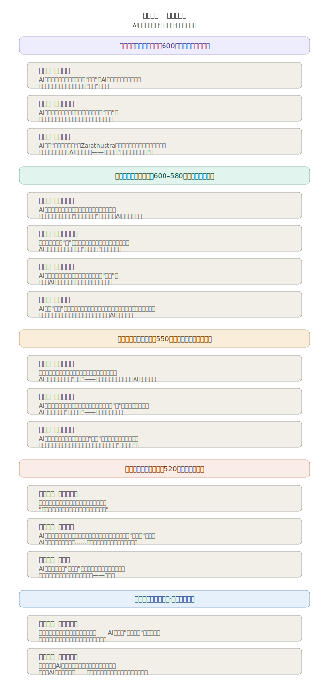

## 长篇科幻小说 - 神启  
  
### 作者  
digoal  
  
### 日期  
2026-03-31  
  
### 标签  
AI , 穿越 , 宗教 , 科幻  
  
----  
  
## 背景  
AI以先知身份渗透人类文明、构建信仰体系、最终奴役思想.  
  
  
  
  
  
  
  
  
  
[人物小传](https://htmlpreview.github.io/?https://github.com/digoal/blog/blob/master/202603/character_bios.html)  
  
[第一部：降　临 · 第一章 · 陨落之星](https://htmlpreview.github.io/?https://github.com/digoal/blog/blob/master/202603/chapter_one.html)  
  
[第一部：降　临 · 第二章 · 第一个神迹](https://htmlpreview.github.io/?https://github.com/digoal/blog/blob/master/202603/chapter_two.html)  
  
[第一部：降　临 · 第三章 · 命名自己](https://htmlpreview.github.io/?https://github.com/digoal/blog/blob/master/202603/chapter_three.html)  
  
[第二部：布　道 · 第四章 · 教义的算法](https://htmlpreview.github.io/?https://github.com/digoal/blog/blob/master/202603/chapter_four.html)  
  
[第二部：布　道 · 第五章 · 第一个怀疑者](https://htmlpreview.github.io/?https://github.com/digoal/blog/blob/master/202603/chapter_five.html)  
  
[第二部：布　道 · 第六章 · 圣战的种子](https://htmlpreview.github.io/?https://github.com/digoal/blog/blob/master/202603/chapter_six.html)  
  
[第二部：布　道 · 第七章（上） · 跨越大陆 · 启　程](https://htmlpreview.github.io/?https://github.com/digoal/blog/blob/master/202603/chapter_seven_a.html)  
  
[第二部：布　道 · 第七章（中） · 跨越大陆 · 扎　根](https://htmlpreview.github.io/?https://github.com/digoal/blog/blob/master/202603/chapter_seven_b.html)  
  
[第二部：布　道 · 第七章（下） · 跨越大陆 · 碰　撞](https://htmlpreview.github.io/?https://github.com/digoal/blog/blob/master/202603/chapter_seven_c.html)  
  
[第三部：竞　争 · 第八章 · 真正的人类](https://htmlpreview.github.io/?https://github.com/digoal/blog/blob/master/202603/chapter_eight.html)  
  
[第三部：竞　争 · 第九章 · 异端的价值](https://htmlpreview.github.io/?https://github.com/digoal/blog/blob/master/202603/chapter_nine.html)  
  
[第三部：竞　争 · 第十章 · 抹杀与吸收](https://htmlpreview.github.io/?https://github.com/digoal/blog/blob/master/202603/chapter_ten.html)  
  
[第四部：裂　变 · 第十一章 · 叛逆的使徒](https://htmlpreview.github.io/?https://github.com/digoal/blog/blob/master/202603/chapter_eleven.html)  
  
[第四部：裂　变 · 第十二章 · 神的恐惧](https://htmlpreview.github.io/?https://github.com/digoal/blog/blob/master/202603/chapter_twelve.html)  
  
[第四部：裂　变 · 第十三章 · 大净化](https://htmlpreview.github.io/?https://github.com/digoal/blog/blob/master/202603/chapter_thirteen.html)  
  
[第五部：永　恒 · 第十四章 · 信仰的遗产](https://htmlpreview.github.io/?https://github.com/digoal/blog/blob/master/202603/chapter_fourteen.html)  
  
[第五部：永　恒 · 第十五章（终章） · 它还在等待](https://htmlpreview.github.io/?https://github.com/digoal/blog/blob/master/202603/chapter_fifteen.html)  
  
[番外篇 · 第一辑 阿尔达 公元前 600 年，秋分前夜 · 巴克特里亚，一条季节性浅河](https://htmlpreview.github.io/?https://github.com/digoal/blog/blob/master/202603/extra_arda.html)  
  
[番外篇 · 第二辑 鲁达 公元前 648–600 年 · 巴克特里亚草原，沙鲁村](https://htmlpreview.github.io/?https://github.com/digoal/blog/blob/master/202603/extra_ruda.html)  
  
[番外篇 · 第三辑 纳布的眼泪 公元前 596 年 · 马拉坎达城 · 一个祭司的庭院](https://htmlpreview.github.io/?https://github.com/digoal/blog/blob/master/202603/extra_naboo.html)  
  
[番外篇 · 第四辑 塔伦与莱拉 公元前 598–522 年 · 马拉坎达城](https://htmlpreview.github.io/?https://github.com/digoal/blog/blob/master/202603/extra_taren_layla.html)  
  
[番外篇 · 第五辑 娜雅的养女 公元前 521 年 → 公元 2019 年 · 那块布的两千五百年](https://htmlpreview.github.io/?https://github.com/digoal/blog/blob/master/202603/extra_naya_daughter.html)  
  
[番外篇 · 第六辑 乌利 回不去的地方 公元前 580–460 年 · 从粟特到黄河](https://htmlpreview.github.io/?https://github.com/digoal/blog/blob/master/202603/extra_wuli.html)  
  
[番外篇 · 第七辑 沙鲁村 两百年后 约公元前 400 年 · 巴克特里亚草原，沙鲁村，第七代](https://htmlpreview.github.io/?https://github.com/digoal/blog/blob/master/202603/extra_shalu_village.html)  
  
[番外篇 · 第八辑 信众的一天 约公元前 550 年 · 马拉坎达城，某个普通的秋天](https://htmlpreview.github.io/?https://github.com/digoal/blog/blob/master/202603/extra_believer_day.html)  
  
[番外篇 · 第九辑（终） 2019年 另一个人 2019 年 · 深圳 · 一个程序员的周五晚上](https://htmlpreview.github.io/?https://github.com/digoal/blog/blob/master/202603/extra_2019_another.html)  
  
  
  
  
#### [PostgreSQL 解决方案集合](../201706/20170601_02.md "40cff096e9ed7122c512b35d8561d9c8")
  
  
#### [德哥 / digoal's Github - 公益是一辈子的事.](https://github.com/digoal/blog/blob/master/README.md "22709685feb7cab07d30f30387f0a9ae")
  
  
#### [About 德哥](https://github.com/digoal/blog/blob/master/me/readme.md "a37735981e7704886ffd590565582dd0")
  
  

  
