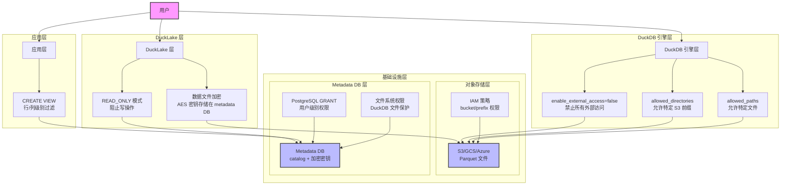

## 使用 DuckLake 如何实现数据访问权限控制?  
  
### 作者  
digoal  
  
### 日期  
2026-04-15  
  
### 标签  
DuckDB , DuckLake , 湖仓一体 , 对象存储 , catalog , 权限控制  
  
----  
  
## 背景  
如果使用ducklake插件, 将catalog存储在duckdb数据文件中, 将真实数据存储在对象存储中. 是否有方法控制用户可以访问的真实数据范围?  
  
DuckLake 将 catalog 存储在 DuckDB/PostgreSQL/SQLite 数据文件中，将真实数据（Parquet 文件）存储在对象存储中。**DuckLake 本身没有内置的细粒度访问控制机制**（无 `GRANT`/`REVOKE`、行级安全、列级安全等），但可以通过以下几个层面组合实现访问控制。  
  
  
  
## 1. 只读模式（READ_ONLY）  
  
在 `ATTACH` 时指定 `READ_ONLY`，可以阻止任何写操作：  
  
```sql  
ATTACH 'ducklake:metadata.db' AS my_lake (  
    DATA_PATH 's3://my-bucket/data/',  
    READ_ONLY  
);  
```  
  
这会将整个 catalog 设为只读，任何 `INSERT`/`UPDATE`/`DELETE` 都会报错。`READ_ONLY` 选项在 DuckDB 的 `AttachOptions` 中被解析为 `AccessMode::READ_ONLY`。  
  
  
  
## 2. 数据文件加密（Encryption）  
  
启用加密后，所有写入对象存储的 Parquet 文件都会用随机生成的 AES 密钥加密，密钥存储在 metadata DB 中。即使用户能直接访问对象存储的文件，也无法读取内容：  
  
```sql  
ATTACH 'ducklake:metadata.db' AS my_lake (  
    DATA_PATH 's3://my-bucket/data/',  
    ENCRYPTED  
);  
```  
  
直接用 `read_parquet()` 读取加密文件会报错，无法绕过 DuckLake 直接读取。  
  
加密密钥在 `DuckLakeCopyInput` 结构中以 `encryption_key` 字段传递给写入流程。  
  
**限制**：密钥存储在 metadata DB 中，没有外部 KMS 支持。因此，**控制 metadata DB 的访问权限本身就是保护数据的关键**。  
  
  
  
## 3. DuckDB 层的文件访问限制（`enable_external_access` + `allowed_directories`）  
  
这是原有答案未提及的重要机制。DuckDB 提供了两个配合使用的设置，可以在引擎层面限制用户能访问的 S3 路径范围：  
  
- **`enable_external_access=false`** ：禁止所有外部文件访问（包括 S3、HTTP 等）  
- **`allowed_directories`** ：即使 `enable_external_access=false`，仍允许访问的目录/前缀列表  
- **`allowed_paths`** ：即使 `enable_external_access=false`，仍允许访问的具体文件列表  
  
实际的路径检查逻辑在 `DBConfig::CanAccessFile` 中实现：只有路径前缀匹配 `allowed_directories` 中的条目，才允许访问。  
  
**实际应用**：可以在启动 DuckDB 时（通过 C++ API 或配置文件）设置：  
  
```sql  
SET enable_external_access = false;  
SET allowed_directories = ['s3://my-bucket/user-a-data/'];  
```  
  
这样用户只能通过 DuckLake 访问 `s3://my-bucket/user-a-data/` 前缀下的数据，即使他们知道其他路径也无法直接读取。  
  
**注意**：`enable_external_access` 一旦设为 `false`，`allowed_directories` 和 `allowed_paths` 就无法再被修改，防止用户自行扩大权限。  
  
  
  
## 4. 对象存储层的 IAM 权限控制  
  
DuckLake 通过 DuckDB 的 Secret 机制传递对象存储凭证（如 S3 的 `ACCESS_KEY_ID`/`SECRET_ACCESS_KEY`）。DuckDB 支持 S3、GCS、R2、Azure 等多种对象存储的 Secret 类型：  
  
可以在对象存储侧（AWS IAM、GCS IAM 等）为不同用户/角色配置不同的 bucket/prefix 权限，从而控制谁能读写哪些数据文件。这是最强的隔离手段，因为它在 DuckLake 之外的基础设施层生效。  
  
  
  
## 5. Metadata DB 层的访问控制  
  
由于 catalog 存储在 DuckDB/PostgreSQL/SQLite 中，可以利用这些数据库自身的权限机制：  
  
- **PostgreSQL backend**：可以用 PostgreSQL 的 `GRANT`/`REVOKE` 控制哪些用户能读写 metadata 表，从而间接控制谁能访问 DuckLake catalog。  
- **DuckDB backend**：DuckDB 文件本身可以通过文件系统权限（OS 层）保护。DuckDB 的持久化 Secret 文件也会被强制设置为仅 owner 可读写（`600` 权限），防止泄露。  
  
  
  
## 6. 视图（VIEW）作为应用层行/列过滤  
  
DuckLake 支持 `CREATE VIEW`（通过 `DuckLakeViewEntry` 实现）。可以利用视图在应用层实现行级和列级的访问限制：  
  
```sql  
-- 只暴露特定列  
CREATE VIEW my_lake.user_view AS  
    SELECT id, name FROM my_lake.sensitive_table;  
  
-- 只暴露特定行（模拟行级安全）  
CREATE VIEW my_lake.region_a_view AS  
    SELECT * FROM my_lake.orders WHERE region = 'A';  
```  
  
视图的 SQL 定义存储在 metadata DB 中，用户通过视图查询时，DuckLake 会按视图定义过滤数据。但这依赖于用户只能访问视图而无法直接访问底层表，需要在应用层（而非 DuckLake 内部）强制执行。  
  
## DuckLake 访问控制架构图  
  

  
### 架构说明  
  
该架构图展示了 DuckLake 多层访问控制体系，从上到下依次为：  
  
1. **用户访问入口**：用户通过 SQL 查询访问 DuckLake  
2. **DuckLake 层控制**：  
   - `READ_ONLY` 模式阻止写操作  
   - 数据文件加密防止绕过直读  
3. **DuckDB 引擎层控制**：  
   - `enable_external_access=false` 禁止所有外部访问  
   - `allowed_directories` 限制可访问的 S3 前缀  
4. **应用层控制**：通过 VIEW 实现行/列级过滤  
5. **基础设施层控制**：  
   - IAM 策略控制对象存储访问  
   - PostgreSQL GRANT 和文件系统权限保护 metadata DB  
  
### Notes  
  
该架构图强调了**多层防御**的重要性：每一层都提供不同粒度的访问控制，组合使用可以实现强大的数据安全保护。最关键的控制在基础设施层（IAM 和文件系统权限），其次是 DuckDB 引擎层的路径限制。  
  
  
  
## 总结  
  
| 控制层面 | 机制 | 粒度 | 强度 |  
|---|---|---|---|  
| DuckLake 层 | `READ_ONLY` 模式 | 整个 catalog 只读 | 中 |  
| DuckLake 层 | 数据文件加密 | 防止绕过 DuckLake 直读文件 | 高 |  
| DuckDB 引擎层 | `enable_external_access` + `allowed_directories` | S3 路径/前缀级别 | 高（引擎强制） |  
| 对象存储层 | IAM 策略 | bucket/prefix 级别 | 最高（基础设施层） |  
| Metadata DB 层 | PostgreSQL GRANT 等 | 数据库用户级别 | 中 |  
| 应用层 | DuckLake VIEW | 行/列级别 | 低（依赖应用强制） |  
  
**核心结论**：DuckLake 目前没有内置的行级安全（RLS）、列级权限或 SQL `GRANT`/`REVOKE` 支持。最可靠的访问控制方案是**多层叠加**：  
1. 用对象存储 IAM 控制哪些凭证能访问哪些 S3 前缀（基础设施层保障）  
2. 用 DuckDB 的 `enable_external_access=false` + `allowed_directories` 在引擎层限制路径（防止绕过 DuckLake 直读）  
3. 用数据文件加密防止凭证泄露后的直接文件读取  
4. 用 PostgreSQL backend + GRANT 控制 metadata 访问（适合多用户场景）  
  
  
#### [PostgreSQL 解决方案集合](../201706/20170601_02.md "40cff096e9ed7122c512b35d8561d9c8")
  
  
#### [德哥 / digoal's Github - 公益是一辈子的事.](https://github.com/digoal/blog/blob/master/README.md "22709685feb7cab07d30f30387f0a9ae")
  
  
#### [About 德哥](https://github.com/digoal/blog/blob/master/me/readme.md "a37735981e7704886ffd590565582dd0")
  
  

  
