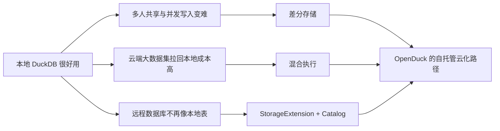
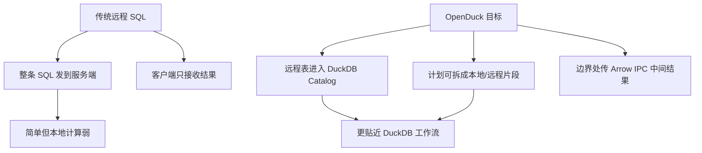
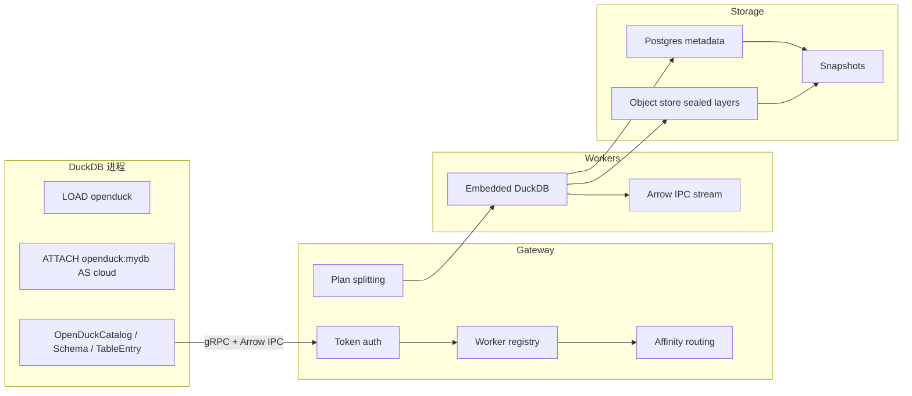
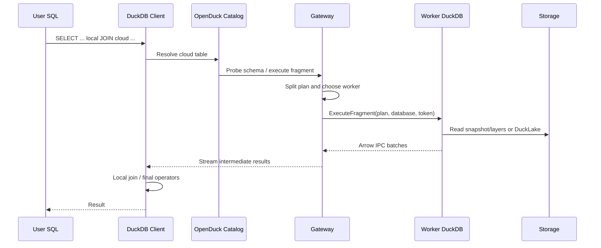
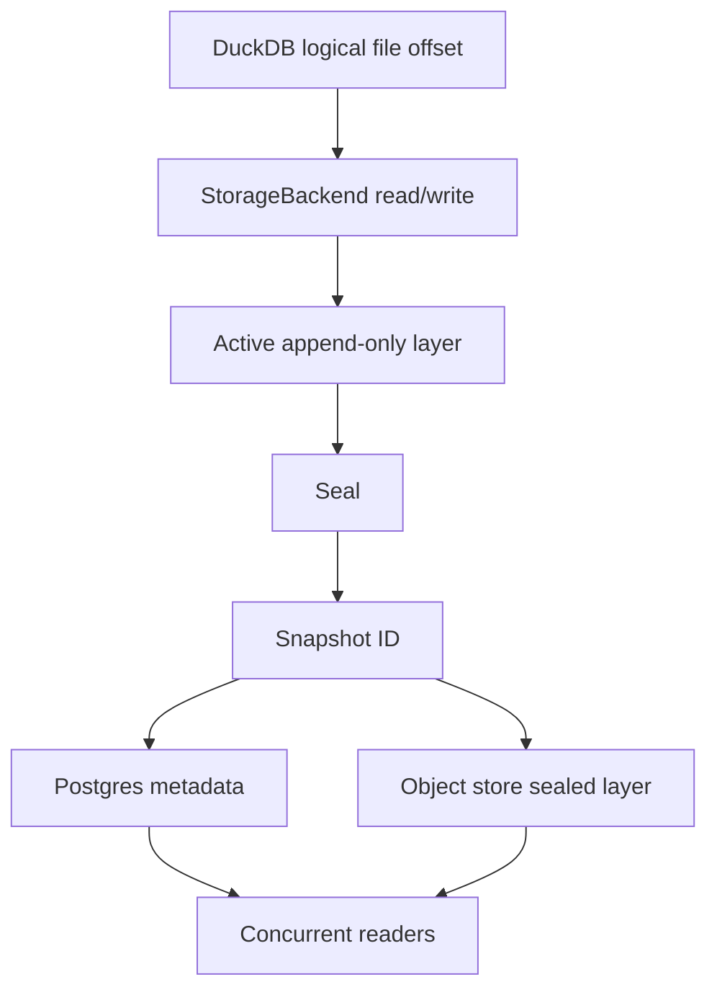
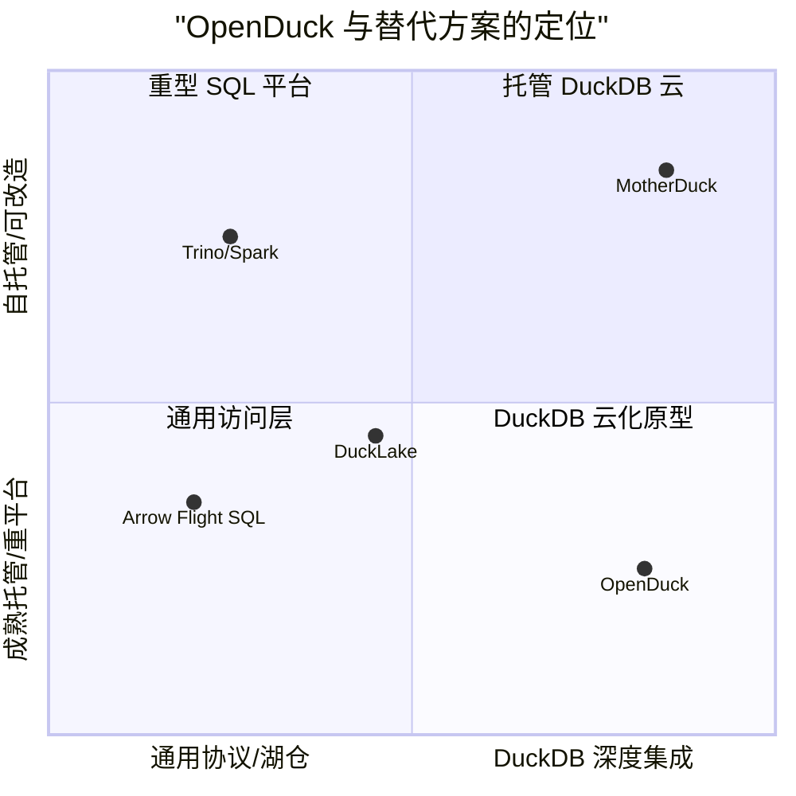
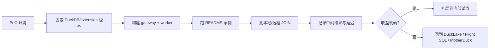
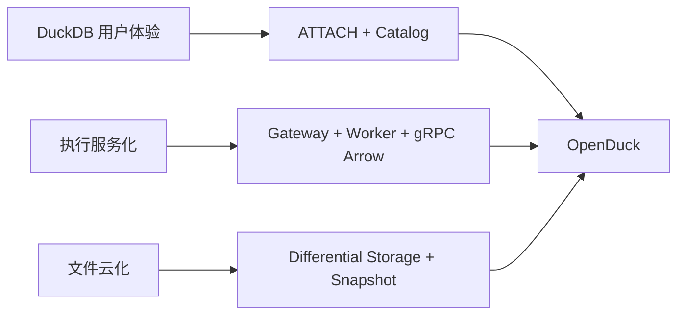

## OpenDuck 开源, DuckDB 可以搞云边协同了
  
### 作者  
digoal  
  
### 日期  
2026-04-23 
  
### 标签  
DuckDB , ducklake , motherduck , 云 , 边 , 存算分离 , openduck 
  
----  
  
## 背景 

OpenDuck 的价值不在于“又做了一个 DuckDB 远程查询代理”，而在于它把 MotherDuck 已经验证过的三件事拆成了可自托管、可替换后端的开源形态：差分存储、混合执行、DuckDB 原生 `ATTACH` 体验。

我的观点：如果你的团队已经大量使用 DuckDB，并且卡在“本地分析很顺手，但共享、并发、远程计算和云端数据访问很难工程化”的阶段，OpenDuck 值得作为架构原型和内部平台方向评估。

成立前提：你接受它目前仍是早期项目；你愿意从源码构建 DuckDB 扩展；你的团队有 Rust、C++、gRPC、Arrow、Postgres、对象存储的工程能力；你的核心诉求是 DuckDB 云化/协同化，而不是找一个即开即用的商业数仓。

如果前提崩塌：如果你需要生产级 SLA、权限体系、托管运维、稳定发布和成熟生态，应优先选择 MotherDuck、传统云数仓或更成熟的 lakehouse/remote SQL 方案；如果你只需要跨语言高性能 SQL 协议，应优先看 Arrow Flight SQL；如果你只需要对象存储上的 Parquet lakehouse catalog，应优先看 DuckLake。



## 背景：DuckDB 云化的关键不是“放到服务器上跑”

DuckDB 的优势是嵌入式、单进程、列式分析、文件即数据库。这个模型对个人分析和应用内分析非常友好，但进入团队协作后，矛盾会集中出现：

| 问题 | 本质约束 | 忽略后的代价 |
| --- | --- | --- |
| 多人共享 `.duckdb` 文件 | 本地文件格式和单写路径更适合单机 | 复制文件、版本混乱、写入冲突 |
| 云端数据集越来越大 | 数据靠近计算，还是计算靠近数据 | 网络传输成本和查询延迟失控 |
| 本地表和远程表割裂 | SQL 引擎无法统一优化本地/远程执行 | 手写 ETL、中间表、重复落盘 |
| 云端化后要鉴权、路由、取消、观测 | 嵌入式数据库缺少服务化控制面 | 生产运维边界不清 |

MotherDuck 的 CIDR 2024 论文和 DuckDB 官方 library 页面把这个方向称为 hybrid query processing：查询可以部分在本地、部分在云端执行。MotherDuck 的 differential storage 博文进一步说明，DuckDB 原生文件要进入云端协作场景，需要把逻辑数据库文件映射到可追加、可快照、可共享的存储层。

OpenDuck 的定位就是把这些思想开源化，但它并不声称和 MotherDuck wire-compatible。README 明确说它受 MotherDuck 启发，重新实现了类似架构思想，并提供开放协议、开放后端和开放扩展。

## 场景：谁应该关心 OpenDuck

最适合先关注 OpenDuck 的角色不是普通 BI 用户，而是这几类工程团队：

| 角色 | 典型触发点 | OpenDuck 可能解决什么 |
| --- | --- | --- |
| 数据平台工程师 | 团队大量用 DuckDB，本地文件开始难共享 | 用 `ATTACH 'openduck:...'` 提供远程数据库体验 |
| 架构师 | 想评估 DuckDB 云化路径 | 研究差分存储、gateway、worker、协议边界 |
| 数据应用开发者 | Web/API 服务需要同时查本地缓存和远程数据 | 混合执行减少手工搬运中间数据 |
| DBA/运维 | 要把 DuckDB 纳入可观测、可鉴权、可取消的服务 | gateway/worker/metrics/token auth 提供服务化起点 |
| 开源实现者 | 想替换后端执行引擎或接入自有数据服务 | 实现 `ExecutionService` 即可兼容数据面 |

我的观点：OpenDuck 更像“DuckDB 云化的可运行架构蓝图”，不是成熟的即插即用产品。

成立前提：你愿意用早期项目换取架构透明性和可改造性。

支撑证据：仓库 layout 显示它同时包含 `exec-gateway`、`exec-worker`、`exec-proto`、`diff-*`、`extensions/openduck`、`clients/python`、`examples`；协议只暴露少量 gRPC RPC；扩展 README 说明 remote table 通过 DuckDB catalog 进入优化器和执行引擎。

如果前提崩塌：如果团队目标是“下周上线给业务使用”，应该把 OpenDuck 放在实验/PoC，而不是生产依赖。

## 传统方案为什么不够

### 方案一：继续传 `.duckdb` 文件

简单，但协作一旦上来就会变成文件分发问题。谁拥有最新版本？谁负责写入？如何回滚？如何避免多个副本之间的业务口径漂移？这种方式适合单人分析和离线交付，不适合持续协作。

### 方案二：把 DuckDB 放在远程服务里，所有 SQL 都发过去

这能解决集中访问，但丢掉了 DuckDB 最强的本地计算优势。用户本地已有 CSV、Parquet、临时表、缓存数据时，如果所有查询都远程执行，就要先上传或落地。对交互式分析来说，这会增加等待、复制和安全暴露面。

### 方案三：使用通用 SQL-over-Arrow 协议

Arrow Flight SQL 是 Apache Arrow 官方协议，用 Arrow 内存格式和 Flight RPC 访问 SQL 数据库，覆盖 metadata、query execution、prepared statement 等通用数据库能力。它适合做跨数据库、高性能、标准化的数据访问层。

但 OpenDuck 的批判点是：通用协议通常是“客户端驱动访问服务端数据库”，而不是把远程表变成 DuckDB 原生 catalog entry，更不会让 DuckDB 优化器天然理解本地表和远程表之间的执行位置。



### 方案四：只用 DuckLake

DuckLake 是 DuckDB 生态里面向 lakehouse catalog 的方案。DuckDB 官方文档说明 `ducklake` 扩展可 `ATTACH` DuckLake 格式数据库，典型用法是 metadata 加 data path；README 也承认 OpenDuck 不替代 DuckLake，两者层次不同：DuckLake 管表、Parquet 文件和事务元数据，OpenDuck 管 DuckDB 文件 I/O、差分层、快照和远程执行传输。

因此，DuckLake 更适合“表已经是对象存储里的 Parquet 数据集”；OpenDuck 更适合“我仍需要 DuckDB-native storage、索引、全文检索或远程 DuckDB 执行能力”。

## OpenDuck 到底做了什么

OpenDuck 提供四个核心构件：

1. DuckDB C++ 扩展：注册 `openduck:` 和 `od:` storage scheme，让用户通过 `ATTACH` 把远程数据库挂进 DuckDB。
2. 开放协议：`proto/openduck/v1/execution.proto` 定义 `ExecuteFragment`、`CancelExecution`、`RegisterWorker`、`Heartbeat` 四个 RPC，数据以 Arrow IPC batch 流式返回。
3. Gateway/Worker 执行层：gateway 做 token auth、worker registry、affinity routing、plan splitting、backpressure；worker 嵌入 DuckDB 执行片段并流式返回结果。
4. Differential storage：用 append-only layer、snapshot、Postgres metadata、对象存储 sealed layer 来把 DuckDB 看到的随机访问文件转成云友好的层化存储。



## 架构原则：把“远程”藏进 DuckDB 原生接口

扩展 README 给出了关键路径：

```text
ATTACH 'openduck:mydb?token=...' AS cloud
  -> 创建 OpenDuckCatalog
SELECT * FROM cloud.users
  -> DuckDB 解析 cloud.main.users
  -> schema entry 通过 gRPC 探测远程 schema
  -> table entry 返回 scan function
  -> scan function 拉取 Arrow IPC 并转换为 DuckDB DataChunk
```

这条路径的意义是：用户不是调用一个外部 driver，也不是写 `remote_query(...)` 包裹函数，而是让远程表成为 DuckDB catalog 里的一级对象。这样 JOIN、CTE、subquery、类型系统和优化器才有机会把它当成普通表处理。

源码侧可以看到对应边界：

| 层 | 证据 | 作用 |
| --- | --- | --- |
| `extensions/openduck` | C++ extension README 与 `src` 目录 | DuckDB StorageExtension、Catalog、SchemaCatalogEntry、TableCatalogEntry |
| `proto/openduck/v1/execution.proto` | 四个 RPC 与 Arrow IPC batch | 定义客户端、gateway、worker 的最小协议面 |
| `crates/exec-gateway` | `main.rs` 默认监听 `0.0.0.0:7878` | 服务入口、worker 地址、并发限制、转发与路由 |
| `crates/exec-worker` | worker 支持 in-memory、`OPENDUCK_WORKER_DB`、DuckLake metadata/data env | 嵌入 DuckDB，执行远程片段 |
| `crates/diff-core` | `StorageBackend` trait | 读、写、flush、fsync、seal、truncate 的逻辑文件接口 |
| `crates/diff-metadata` | Postgres migrations、GC、pg storage | snapshot/layer 元数据和垃圾回收 |
| `crates/diff-blob` | object_store aws 依赖 | sealed layer 上传到 S3 兼容对象存储 |
| `crates/diff-fuse` | Linux FUSE adapter | 把差分存储暴露成文件系统接口 |

## 数据流：一次混合查询如何走

以 `local.products JOIN cloud.sales` 为例，OpenDuck README 展示的计划形态是：本地扫描本地表，远程扫描远程表，在边界插入 bridge operator，只传中间结果。真正的收益不在“远程能查”，而在“避免把所有远程原始数据拉回本地，或把所有本地临时数据上传远端”。



我的推断是：OpenDuck 真正有价值的执行模式，是远程过滤、聚合、扫描尽量靠近云端数据，本地小表、临时表、交互式计算留在本地。

成立前提是：plan splitting 足够准确，bridge operator 的中间结果远小于原始远程数据，网络延迟和序列化成本不吞掉收益。

如果前提不成立：简单 remote query、Arrow Flight SQL、直接 DuckDB 读 Parquet，甚至把计算完全下推到云数仓，都会更稳。

## 存储模型：差分层解决的是 DuckDB 文件云化问题

OpenDuck 的 `diff-core` 把存储抽象成一个逻辑随机访问文件，暴露 `read`、`write`、`flush`、`fsync`、`seal`、`truncate`。README 把它解释为：DuckDB 看到普通文件；OpenDuck 持久化为不可变 sealed layers；snapshot 提供一致性读取；一个序列化写路径，多个并发读者。

MotherDuck 的 differential storage 博文提供了这个架构思想的背景：把数据库表示成有序 layer，每个 layer 对应某个 checkpoint 之后的差异，snapshot layer metadata 保存在单独的 OLTP 数据库中。OpenDuck README 对应采用 Postgres metadata 和 object store sealed layers。



我的观点：差分存储是 OpenDuck 区别于“远程 SQL 代理”的根部能力。

成立前提：你确实需要 DuckDB-native file semantics 的远程共享、快照、一致性读取，而不是只管理 Parquet 表。

支撑证据：README 明确把 differential storage 放在首位；`diff-core`、`diff-layer-fs`、`diff-blob`、`diff-metadata`、`diff-fuse` 组成独立模块；`execution.proto` 的 `ExecuteFragmentRequest` 包含可选 `snapshot_id`。

如果前提崩塌：如果你的数据天然是 Parquet/Delta/Iceberg 表，且主要问题是 catalog 和事务元数据，DuckLake、Iceberg、Delta Lake 类方案更直接。

## 前后效果对比

目前没有发现 OpenDuck 官方发布的性能 benchmark 或生产 case study，因此下面只做机制层面的比较，不声明性能提升倍数。

| 维度 | 传统本地 DuckDB | OpenDuck 后的目标状态 | 证据级别 |
| --- | --- | --- | --- |
| 远程数据库体验 | 手动拉文件或写外部连接 | `ATTACH 'openduck:mydb' AS cloud` | README / extension README |
| 本地+远程 JOIN | 手工搬运或全量拉取 | plan split + bridge operator | README / extension README |
| 协议开放性 | 无统一远程协议 | gRPC + Arrow IPC，4 个核心 RPC | `execution.proto` |
| 存储共享 | `.duckdb` 文件副本 | append-only layer + snapshot + metadata | README / diff-core |
| 扩展分发 | DuckDB 官方/社区扩展可 `INSTALL` | 当前需源码构建、unsigned load | README / DuckDB extension docs |
| 生产成熟度 | DuckDB 本体成熟 | OpenDuck 无 release/tag，早期项目 | GitHub API |

## 竞品与替代方案

| 方案 | 更适合的场景 | 与 OpenDuck 的关键差异 |
| --- | --- | --- |
| MotherDuck | 需要托管 DuckDB 云服务、协作、权限、稳定体验 | 商业服务；OpenDuck 是自托管开源实现，不 wire-compatible |
| Arrow Flight SQL | 需要通用 SQL-over-Arrow 协议、跨数据库访问 | 通用数据库协议；OpenDuck 更深集成 DuckDB catalog 和混合执行 |
| DuckLake | 需要对象存储 Parquet lakehouse catalog | DuckLake 管表和数据文件；OpenDuck 管 DuckDB storage/execution/transport |
| 直接 DuckDB + Parquet/S3 | 单人或简单批处理分析 | 简单可靠；缺少远程 catalog、gateway/worker、混合执行控制面 |
| Trino/Presto/Spark | 大规模分布式 SQL 和成熟集群治理 | 生态成熟但更重；OpenDuck 追求 DuckDB 工作流延续 |



## 使用场景

### 场景一：团队共享 DuckDB-native 数据库

症状：分析师和开发者反复传 `.duckdb` 文件，版本和口径不可控。

为什么 OpenDuck 有帮助：它把远程数据库挂载成 DuckDB catalog，读者可通过相同 SQL 访问远程表。

示例：

```python
import duckdb

con = duckdb.connect(config={"allow_unsigned_extensions": "true"})
con.execute("LOAD 'extensions/openduck/build/release/extension/openduck/openduck.duckdb_extension';")
con.execute("ATTACH 'openduck:mydb?endpoint=http://localhost:7878&token=your-token' AS cloud;")
con.sql("SELECT * FROM cloud.users LIMIT 10").show()
```

注意：当前写路径、并发写入、权限模型需要结合源码和测试自行验证，不能直接假设等价于成熟云数据库。

### 场景二：本地临时表 JOIN 云端大表

症状：本地有小维表或临时分析结果，云端有大事实表，全量搬运很慢。

为什么 OpenDuck 有帮助：计划可以拆成本地和远程片段，只跨网络传中间结果。

示例：

```sql
SELECT p.name, s.revenue
FROM local_products p
JOIN cloud.sales s ON p.id = s.product_id;
```

注意：只有当远程过滤/聚合后中间结果足够小，混合执行才可能带来收益。

### 场景三：内部实现一个自定义后端

症状：你已有数据服务，但希望 DuckDB 用户通过统一 `ATTACH` 使用。

为什么 OpenDuck 有帮助：协议数据面足够小，实现 `ExecuteFragment` 和 `CancelExecution` 并返回 Arrow IPC batch，就有机会成为兼容后端。

注意：如果你需要标准 metadata、prepared statement、跨语言生态，Arrow Flight SQL 的协议面更成熟。

### 场景四：研究 DuckDB 文件云化

症状：想把 `.duckdb` 的随机读写文件语义映射到对象存储。

为什么 OpenDuck 有帮助：`StorageBackend`、Postgres metadata、object store layer、FUSE adapter 提供了可读源码路径。

注意：这更像系统软件工程，不是简单配置项。

## 最佳实践

1. 先把它当 PoC，不要直接放生产关键路径。当前无 release/tag，扩展未发布到 DuckDB 官方扩展仓库。
2. 把 token 当最低限度鉴权，不要把它理解为完整权限系统。需要 TLS、网络隔离、密钥轮换、审计和最小权限。
3. 先验证查询计划和中间结果体积，再谈性能收益。混合执行怕的是 bridge 边界传输过大。
4. 把 Postgres metadata 和对象存储纳入备份/恢复设计。差分层一旦元数据和对象层不一致，恢复会比单文件复杂。
5. 版本固定。DuckDB 扩展存在二进制兼容性约束，DuckDB 官方文档说明扩展通常和 DuckDB 版本、平台绑定。
6. 观测先行。gateway、worker、backpressure、cancel、heartbeat 都要有日志、指标和报警。
7. 保留回退路径。PoC 阶段至少保留本地 DuckDB 文件、DuckLake/Parquet 或原有数仓查询路径。



## 动手步骤

以下命令来自 OpenDuck README 和 extension README，路径按仓库根目录执行。

### 1. 构建后端

```bash
cargo build --workspace
```

### 2. 构建 DuckDB 扩展

macOS 需要准备依赖：

```bash
brew install protobuf grpc apache-arrow
```

其他平台可按 extension README 使用 vcpkg。然后构建：

```bash
cd extensions/openduck
make
```

产物路径：

```text
extensions/openduck/build/release/extension/openduck/openduck.duckdb_extension
```

### 3. 启动服务

```bash
export OPENDUCK_TOKEN=your-token
cargo run -p openduck -- -d mydb --token your-token
```

README 里 gateway 默认 endpoint 示例是 `http://localhost:7878`；`crates/exec-gateway/src/main.rs` 也显示默认监听 `0.0.0.0:7878`。

### 4. Python 连接

```python
import duckdb

con = duckdb.connect(config={"allow_unsigned_extensions": "true"})
con.execute("LOAD 'extensions/openduck/build/release/extension/openduck/openduck.duckdb_extension';")
con.execute("ATTACH 'openduck:mydb?endpoint=http://localhost:7878&token=your-token' AS cloud;")

con.sql("SELECT 1 AS x").show()
con.sql("SELECT * FROM cloud.users LIMIT 10").show()
```

### 5. Python wrapper

```bash
pip install -e clients/python
export OPENDUCK_TOKEN=your-token
```

```python
import openduck

con = openduck.connect("mydb")
con.sql("SELECT 1 AS x").show()
```

### 6. CLI

```bash
duckdb -unsigned -c "
  LOAD 'extensions/openduck/build/release/extension/openduck/openduck.duckdb_extension';
  ATTACH 'openduck:mydb?token=your-token' AS cloud;
  SELECT * FROM cloud.users LIMIT 10;
"
```

### 7. 回滚/清理

OpenDuck README 没有给出完整 cleanup 命令。保守处理方式是停止 gateway/worker 进程，删除本地构建产物，撤销 `OPENDUCK_TOKEN`、`OPENDUCK_EXTENSION_PATH`、`OPENDUCK_ENDPOINT` 等环境变量。涉及 Postgres metadata 和对象存储时，应按你自己的 PoC 资源命名做显式清理，避免误删共享桶或数据库。

## 风险、限制与失败条件

1. **项目非常新。** GitHub API 显示仓库创建于 2026-04-14，2026-04-23 当前无 release/tag。这意味着 API、协议、构建和行为都可能快速变化。
2. **DeepWiki 未索引。** 按 skill 要求尝试 DeepWiki structure/question 均返回 repository not found，因此本文架构判断来自 README、源码文件和官方外部资料。
3. **未见公开 benchmark。** 不能声称 OpenDuck 比本地 DuckDB、MotherDuck、Arrow Flight SQL、DuckLake 更快。
4. **扩展未发布。** README 明确需要源码构建并启用 unsigned extension；DuckDB 官方文档提醒 unsigned extension 只应从可信来源加载。
5. **安全模型有限。** 协议和 README 主要体现 token auth；生产环境还需要 TLS、租户隔离、权限模型、审计、secret management。
6. **差分存储增加运维复杂度。** Postgres metadata、object store layer、snapshot、GC 任一环节出问题都需要可恢复设计。
7. **混合执行收益有条件。** 如果计划拆分不好，或者中间结果比原始数据还大，网络和序列化成本会抵消收益。
8. **DuckDB 扩展二进制兼容性要管理。** DuckDB 官方文档说明扩展二进制与 DuckDB 版本和平台绑定，升级时要重测。

我的观点：OpenDuck 目前最适合“架构研究 + 内部 PoC + 贡献代码”，不适合“直接替换生产数仓”。

成立前提：它的核心抽象继续稳定，社区或团队能补上发布、安全、测试、部署和观测。

支撑证据：源码已经覆盖多个关键模块，但 release、benchmark、生产案例和 DeepWiki 架构索引尚缺。

如果前提崩塌：把 OpenDuck 视为参考实现，生产使用 MotherDuck、DuckLake、Arrow Flight SQL、Trino/Spark 或现有云数仓。

## 结论

OpenDuck 最值得看的地方，是它把 DuckDB 云化拆成了三个明确接口：



如果你已经在 DuckDB 上构建内部数据工具，OpenDuck 给你的不是一个“今天就替换生产”的答案，而是一条值得验证的路线：保留 DuckDB 的本地体验，同时把存储、执行和协作逐步拉到可服务化、可自托管的形态。

如果你要稳定产品，今天应谨慎；如果你要抢先理解 DuckDB 云化的工程边界，今天正适合读源码、跑 PoC、测 workload、参与贡献。

## 参考资料

- OpenDuck GitHub 仓库：https://github.com/CITGuru/openduck
- OpenDuck README：https://raw.githubusercontent.com/citguru/openduck/refs/heads/main/README.md
- OpenDuck extension README：https://raw.githubusercontent.com/CITGuru/openduck/refs/heads/main/extensions/openduck/README.md
- OpenDuck protocol `execution.proto`：https://raw.githubusercontent.com/citguru/openduck/refs/heads/main/proto/openduck/v1/execution.proto
- OpenDuck GitHub API repository metadata：https://api.github.com/repos/CITGuru/openduck
- OpenDuck latest commit API：https://api.github.com/repos/CITGuru/openduck/commits/main
- DuckDB extension overview：https://duckdb.org/docs/lts/extensions/overview.html
- DuckDB extension distribution and unsigned extensions：https://duckdb.org/docs/current/extensions/extension_distribution.html
- DuckDB library: MotherDuck, DuckDB in the Cloud and in the Client：https://duckdb.org/library/motherduck/
- MotherDuck differential storage blog：https://motherduck.com/blog/differential-storage-building-block-for-data-warehouse/
- MotherDuck dual execution explainer：https://motherduck.com/videos/bringing-duckdb-to-the-cloud-dual-execution-explained/
- Apache Arrow Flight SQL documentation：https://arrow.apache.org/docs/format/FlightSql.html
- DuckDB DuckLake documentation：https://duckdb.org/docs/lts/core_extensions/ducklake.html


  
#### [PostgreSQL 解决方案集合](../201706/20170601_02.md "40cff096e9ed7122c512b35d8561d9c8")
  
  
#### [德哥 / digoal's Github - 公益是一辈子的事.](https://github.com/digoal/blog/blob/master/README.md "22709685feb7cab07d30f30387f0a9ae")
  
  
#### [About 德哥](https://github.com/digoal/blog/blob/master/me/readme.md "a37735981e7704886ffd590565582dd0")
  
  

  
