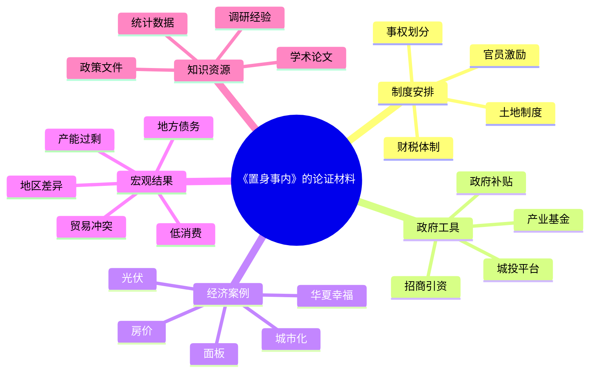
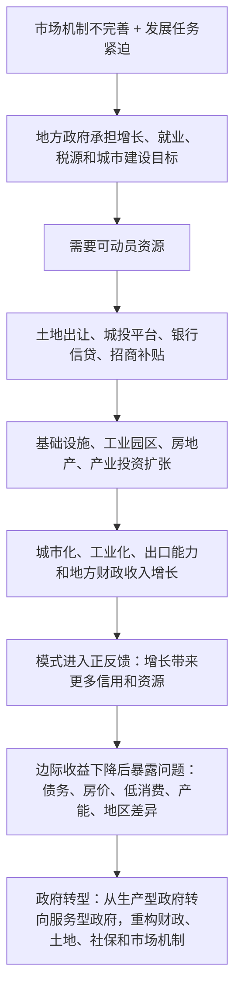

## 《置身事内》读书笔记: 读懂中国经济，先读懂地方政府的行动逻辑
  
### 作者  
digoal  
  
### 日期  
2026-04-23 
  
### 标签  
读书笔记 , 置身事内
  
----  
  
## 背景 
> 一句话结论：这本书最有价值的地方，不是给中国经济下一个简单判断，而是把“政府如何参与生产、投资、融资、城市化和产业升级”这套机制摊开，让读者先看清运行逻辑，再讨论得失。
>
> 适合谁读：关心中国经济、地方财政、房地产、产业政策、城市化、投资和宏观政策的人；也适合需要把政经新闻转化为业务判断的金融、投资、产业从业者。
>
> 我的评价：优秀的入门级政治经济学读本，强在框架清晰、材料广泛、解释克制；弱在对寻租、低效、权力约束和微观个体代价的展开不够充分。读它最好带着两个问题：机制为什么有效？机制何时变成约束？

## 1. 书籍档案与资料来源

| 项目 | 信息 |
|---|---|
| 书名 | 《置身事内：中国政府与经济发展》 |
| 作者 | 兰小欢 |
| 出版社 | 上海人民出版社 |
| 出品方 | 世纪文景 |
| 初版时间 | 2021 年 8 月 |
| ISBN | 9787208171336 |
| 页数与装帧 | 豆瓣页面记录为 340 页、平装、定价 65 元 |
| 版本 caveat | 豆瓣另列 2023 年 10 月精装版，ISBN 9787208184060，页数 352 页；本文主要依据用户给出的 2021 平装版页面，同时说明 2023 精装版存在。 |

资料显示，豆瓣该书页面列出作者、出版社、出版年、ISBN、目录和评分信息，并显示 2026 年 4 月 23 日抓取时评分为 9.1、超过 10 万人评价。[豆瓣读书](https://book.douban.com/subject/35546622/) 豆瓣阅读页面列出电子书为“出版 / 非虚构”，约 18.3 万字，出版社为上海人民出版社，提供方为世纪文景。[豆瓣阅读](https://read.douban.com/ebook/327631159/) 复旦大学经济学院的新书介绍称，本书来自作者在复旦大学和香港中文大学（深圳）的课程讲义，主角是“政府”和“政策”，以地方政府投融资为主线，分为“微观机制”和“宏观现象”两大部分。[复旦大学经济学院](https://econ.fudan.edu.cn/info/1024/19122.htm)

作者履历方面，复旦 2021 年资料称兰小欢为复旦大学经济学院副教授、美国弗吉尼亚大学经济学博士，并曾任长江经济带产业基金战略与研究总监。[复旦大学中国经济研究中心](https://rice.fudan.edu.cn/info/1002/1805.htm) 最新公开履历则显示，兰小欢现为中欧国际工商学院经济学教授，研究方向包括发展经济学、政治经济学、公共财政、中国地方政府投融资、产业政策和科技创新。[中欧国际工商学院](https://cn.ceibs.edu/lan_xiaohuan)

荣誉与传播方面，文化和旅游部转载国家图书馆消息称，第十七届文津图书奖于 2022 年 4 月 23 日揭晓，《置身事内》在 19 种获奖图书之列。[文化和旅游部 / 国家图书馆](https://www.mct.gov.cn/whzx/zsdw/zggjtsg/202204/t20220424_932638.html) 《新京报》把它列为 2021 年度通识写作特别致敬作品，评价其以专业知识解释地方政府参与和推动经济发展的机制。[新京报](https://m.bjnews.com.cn/detail/164222371914395.html)

来源限制：我没有读取非公开全书正文，只使用公开元数据、目录、出版社/高校介绍、作者公开履历、豆瓣阅读公开目录与热门划线、媒体评论和宏观公开数据。因此本文是“基于公开资料和目录结构的分析型读书笔记”，不是逐章精读摘录。书中案例部分只压缩公开目录和官方简介明确提到的案例，不补写未经可靠来源确认的情节细节。

## 2. 时代背景：这本书在回应什么问题

《置身事内》回应的核心问题是：为什么中国经济不能只用“市场 vs 政府”的抽象二分来理解？

很多经济学入门解释默认市场配置资源，政府主要提供公共品、纠正外部性、维持秩序。但中国改革开放后的增长经验更复杂：地方政府不是站在市场外部的裁判，而是深度参与招商引资、土地开发、基础设施、产业投资、融资平台、城市化和区域竞争。复旦经济学院的新书介绍也明确说，本书主角不是微观价格机制，也不是宏观经济周期，而是政府和政策。[复旦大学经济学院](https://econ.fudan.edu.cn/info/1024/19122.htm)

这本书出版于 2021 年，正处在几个长期问题交汇的节点：房地产调控加码，地方债务风险上升，外部贸易和科技摩擦加深，投资驱动增长模式的边际收益下降，国内大循环和共同富裕成为公共讨论关键词。到 2025 年，这些问题并没有消失。国家统计局 2025 年公报显示，2025 年中国 GDP 增长 5.0%，最终消费支出、资本形成和净出口分别拉动 GDP 增长 2.6、0.8、1.6 个百分点；固定资产投资下降 3.9%，全国一般公共预算收入下降 1.7%。[国家统计局](https://www.stats.gov.cn/english/PressRelease/202602/t20260228_1962661.html) 世界银行 2025 年 12 月中国经济更新也强调，房地产调整、收入预期谨慎、地方政府财政趋紧、消费和投资压力仍是增长约束。[世界银行](https://www.worldbank.org/en/news/press-release/2025/12/11/advancing-reforms-can-enhance-prospects-china-economic-update)

所以这本书今天仍值得读：它不是预测某个年度的经济走势，而是解释许多年度走势背后的制度机制。

## 3. 作者想表达什么

我的概括是，兰小欢的核心命题可以写成：

> 中国经济不是“政府在市场外部修修补补”，而是“政府长期置身于生产、融资、土地、投资和产业组织之内”；因此理解中国经济，必须理解地方政府的目标、资源、约束和激励。

主 thesis 有三层：

1. 地方政府是经济发展的深度参与者。它既影响分配，也参与生产；既制定规则，也动员资源。
2. 中国增长模式的很多宏观现象，必须从地方政府的微观行为解释。房价、土地财政、地方债、工业园区、招商竞争、产能扩张、消费偏低，都不是孤立现象。
3. 评价中国模式不能先套一个抽象模板，而要先理解具体发展阶段、制度禀赋和资源约束。

次级判断包括：

| 次级命题 | 对应现象 | 解释方向 |
|---|---|---|
| 财税关系塑造地方行为 | 分税制、转移支付、土地出让 | 财权、事权和发展压力不匹配，会推动地方寻找预算外或准预算资源 |
| 土地是城市化融资枢纽 | 土地财政、土地金融、城投平台 | 土地把政府信用、银行信贷、城市建设和房地产市场连在一起 |
| 地方竞争推动扩张 | 招商引资、产业园区、补贴 | 官员晋升、税源、就业、GDP 和产业升级目标形成扩张激励 |
| 投资驱动有收益也有代价 | 基建、制造业、房地产 | 早期能补短板，后期可能积累债务、产能和收入分配失衡 |

隐含价值观是务实主义：先解释现实如何运行，再讨论如何改革；先理解制度约束，再判断政策选择。

## 4. 作者如何证明：数据、案例、故事与概念

从目录和公开介绍看，本书的证据结构不是单一模型推导，而是“制度机制 + 现实案例 + 学术研究 + 政策材料”的组合。复旦经济学院介绍称，作者广泛引用经济学、人文社科、业界研究报告和新闻深度调查，并使用了 260 多种文献，多数发表于 2010 年之后。[复旦大学经济学院](https://econ.fudan.edu.cn/info/1024/19122.htm)

证据地图如下：



最强证据在于机制之间能互相扣合：财税压力解释土地依赖，土地依赖解释房地产和城投融资，城投融资解释基础设施扩张和债务风险，招商竞争解释产业补贴和产能扩张，居民收入占比和社会保障约束解释消费不足。

较弱或需要补充的地方在于：公开目录显示，本书偏重解释“看得见的制度逻辑”和“公开政策过程”，但对具体项目中的寻租、信息扭曲、财政软约束、地方隐性担保、失败项目清算和个体福利损失，展开空间有限。豆瓣热门短评中也有读者批评其“只说了一半”或“偏浅”，这类评价不能作为事实证据，但能提示阅读边界。[豆瓣读书](https://book.douban.com/subject/35546622/)

## 5. 书中的 1-3 个浓缩例子

以下例子来自公开目录、豆瓣阅读目录和出版社/高校介绍中明确出现的章节或案例名称；由于我没有读取全书非公开正文，细节只写到可靠公开材料能够支持的程度。

### 例子一：京东方与政府投资

- 书中发生了什么：豆瓣阅读目录显示，第四章“工业化中的政府角色”第一节是“京东方与政府投资”。[豆瓣阅读](https://read.douban.com/ebook/327631159/) Google Books 的常用词也显示“合肥”“京东方”“投资”“政府”等高频词共同出现。[Google Books](https://books.google.com/books/about/%E7%BD%AE%E8%BA%AB%E4%BA%8B%E5%86%85_%E4%B8%AD%E5%9B%BD%E6%94%BF%E5%BA%9C%E4%B8%8E%E7%BB%8F%E6%B5%8E%E5%8F%91%E5%B1%95.html?id=l4mpzgEACAAJ) 公开简介把“面板”列为本书生动解说的行业案例之一。[复旦大学经济学院](https://econ.fudan.edu.cn/info/1024/19122.htm)
- 作者借它证明什么：我的判断是，这个案例服务于“政府不是只提供公共品，也会直接参与高资本、高风险、长周期产业投资”的观点。
- 这个例子的关键机制：地方政府用资本、土地、融资协调和产业承诺降低企业单独承担的早期风险；如果项目成功，地方可能获得税源、就业、产业链和城市能级提升。
- 我的迁移理解：分析半导体、新能源、AI 算力中心等产业时，不能只问企业技术强不强，还要问地方政府为什么愿意押注、押注的钱从哪里来、失败后谁承担成本。

### 例子二：光伏发展与政府补贴

- 书中发生了什么：豆瓣阅读目录显示，第四章第二节是“光伏发展与政府补贴”。[豆瓣阅读](https://read.douban.com/ebook/327631159/) 复旦经济学院介绍也把光伏列为书中“生动解说”的行业案例。[复旦大学经济学院](https://econ.fudan.edu.cn/info/1024/19122.htm)
- 作者借它证明什么：这个案例用于说明，产业政策不是一个抽象口号，而是一组具体工具：补贴、投资、市场准入、融资、地方竞争和企业扩张。
- 这个例子的关键机制：补贴降低企业进入和扩产成本，地方竞争放大产能建设速度，全球市场需求又把地方产业政策和国际贸易摩擦连接起来。
- 我的迁移理解：产业政策要同时看“技术学习”和“产能纪律”。只看成功企业，会高估政策精准度；只看补贴浪费，又会低估早期市场培育和规模经济的作用。

### 例子三：宽窄巷子与华夏幸福

- 书中发生了什么：豆瓣、豆瓣阅读和复旦经济学院的作品简介都明确提到，本书复盘宽窄巷子、华夏幸福等建设经验。[豆瓣读书](https://book.douban.com/subject/35546622/) 它们共同指向一个问题：城市空间、土地开发、运营主体和地方政府之间如何形成项目组织。
- 作者借它证明什么：我的判断是，这类案例承接“土地财政、城市化、政府投融资与债务”的主线，说明地方政府如何把土地、规划、基础设施、招商和项目公司组织为城市开发工程。
- 这个例子的关键机制：地方政府通过规划和土地资源启动项目，企业或平台公司承担开发运营，未来现金流、土地增值或产业导入预期支撑前期投资。
- 我的迁移理解：看一个新区、文旅街区、产业新城或城市更新项目，关键不是只看建筑和客流，而要看背后的融资结构、土地价值实现路径、运营现金流和债务闭环。

## 6. 论证逻辑图



这条逻辑链的关键不是“政府干预一定好”或“市场一定失灵”，而是：在特定发展阶段，政府能把分散资源集中成可投资能力；但当短缺约束变成需求约束、当土地和债务的循环变脆弱，原来促进增长的机制就可能反过来限制增长。

## 7. 前提假设与反方观点

| 前提假设 | 支撑材料 | 可能反例 | 我的判断 |
|---|---|---|---|
| 地方政府有足够能力识别和组织发展机会 | 中国大量基础设施、工业园区和产业集群确实由地方政府推动 | 低效园区、烂尾工程、重复建设、地方保护 | 在基础设施短缺阶段更成立，在产业升级和创新阶段不稳定 |
| 政府介入能弥补市场机制不完善 | 土地、融资、招商、公共服务等需要协调 | 政府也可能制造扭曲，尤其在预算软约束下 | 政府介入要看问责、信息和退出机制，不是越多越好 |
| 地方竞争总体推动增长 | GDP、税源、就业、工业化目标形成竞争 | 竞争可能转化为补贴竞赛、债务竞赛和环保外部性 | 竞争是双刃剑，需要财政纪律和统一市场约束 |
| 投资驱动能为市场建设争取时间 | 早期基建和工业能力建设提高生产率 | 后期可能压低消费、推高债务、降低资本回报 | 投资驱动有阶段性，不能成为永久增长公式 |
| 读懂政策制定者的目标比表达个人偏好更重要 | 本书定位是解释“是什么”和“为什么” | 过度克制可能弱化规范性批判 | 作为入门书可接受，但读者还需补充政治约束和公共选择视角 |

反方观点主要有三类：

第一，公共选择视角会问：政府官员并不天然代表公共利益，地方政府的目标函数可能混合 GDP、晋升、财政收入、部门利益和个人激励。本书对这类阴影面解释不够充分。

第二，市场派会问：如果政府深度介入带来错误定价、隐性担保和退出困难，那么“发展型政府”的成功案例是否被幸存者偏差放大？

第三，福利视角会问：城市化和土地金融的收益如何在政府、企业、城市居民、农民、购房者、外来人口之间分配？如果只看增长和建设，可能忽略了人的成本。

我的判断：这些反方观点不是推翻本书，而是提示本书的正确用法。它适合作为“机制地图”，不适合作为“最终价值裁判”。

## 8. 作者真正的思想

作者真正想改变的，不是读者对某项政策的立场，而是观察中国经济的入口。

普通读者看经济新闻，容易把事件看成碎片：房价涨跌、地方债置换、招商补贴、产业基金、城投违约、消费不足、贸易摩擦。兰小欢想让读者看到，这些不是互不相关的新闻，而是一个政治经济系统不同部位的表现。

这本书的思维训练是：

1. 不要先问“政府该不该管”，先问“政府为什么有动机管、有什么资源管、靠什么机制管”。
2. 不要只看宏观结果，要回到地方政府的预算、土地、融资、招商和官员激励。
3. 不要把成功经验永恒化。发展过程不是发展目标，过去能解决短缺的问题，不等于未来能解决效率、消费、创新和公平的问题。

这也是书名“置身事内”的双重含义：政府置身经济发展之内，读者也置身这套制度后果之内。

## 9. 我读完学到了什么

第一，土地不是单纯的房地产问题，而是财政、金融、城市化和产业政策的连接器。理解土地财政，才能理解为什么房地产下行会同时影响地方收入、城投信用、银行资产、居民财富和消费信心。

第二，地方政府不是一个抽象整体，而是一组处在激励和约束中的行动者。它既要完成上级目标，也要面对本地财政和就业压力；既能创新，也可能短视。

第三，许多宏观问题本质上是微观激励的累积结果。低消费不是一句“居民不愿花钱”可以解释，它牵涉收入分配、社会保障、住房支出、公共服务和地方发展模式。

第四，产业政策不能只看成功项目。面板、光伏、新能源等案例容易让人记住政府投资的正面效果，但完整评估还要看失败项目、财政机会成本、退出机制和是否形成真正的企业竞争力。

第五，读懂中国经济需要“制度账本”而不只是“市场价格表”。价格、利润、产量、债务、税收、土地、官员考核和政策文件，都在同一张账本里。

## 10. 如何举一反三

| 书中思想 | 可迁移场景 | 使用方法 | 风险 |
|---|---|---|---|
| 从地方政府激励理解宏观现象 | 分析房地产政策 | 同时看土地收入、地方债、银行风险、居民财富和城市财政 | 把所有问题都归因于地方政府，忽略人口和产业周期 |
| 从资源动员能力判断产业政策 | 分析新能源、半导体、AI 基建 | 看政府补贴、融资、需求牵引、企业能力和全球竞争格局 | 只看投入，不看产出和退出 |
| 从财政约束判断政策持续性 | 分析消费刺激和社保改革 | 看钱从哪里来，中央和地方如何分担 | 忽略政治目标带来的非财务约束 |
| 从发展阶段判断制度有效性 | 比较不同国家或地区 | 区分短缺阶段、扩张阶段、质量阶段 | 把阶段性经验误当成普适规律 |
| 从“目的”和“过程”分离判断改革 | 讨论共同富裕、城市化、统一大市场 | 先问目标，再问现有路径是否仍有效 | 因理解路径而淡化价值判断 |

一个可复用的分析模板：

```text
现象：发生了什么？
目标：地方政府/中央政府/企业/居民分别想要什么？
资源：谁掌握土地、财政、信贷、牌照、数据、市场准入？
约束：预算、债务、考核、人口、产业、外部环境有什么限制？
机制：激励如何传导为行动？
后果：短期收益是什么，长期成本是什么？
边界：什么条件变化后，原机制会失效？
```

## 11. 我的反思与讨论问题

我同意作者最核心的判断：脱离政府理解中国经济，确实会误读大量现实。尤其是地方政府投融资、土地财政、城市化和产业政策，它们不是市场自发均衡的结果，而是强组织能力和强发展目标共同作用的结果。

我保留的疑问是：解释政府行为时，如果太强调“发展理性”，容易低估权力不透明、资源错配和利益固化。发展型政府的正面叙事必须配套问责、透明、法治和退出机制，否则读者可能只看到“集中力量办大事”，看不到“集中资源办错事”的成本。

值得讨论的问题：

1. 中国地方政府过去的增长机制，哪些仍然有效，哪些已经成为负担？
2. 土地财政退潮之后，地方政府靠什么建立新的财政和治理能力？
3. 产业政策的成功应该如何衡量：产量、出口、技术自主、企业利润，还是社会总成本？
4. 如果要从“生产型政府”转向“服务型政府”，最难改变的是财政体制、官员激励，还是公共服务均等化？
5. 读懂政府逻辑之后，普通人和企业应该如何避免被宏观叙事裹挟？

## 12. 分享版：3-5 分钟讲稿

《置身事内》这本书解决的是一个很基础但很容易被忽略的问题：我们到底该怎么理解中国经济？

很多人讨论经济，习惯从市场开始：价格、企业、消费者、周期。但兰小欢提醒我们，在中国，政府不是站在市场外面的裁判，而是深度置身其中的参与者。地方政府不仅修路、批地、招商，还通过土地、城投平台、银行信贷、产业基金和补贴，把资源组织起来，推动城市化和工业化。

这套机制解释了很多看似分散的现象。为什么房价和地方财政关系这么深？因为土地出让和城市建设绑定在一起。为什么地方政府热衷招商引资？因为税源、就业、GDP 和官员激励都指向扩张。为什么中国长期重投资、重生产、轻消费？因为地方政府和企业部门在资源分配中更强，居民部门的收入和保障相对不足。为什么地方债务会成为长期风险？因为很多增长项目依赖未来土地收入和财政信用，一旦房地产和投资回报下行，循环就会变脆。

这本书的优点是克制、清晰、成体系。它不急着骂，也不急着赞，而是先把机制讲出来。它的局限也在这里：对寻租、浪费、权力约束和个体代价讲得不够多。所以我建议把它当成一张地图，而不是最终裁判书。

读完之后，我最大的收获是：看中国经济新闻时，不要只问“政策好不好”，还要问“谁有目标，谁有资源，谁有约束，激励怎样传导，成本由谁承担”。这样看，房地产、地方债、产业政策、消费不足和外部贸易冲突，就不再是孤立新闻，而是同一套发展模式在不同阶段显露出来的结果。

一句话总结：读懂中国经济，不能只看市场价格，还要看地方政府的账本、激励和行动逻辑。

## 13. 来源与延伸阅读

1. [豆瓣读书：《置身事内：中国政府与经济发展》2021 平装版](https://book.douban.com/subject/35546622/)
2. [豆瓣阅读：《置身事内》电子书页面](https://read.douban.com/ebook/327631159/)
3. [豆瓣读书：《置身事内》2023 精装版](https://book.douban.com/subject/36601306/)
4. [Google Books：《置身事内：中国政府与经济发展》](https://books.google.com/books/about/%E7%BD%AE%E8%BA%AB%E4%BA%8B%E5%86%85_%E4%B8%AD%E5%9B%BD%E6%94%BF%E5%BA%9C%E4%B8%8E%E7%BB%8F%E6%B5%8E%E5%8F%91%E5%B1%95.html?id=l4mpzgEACAAJ)
5. [复旦大学经济学院：新书上架｜兰小欢：《置身事内：中国政府与经济发展》](https://econ.fudan.edu.cn/info/1024/19122.htm)
6. [复旦大学中国经济研究中心智库：新书上架｜兰小欢：《置身事内：中国政府与经济发展》](https://rice.fudan.edu.cn/info/1002/1805.htm)
7. [中欧国际工商学院：兰小欢教授简介](https://cn.ceibs.edu/lan_xiaohuan)
8. [文化和旅游部 / 国家图书馆：第十七届文津图书奖揭晓](https://www.mct.gov.cn/whzx/zsdw/zggjtsg/202204/t20220424_932638.html)
9. [新京报：年度通识写作《置身事内》](https://m.bjnews.com.cn/detail/164222371914395.html)
10. [国家统计局：2025 年国民经济和社会发展统计公报](https://www.stats.gov.cn/english/PressRelease/202602/t20260228_1962661.html)
11. [世界银行：中国经济更新，2025 年 12 月](https://www.worldbank.org/en/news/press-release/2025/12/11/advancing-reforms-can-enhance-prospects-china-economic-update)
  
  
#### [PostgreSQL 解决方案集合](../201706/20170601_02.md "40cff096e9ed7122c512b35d8561d9c8")
  
  
#### [德哥 / digoal's Github - 公益是一辈子的事.](https://github.com/digoal/blog/blob/master/README.md "22709685feb7cab07d30f30387f0a9ae")
  
  
#### [About 德哥](https://github.com/digoal/blog/blob/master/me/readme.md "a37735981e7704886ffd590565582dd0")
  
  

  
