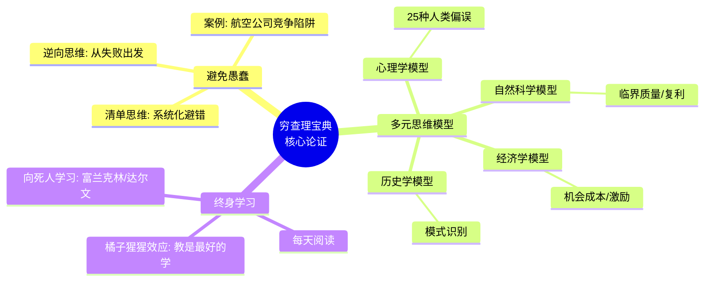

## 《穷查理宝典》读书笔记: 跨学科多元思维模型, 如何少犯蠢
  
### 作者  
digoal  
  
### 日期  
2026-04-23 
  
### 标签  
读书笔记 , 穷查理宝典 , 思维模型 , 投资哲学 , 人生智慧 , 跨学科 , 查理芒格
  
----  
  
## 背景 
---
书名: 《穷查理宝典》（Poor Charlie's Almanack）
作者: 查理·芒格（Charles T. Munger）/ 彼得·考夫曼（Peter D. Kaufman）编
出版年份: 2005（英文版）/ 2010（中文版）
笔记日期: 2025-04-23
豆瓣链接: https://book.douban.com/subject/5346316/
豆瓣评分: 9.0+
标签: [思维模型, 投资哲学, 人生智慧, 跨学科, 查理芒格]
---

# 《穷查理宝典》读书笔记

> **一句话**：一个用一生践行"像工程师一样思考"的老头，告诉你如何少犯蠢。
> **适合谁读**：想提升决策质量、对跨学科思维感兴趣、准备长期投资的人
> **阅读难度**：⭐⭐⭐☆☆（单篇演讲好读，整体体系需要自己整合）
> **推荐指数**：⭐⭐⭐⭐☆（适合慢读、常翻，不适合一口气读完）

---

## 一、时代坐标：一个异类在说话

```
1924                    1965              1994              2005
 │                       │                 │                 │
 │  芒格出生，            │  与巴菲特        │  USC演讲         │  本书出版
 │  大萧条时期成长         │  开始合作         │ "普世智慧的要素"  │  集结20年演讲
 │                       │                 │                 │
 └───────────────────────┴─────────────────┴─────────────────┘
           个人成长                合作投资             思想公开
```

这本书写于2005年，但收录的演讲横跨芒格1994年至2000年代初的公开讲话。

理解背景很重要：**20世纪末的美国正处于一个"专业化崇拜"的时代**。学科壁垒越来越高，MBA课程越来越精细，量化分析工具越来越复杂。芒格是一个刻意逆潮而行的人——他从哈佛法学院毕业，却大量阅读物理、生物、心理学；他身处投资界，却几乎从不谈技术分析。

他写这本书（或者说，别人替他编这本书）的动机，不是要教你如何选股，而是要回答一个更基本的问题：**为什么受过良好教育的聪明人，仍然会一次次做出愚蠢的决定？**

芒格自己经历过艰难。他第一段婚姻以离婚告终，第一个儿子死于白血病，他含泪在医院走廊中经历了这一切。这些经历塑造了他对"避免愚蠢"近乎偏执的重视——他深知，生活不会因为你聪明就对你客气。

---

## 二、核心命题：芒格在说什么？

### 命题一：避免愚蠢，比追求聪明更重要

这是全书最反直觉、也最核心的观点。大多数"成功学"告诉你如何做对的事，芒格说：**先搞清楚什么是错的，别去做就好了。**

这在数学上有非常干净的逻辑：如果你能把灾难性错误的概率从10%降到1%，收益远大于你把"好决策"的质量从80分提升到85分。

芒格把这叫做"逆向思维"（Inversion）：

> 我只想知道我会死在哪里，这样我就永远不去那个地方。

### 命题二：多元思维模型——不要只有一把锤子

这是芒格最著名的理论贡献。他认为，**人类最常见的认知缺陷，是用一种框架去解释所有问题**。

他有一句话说得极好：**"对只有锤子的人来说，每个问题都像钉子。"**

解药是什么？从心理学、经济学、物理学、生物学、数学、历史……各学科中提炼出最核心的"思维模型"，形成一个相互交织的"格栅"（Latticework）。当你遇到问题时，用多个不同的模型从不同角度审视，交叉验证。

### 命题三：人类心理是最大的敌人

芒格列举了25种人类常见的心理偏误（"错误倾向"），包括：
- **激励驱动的偏见**（人会合理化对自己有利的事）
- **社会认同偏见**（从众）
- **损失厌恶**（失去100元的痛苦 > 得到100元的快乐）
- **确认偏见**（只看支持自己观点的信息）

他的结论是：理性不是自然状态，**理性需要系统地对抗自己的本能**。

---

## 三、论证地图：芒格怎么说服你的？



**关键论证方式分析**：

芒格几乎不用抽象理论说话，他极度依赖**类比**和**反例**。他会从物理学的"临界质量"讲到品牌护城河，从达尔文的"进化"讲到企业的竞争优势。这让他的论述非常生动，但也造成了一个问题：有些类比并不严格成立，读者需要自己分辨。

**代表性案例**：
- 可口可乐：用"心理账户"和"品牌认知强化"解释为何定价权如此持久
- 麦当劳的系统化管理：用"checklist文化"解释如何把复杂问题简化为可执行流程
- 航空业的竞争悖论：行业整体持续亏损，但各家公司仍在竞争——激励结构的问题

---

## 四、前提假设与边界：什么情况下这不成立？

这是这本书被粉丝们忽视最多的一面。

### 假设一：理性是可以习得的

芒格的整个体系建立在"通过学习可以变得更理性"的信念上。但认知科学的研究（如Kahneman的工作）表明，**很多偏见是根植于神经结构的**，了解它们并不等于能克服它们。

芒格自己也承认，他在日常生活中并不总是理性的——但他刻意建立了系统和清单来约束自己。所以这个假设的更准确表述是：**"理性是可以通过系统设计来增强的"**，而非天生就会变好。

### 假设二：跨学科学习对所有人都有效

一个严肃的批评来自Commoncog的研究者：他按照芒格的方法大量学习跨学科知识，发现这并没有让他的决策明显变好。

可能的原因：**芒格的方法是为"高手锦上添花"设计的，不是为初学者入门设计的**。你需要先在某个领域达到相当深度，才能有效利用跨学科模型进行"类比迁移"。

### 假设三：价值投资在未来依然有效

书中的投资逻辑建立在"市场长期会回归价值"的假设上。在2005年是相对成立的，但在信息更透明、算法交易盛行的今天，这个假设受到越来越多的挑战。

**边界**：这本书的投资建议，不宜照单全收地用于今天的A股、加密货币或高频交易场景。

---

## 五、思想谱系：芒格站在谁的肩膀上？

```
本杰明·富兰克林
（实用主义、道德诫命、终身学习）
        │
        ▼
达尔文
（多变量分析、对自己想法保持怀疑）
        │
        ▼
        ├──────────────────────┐
        │                      │
本杰明·格雷厄姆             心理学研究者
（价值投资）            （Cialdini等行为科学）
        │                      │
        └──────────┬───────────┘
                   │
                   ▼
             查理·芒格
         （多元思维模型体系）
                   │
          ┌────────┴──────────┐
          │                   │
    Shane Parrish          更广泛的
   （Farnam Street）     "心智模型"运动
```

芒格对自己思想谱系的坦诚是令人钦佩的：他反复引用富兰克林、达尔文、爱因斯坦，从不假装这些想法是他自己原创的。他的核心贡献在于**整合**——把分散在各学科的"大道理"系统化，并展示如何在投资和生活决策中实际运用。

---

## 六、我学到了什么？

读完这本书，有三件事真正改变了我的思考方式：

**第一：激励结构解释了大多数"不可理解"的行为。**

以前遇到某机构做出奇怪决策，我会想"他们是不是傻？"。现在第一反应是：**"他们的激励是什么？"** 理解激励，比判断聪明与否更有用。一个律师按小时收费，就天然会把案子拖得更长——这不是道德问题，是结构问题。

**第二：清单思维的价值被严重低估。**

芒格谈到飞行员和外科医生使用清单的案例。聪明人总觉得自己不需要清单，但正是聪明人，在高压下最容易犯低级错误。我开始在重要决策前使用简单的"反检查清单"：这个决定有没有明显的我没考虑到的对手？我有没有受到近期某件事的不当影响？

**第三："橘子猩猩效应"——教才是最好的学。**

芒格说，如果你把一个想法讲给一只猩猩听，离开时你比猩猩更清晰。我开始刻意去"输出"——写笔记、讲给朋友听。这篇读书笔记本身，就是对这个方法的实践。

---

## 七、举一反三：这个框架能用在哪？

芒格的"逆向思维 + 多元模型"框架，在投资之外也很好用：

**产品设计**：不要只问"好的产品有什么特征"，先问"什么会让用户讨厌这个产品？"。从投诉出发，往往比从愿景出发更有洞察力。

**职业选择**：不要只问"我适合做什么"，先列出"什么样的工作会让我在10年后后悔"。用逆向淘汰来缩小选择范围。

**团队管理**：理解激励结构——如果员工的考核指标只有"完成任务数量"，他就会优先选择容易完成的任务，而不是重要的任务。这不是态度问题，是制度设计问题。

**学习策略**：芒格的"格栅"思维告诉我们，真正的理解是跨学科的。学统计学，要结合心理学（人如何误解概率）；学经济学，要结合历史学（理论如何在现实中失效）。

---

## 八、批判与反思

**我不完全同意的地方**：

芒格的体系有一种隐含的**精英主义气质**。"多读书、跨学科、终身学习"——这些建议对一个从小接受良好教育、有大量空闲时间的中产阶级或精英非常适用。但对一个每天12小时工作、照顾三个孩子的普通人来说，这套体系的可行性需要大幅缩减。

芒格本人出身中产、哈佛法学院毕业、早年已经财务自由——他有充足的时间和资源去构建自己的"思维格栅"。他的路径能普遍化吗？值得存疑。

**时代已经变了的地方**：

芒格高度推崇"长期持有、集中投资"。但2005年之后，全球市场的结构性变化（指数基金崛起、信息不对称缩小、美联储政策影响加剧）让这一策略的前提假设更加脆弱。他本人在晚年也承认对科技公司的忽视是一个遗憾。

**这本书最大的局限性**：

这是一本**演讲集，不是系统论著**。芒格反复讲同样的几个观点，有时前后不完全一致。如果想把它当成一套严密的方法论来学，会让你失望。它更像一个老人的人生箴言——有深刻的洞见，但需要读者自己去整合和检验。

---

## 九、金句与记忆点

1. **"我只想知道我会死在哪里，这样我就永远不去那个地方。"**
   → 逆向思维的最好注脚。避免灾难，往往比追求成功更重要。

2. **"对只有锤子的人来说，每个问题看起来都像钉子。"**
   → 单一思维框架的危险。你用什么工具，决定了你能看到什么问题。

3. **"如果你有一个想法，你必须把它反过来看。"**
   → 不是要推翻自己的想法，而是要通过压力测试让它更强。

4. **"聪明人会计算太多，而思考太少。"**
   → 警惕"精确的错误"。精密的模型，建立在错误假设上，依然是错的。

5. **"每天睡觉时，要比醒来时聪明一点点。"**
   → 复利不仅适用于金钱，也适用于知识。每天1%的进步，一年后你已经面目全非。

6. **"避开嫉妒、怨恨和自怜——这些都是让自己变差的情绪。"**
   → 这是少见的情感智慧。芒格从不在公开场合抱怨，他把精力用在他能控制的事情上。

7. **"你想得到什么，首先要让自己配得上它。"**
   → 这句话看起来像老生常谈，但放在他整个体系里，它是对"激励"逻辑的诚实延伸。

---

## 十、延伸阅读

| 书目 | 推荐理由 |
|------|----------|
| 《思考，快与慢》— 丹尼尔·卡尼曼 | 芒格的"心理学模型"章节的学术版本，更严谨更有数据支撑 |
| 《寻找智慧》— Peter Bevelin | 专门对芒格思想做了更系统的梳理，适合看完本书后深化 |
| 《影响力》— Robert Cialdini | 芒格多次引用，是理解人类说服与从众行为的标准读物 |
| 《巴菲特致股东的信》| 与本书互补，同一体系的另一面——芒格偏哲学，巴菲特偏实操 |
| 《穷理查年鉴》— 本杰明·富兰克林 | 本书标题的直接致敬对象，理解芒格精神谱系的必读参照 |

---

> *笔记写于 2025-04-23*
> *基于豆瓣书评、Goodreads评论、多篇分析文章与深度思考整理*
> *笔记本身有观点，不代表对原书的完整复述——建议结合原书阅读*
  
#### [PostgreSQL 解决方案集合](../201706/20170601_02.md "40cff096e9ed7122c512b35d8561d9c8")
  
  
#### [德哥 / digoal's Github - 公益是一辈子的事.](https://github.com/digoal/blog/blob/master/README.md "22709685feb7cab07d30f30387f0a9ae")
  
  
#### [About 德哥](https://github.com/digoal/blog/blob/master/me/readme.md "a37735981e7704886ffd590565582dd0")
  
  

  
