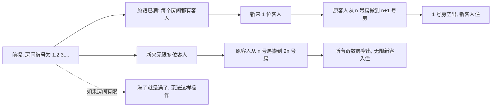
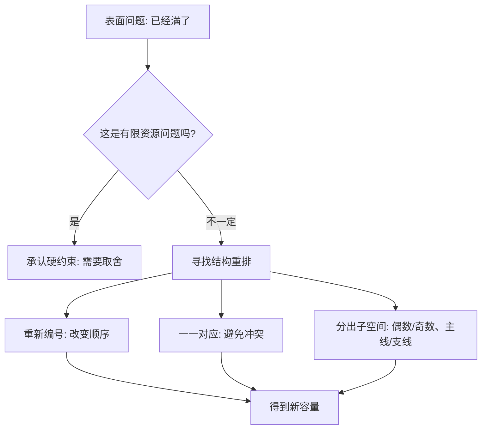

## 思维课: 希尔伯特旅馆: 无限不是“很大”, 而是另一套规则
  
### 作者  
digoal  
  
### 日期  
2026-04-23 
  
### 标签  
希尔伯特旅馆 , 无限大 , 规则 
  
----  
  
## 背景 
  
> 面向对象: 初中高年级到高中学生  
> 核心问题: 为什么一个“已经住满”的无限旅馆，还能继续接待新客人？这是不是在玩文字游戏？  
> 先说结论: 希尔伯特旅馆是一个思想实验，用来说明“可数无限”的反直觉性质: 无限集合可以和自己的真子集一样多。它不是现实中的酒店经营方案，而是帮助我们理解无限、对应关系和集合大小的数学模型。

## 一张图先看懂



这张图里最重要的不是“搬房间”，而是“编号对应”。只要每个旧客人和每个新客人都能被安排到一个不同的房间，数学上就说安排成功。

## 求真讲法

### 它到底说了什么

希尔伯特旅馆的故事大意是:

假设有一家旅馆，房间不是 100 间、10000 间，而是从 1 号、2 号、3 号一直编号下去，永远没有最后一间。现在每个房间都住了人，看起来“满房”了。

但如果来了 1 位新客人，老板可以让:

```text
1号房客人 -> 2号房
2号房客人 -> 3号房
3号房客人 -> 4号房
...
n号房客人 -> n+1号房
```

这样每位原客人都有新房间，1 号房空出来，新客人住进去。

如果来了无限多位新客人，老板还可以让原来的第 n 号房客人搬到第 2n 号房:

```text
旧客人:  1   2   3   4   5   ...
新房间:  2   4   6   8   10  ...

空房间:  1   3   5   7   9   ...
```

偶数房留给原客人，奇数房留给新客人。于是，一个“已满”的无限旅馆，仍然能容纳“无限多”新客人。

这不是说现实酒店能违反物理规律，而是在说: 对可数无限集合来说，“满”和“不能再加入”不是同一个概念。

### 它是怎么来的

希尔伯特旅馆常被归于数学家大卫·希尔伯特的思想实验，用来直观展示无限集合的性质。它背后的数学思想主要来自集合论，尤其是乔治·康托尔关于无限集合大小的研究。

在有限世界里，我们判断两个集合是否一样多，常常直接数数量:

| 集合 A | 集合 B | 是否一样多 |
|---|---|---|
| 3 个苹果 | 3 个梨 | 一样多 |
| 3 个苹果 | 4 个梨 | 不一样多 |

但无限集合不能数到最后，所以数学家改用“能不能一一对应”来比较大小。

一一对应的意思是:

| 要求 | 解释 |
|---|---|
| 每个 A 里的元素都有一个 B 里的伙伴 | 不漏掉 A |
| 每个 B 里的元素也都有一个 A 里的伙伴 | 不漏掉 B |
| 不允许两个 A 抢同一个 B | 不重复占用 |

例如自然数集合 `{1,2,3,4,...}` 和偶数集合 `{2,4,6,8,...}` 可以这样对应:

| 自然数 n | 对应的偶数 2n |
|---:|---:|
| 1 | 2 |
| 2 | 4 |
| 3 | 6 |
| 4 | 8 |
| ... | ... |

虽然偶数只是自然数的一部分，但它们可以一一对应，所以在集合论里，它们有相同的“可数无限”大小。

### 它依赖哪些假设

希尔伯特旅馆成立，依赖几个很强的理想化假设:

| 假设 | 含义 | 如果不成立会怎样 |
|---|---|---|
| 房间可数无限 | 房间编号是 1,2,3,...，没有最后一间 | 有限旅馆满了就不能再加人 |
| 每位客人愿意搬房间 | 所有人都按规则同时或顺序完成搬迁 | 现实中会有沟通、时间、成本问题 |
| 每间房只能住一位客人 | 目标是建立“一一对应” | 如果允许挤房间，问题就变成现实管理问题 |
| 不考虑物理时间和空间限制 | 数学模型只关心对应关系是否存在 | 现实酒店无法真的执行无限次安排 |
| 新客人也能被编号 | 新来的人可以排成第 1 位、第 2 位、第 3 位…… | 如果新客集合不可数，就不能用同样方法安排 |

最后一条很关键。希尔伯特旅馆能接待“无限多”新客人，指的是“可数无限多”新客人。如果新客人的数量像实数那样不可数，就不是简单让人搬到偶数房可以解决的了。

### 常见误解

**误解 1: 无限就是一个特别大的数字。**  
不是。再大的数字，比如一万亿，也仍然是有限数。无限不是某个终点，而是“没有最后一个”的结构。

**误解 2: 既然满了还能住人，说明‘满’这个词没意义。**  
在有限世界里，“满”通常表示没有空位。在希尔伯特旅馆里，“满”表示每个房间当前都有人，但因为房间是可数无限的，重新建立对应关系后仍能空出位置。

**误解 3: 无限加 1 还是无限，所以 1 个人不重要。**  
这句话容易误导。更准确的说法是: 可数无限集合加上有限个元素后，仍然可以和原集合一一对应。但这不等于“新增的人不存在”或“变化没有发生”。

**误解 4: 所有无限都一样大。**  
不对。自然数是可数无限，实数是不可数无限。康托尔证明，不同类型的无限可以有不同大小。

## 求存讲法

### 它有什么用

希尔伯特旅馆的原生用途，是帮助人理解集合论中的无限:

| 它帮助理解的概念 | 用旅馆故事怎么对应 |
|---|---|
| 可数无限 | 房间可以编号为 1,2,3,... |
| 一一对应 | 每位客人安排到唯一房间 |
| 真子集同势 | 偶数房只是房间的一部分，却能容纳所有旧客人 |
| 无限的反直觉 | “满房”仍可重新安排出空位 |
| 不同无限大小 | 可数新客能安排，不代表不可数新客也能安排 |

它的价值不在于现实可操作，而在于训练一种能力: 当直觉来自有限经验时，要警惕它被错误地搬到无限问题里。

### 它怎么迁移到熟悉领域

希尔伯特旅馆可以迁移成一种思维方式: 不要只看“当前位置满了没有”，还要看“能不能重新编号、重新组织、重新建立对应关系”。



例如学习时间看似“满了”，并不一定只能硬塞更多任务。你可以把任务重新编号:

| 原安排 | 重排思路 | 类比旅馆 |
|---|---|---|
| 每天随机背单词 | 固定早晨 10 分钟复习旧词，晚上 10 分钟学新词 | 旧客搬到偶数房，新客住奇数房 |
| 所有资料都放一个文件夹 | 按“课内、错题、拓展”编号分类 | 给每个对象唯一房间 |
| 任务来了就插队 | 设定固定入口和优先级 | 新客先编号再安排 |

### 它的适用范围和边界

希尔伯特旅馆式思维适用于:

| 适用场景 | 为什么适用 |
|---|---|
| 抽象数学问题 | 只关心结构和对应关系 |
| 信息分类 | 文件、任务、知识点可以编号和重排 |
| 流程设计 | 可以通过规则避免冲突 |
| 学习方法优化 | 可以重新组织已有时间和材料 |

但它不适用于把有限资源伪装成无限资源:

| 不适用场景 | 失败原因 |
|---|---|
| 一天只有 24 小时，却无限加任务 | 时间是有限资源 |
| 一个服务器容量固定，却无限接入用户 | 计算、内存、带宽有限 |
| 一个团队人数固定，却无限增加项目 | 注意力和协调成本有限 |
| 现实酒店房间有限，却说“重新安排就行” | 物理房间没有无限编号 |

迁移时要问一句: 我面对的是“可重排的结构问题”，还是“真实有限的资源问题”？

### 正例: 怎么用它提升能力

正例: 整理错题本。

一个学生的错题越来越多，感觉“错题本满了”，不知道怎么复习。如果只是继续往后贴，最后会变成一堆无法使用的资料。

可以用希尔伯特旅馆式思维:

1. 先给每道错题编号。
2. 把旧错题按知识点搬到“偶数页”或固定分区。
3. 把新错题放到“奇数页”或新入口。
4. 每道题都对应一个知识点、一个错误原因、一次复习时间。

这里的关键不是纸张真的无限，而是通过重新编号和分类，让原本混乱的资料重新获得可扩展结构。

### 反例: 前提不成立会怎样

反例: 给一支 5 人小组安排 20 个并行项目。

管理者说:“我们像希尔伯特旅馆一样重新安排一下，每个人多切换几个任务，就能接住更多项目。”

这个类比失败，因为“房间可数无限”这个假设不成立。团队成员的时间、注意力和沟通带宽都是有限的。强行把有限资源当成无限结构，会导致:

| 错误类比 | 实际结果 |
|---|---|
| 以为任务可以无限重排 | 切换成本急剧上升 |
| 以为每个人都能同时搬房间 | 沟通延迟和误解增加 |
| 以为编号等于完成 | 排期漂亮但交付失败 |

这说明希尔伯特旅馆不能用来给“无节制加任务”辩护。它只能提醒我们: 如果问题主要是结构混乱，重排可能创造空间；如果问题本质是资源有限，重排不能变出资源。

## 思考

希尔伯特旅馆最有意思的地方，是它逼我们承认: 人的直觉通常是在有限世界里训练出来的。

在有限世界中，部分一定比整体少。但在可数无限世界中，偶数集合只是自然数集合的一部分，却能和自然数一一对应。这不是逻辑崩坏，而是“大小”的定义换成了“一一对应”以后，得到的严肃结论。

可以继续思考三个问题:

| 问题 | 它逼你思考什么 |
|---|---|
| 如果来了 10 辆公交车，每辆车上都有无限多位客人，能不能安排？ | 多个可数无限合在一起，是否仍可数 |
| 如果每个实数都变成一位客人，能不能安排？ | 可数无限和不可数无限的差别 |
| 为什么数学愿意接受这种反直觉结论？ | 数学更看重定义、推理和一致性，而不是日常感觉 |

一个更深的问题是: 当你说“这不可能”时，你是在说它违反了逻辑，还是只是违反了你的经验？

## 最后记住

1. 希尔伯特旅馆说明: 可数无限集合即使“每个位置都被占用”，也可能通过重新对应接纳新元素。
2. 它的核心不是酒店故事，而是一一对应: `n -> n+1` 可以空出 1 号房，`n -> 2n` 可以空出所有奇数房。
3. “无限”不是一个很大的有限数；可数无限有自己的运算和比较规则。
4. 不是所有无限都一样大。自然数、偶数属于可数无限，实数属于更大的不可数无限。
5. 迁移到生活中时，先判断问题是结构可重排，还是资源真有限；不要用无限故事掩盖有限约束。

## 参考资料

- David Hilbert, 常见归属的“希尔伯特旅馆”思想实验，用于解释可数无限的反直觉性质。
- Georg Cantor, 集合论中关于无限集合、基数和可数性的经典思想。
- Herbert B. Enderton, *Elements of Set Theory*, 关于集合、函数、一一对应和可数性的标准教材体系。
- Paul R. Halmos, *Naive Set Theory*, 关于集合论基本概念的经典入门教材。
- 本文未联网检索，基于通用集合论教材体系和常见数学科普表述写成；历史细节仅作保守表述，不把思想实验来源写成未经核验的具体轶事。

   
  
#### [PostgreSQL 解决方案集合](../201706/20170601_02.md "40cff096e9ed7122c512b35d8561d9c8")
  
  
#### [德哥 / digoal's Github - 公益是一辈子的事.](https://github.com/digoal/blog/blob/master/README.md "22709685feb7cab07d30f30387f0a9ae")
  
  
#### [About 德哥](https://github.com/digoal/blog/blob/master/me/readme.md "a37735981e7704886ffd590565582dd0")
  
  

  
