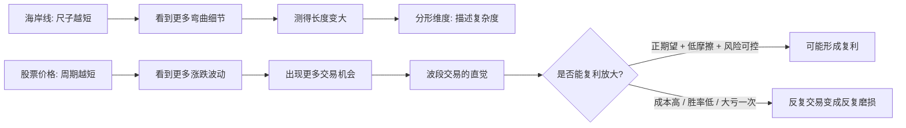

## 思维课: 分形理论与股票波段: 尺子越短, 机会就越多吗?
  
### 作者  
digoal  
  
### 日期  
2026-04-23 
  
### 标签  
分形 , 海岸线 , 丈量尺度 , 股票 , 波段 , 复利  
  
----  
  
## 背景 
  

> 面向对象: 高中生到普通投资者  
> 核心问题: 海岸线长度会随着丈量尺子变短而变长; 股票价格也在不断波动, 那么更频繁地做波段, 再把盈利复投, 是否理论上能比长期持有赚得更多?  
> 先说结论: 这确实接近“波段操作”的直觉, 但不能从分形理论直接推出“交易越频繁越赚钱”。分形告诉我们: 观察尺度越细, 看到的波动越多; 投资真正要问的是: 每次交易在扣除成本、税费、滑点和错误后, 是否仍有正期望, 并且不会被一次大亏打断复利。

## 一张图先看懂



## 求真讲法

### 它到底说了什么

分形理论研究的是一种“尺度相关的复杂形状”: 你用不同大小的尺子去观察它, 得到的结果会不同。

最经典的例子是海岸线。你用 100 公里的尺子量, 很多小海湾、小礁石都被跳过去; 你用 1 公里的尺子量, 会沿着更多弯曲走; 如果尺子继续变短, 测得长度还会继续增加。现实世界不会真的无限, 因为原子、地图精度、潮汐和地貌变化会设下物理边界; 但在一定尺度范围内, “尺子越短, 细节越多”是成立的。

可以把它想成:

```text
大尺子:  A---------B        只看大方向
中尺子:  A---\__/---B       看见海湾
小尺子:  A-\/\_/\_/\/-B     看见更多凹凸
```

股票价格也有类似的观察问题。你看月线, 可能只看到长期上升或下降; 看日线, 会看到更多回撤和反弹; 看分钟线, 又会看到更多小波动。所以“更短周期能看到更多交易机会”这个直觉是对的。

但这里有一个关键转折: 海岸线的“长度变大”是测量结果; 股票的“机会变多”不是利润。机会只有在有可执行优势时, 才会变成收益。

### 它是怎么来的

分形思想的动机是: 传统几何擅长描述直线、圆、平面, 但自然界里有大量不光滑、不规则、层层嵌套的对象, 比如云、山脉、河流、树枝、血管和海岸线。

Mandelbrot 在 1967 年的论文《How Long Is the Coast of Britain?》中指出, 许多地理曲线非常复杂, 它们的长度可能不是一个固定、容易定义的数字; 如果这些曲线在统计意义上具有自相似性, 就可以用一个介于整数之间的“分形维度”描述复杂程度。

简化表达为:

```text
普通线段: 尺子变短, 总长度基本不变
海岸线:   尺子变短, 总长度继续变大

若 L(e) 约等于 C * e^(1-D):
e = 尺子长度
D = 分形维度
当 D > 1 时, e 越小, L(e) 越大
```

注意: 这里不是说海岸线“神秘地变长了”, 而是说“长度”这个概念对不规则曲线依赖测量尺度。

把这个思想迁移到股价:

| 领域 | 被观察对象 | 尺子/尺度 | 看到的变化 | 容易犯的推论错误 |
|---|---|---|---|---|
| 海岸线 | 地理边界 | 量尺长度 | 细节越看越多 | 误以为现实中真的无限 |
| 股票 | 价格路径 | 时间周期 | 波动越看越多 | 误以为波动越多, 利润越多 |
| 投资收益 | 账户净值 | 交易频率 | 复利或亏损都会加速 | 忽略成本、税费、滑点和大亏 |

### 它依赖哪些假设

把“分形尺度”用于理解股价, 至少依赖以下假设:

1. 价格路径在某些尺度上有相似的波动特征。也就是日线、小时线、分钟线都可能出现趋势、回撤、震荡等形态。
2. 市场不是完全平滑的。价格会跳动, 信息会分批进入市场, 参与者的时间尺度不同。
3. 交易者能在某个尺度上识别出可重复的优势。只是看到波动, 不等于能预测波动。
4. 交易摩擦足够低。包括佣金、买卖价差、冲击成本、税费、错过成交、情绪失误。
5. 风险没有把复利链条打断。亏损 50% 后要赚 100% 才能回本, 一次大亏会抵消许多小胜。

### 常见误解

**误解一: 价格像海岸线一样波动, 所以越短线越赚钱。**  
不对。分形只说明“短尺度上有更多细节”, 不说明这些细节可预测, 更不说明它们扣除成本后有正收益。

**误解二: 波段操作就是复利机器。**  
不一定。复利要求每一轮之后资本基数能稳定增加。若一套波段策略的期望收益为负, 复利放大的不是收益, 而是亏损速度。

**误解三: 长期持有就是不看波动。**  
也不对。长期投资不是无视价格, 而是把价格当成报价, 把企业内在价值当成判断锚。价格波动可以提供机会, 但不能替代价值判断。

**误解四: 交易越频繁, 机会越多, 总收益自然越高。**  
频率只增加“下注次数”。若每次下注没有优势, 次数越多, 越接近成本和错误率决定的结果。

## 求存讲法

### 它有什么用

分形理论的原生价值是帮助我们理解“不规则复杂对象”。它提醒我们: 很多问题没有唯一的观察尺度。你换一把尺子, 看到的世界会变。

对投资者来说, 它的价值不是教你画线赚钱, 而是提醒你:

- 月线、周线、日线、分钟线看到的是同一个市场的不同尺度。
- 不同尺度的参与者有不同目标: 长线资金看企业价值, 中线资金看景气变化, 短线资金看订单流和情绪。
- 一个尺度上的“趋势”, 在另一个尺度上可能只是“噪音”。

### 它怎么迁移到熟悉领域

学生复习也有“尺度”:

```text
一年尺度: 高考目标
一月尺度: 一轮复习章节
一天尺度: 今天做哪套题
一题尺度: 这个知识点为什么错
```

如果只看一年目标, 太空; 如果只盯一道错题, 又容易焦虑。好的学习方法是匹配尺度: 用大尺度定方向, 用小尺度找反馈。

投资也一样:

```text
大尺度: 这是不是好资产? 是否在能力圈内?
中尺度: 估值是否合理? 资金面和行业周期是否配合?
小尺度: 买卖点、仓位、止损、成交成本是否可控?
```

### 它的适用范围和边界

这个思想适用于“理解市场结构”, 但不自动适用于“指导买卖”。

| 判断问题 | 若前提成立 | 若前提不成立 |
|---|---|---|
| 市场是否有多尺度波动? | 可以用分形视角理解价格路径 | 分形类比失效, 只是普通噪音 |
| 我是否有可重复优势? | 波段可能成为策略 | 波段只是频繁猜涨跌 |
| 成本是否足够低? | 小利润有机会保留下来 | 利润被价差、税费、错误吃掉 |
| 风险是否可控? | 复利链条不断 | 一次大亏重置多年收益 |
| 是否在能力圈内? | 可以逐步优化 | 复杂度制造虚假自信 |

所以, 对“股票价格是波动的, 理论上更频繁的交易比长期持有可以换取更大利益”这句话, 更严谨的改写是:

> 如果一个交易者在更短时间尺度上拥有稳定、可验证、扣除摩擦后仍为正的期望收益, 并能控制尾部风险, 那么更高频率的资本周转可能提高复利速度。否则, 更频繁交易只是把成本、噪音和情绪错误复利化。

### 正例: 怎么用它提升能力

一个理性的“波段 + 复利”框架不是先问“今天买哪只”, 而是先写清楚策略假设:

1. 我交易的是哪一个尺度? 日线、周线还是分钟线?
2. 我的优势来自哪里? 信息、估值、行为偏差、流动性, 还是纪律?
3. 每次交易的平均盈利是否大于平均亏损和摩擦成本?
4. 最大回撤是多少? 若连续错 5 次, 是否还能继续执行?
5. 是否有样本外验证? 不是只在过去行情里看起来漂亮。

如果这些问题答得上来, 分形视角可以帮助你识别“在哪个尺度上工作”。例如, 长线投资者可以用周线或月线避免被日内噪音牵走; 短线交易者可以用更细尺度寻找入场点, 但必须有严格的风险预算。

### 反例: 前提不成立会怎样

假设一个人看到股价每天上下波动, 于是认为:

```text
每天赚 0.5% -> 一年复利很惊人 -> 所以我要频繁交易
```

问题是, 这个推理漏掉了四个前提:

- 每天并不能稳定赚 0.5%。
- 每次买卖都有价差、滑点和税费。
- 情绪会在连续亏损时改变执行。
- 小概率大跌可能一次打掉很多小盈利。

于是实际路径可能变成:

```text
小赚 -> 小赚 -> 小亏 -> 加仓想追回 -> 大亏
```

这不是“复利”, 而是“反向复利”。复利不是频率本身带来的, 而是正期望在时间中不断再投资带来的。

## 思考

分形理论最有价值的启发, 不是“世界无限复杂”, 而是“尺度决定问题的样子”。

问股票是否适合波段操作, 不能只看价格图像像不像海岸线, 而要问:

- 我看到的是可利用的结构, 还是随机噪音?
- 我的交易频率是在提高资本效率, 还是在提高犯错频率?
- 我赚的是市场给错价的钱, 还是承担了自己没有理解的风险?
- 如果把交易记录遮住股票名字, 只看每笔期望值和回撤, 这还是一门生意吗?

巴菲特式的提醒是: 市场先生每天报价, 波动本身不等于价值变化。你可以利用报价, 但不要被报价牵着走。长期持有并不神圣, 波段交易也不邪恶; 真正的分界线是你是否知道自己在什么尺度上有优势。

## 最后记住

1. 海岸线悖论说明: 测量结果依赖尺子长度; 尺子越短, 看到的细节越多。
2. 股票价格也有多尺度波动; 更短周期会制造更多“看起来像机会”的信号。
3. 波段操作只有在扣除成本后仍有正期望时, 才可能通过复利放大收益。
4. 交易频率会同时放大优势和缺陷; 没有优势时, 它主要放大成本、噪音和情绪错误。
5. 分形视角适合用来理解复杂市场, 但不能替代价值判断、风险控制和能力圈判断。

## 参考资料

- Benoit Mandelbrot, “How Long Is the Coast of Britain? Statistical Self-Similarity and Fractional Dimension,” *Science*, 1967. IBM Research 页面: <https://research.ibm.com/publications/how-long-is-the-coast-of-britain-statistical-self-similarity-and-fractional-dimension>
- DOI 记录: <https://doi.org/10.1126/science.156.3775.636>
- SEC, “Day Trading: Your Dollars at Risk,” 2005: <https://www.sec.gov/about/reports-publications/investorpubsdaytipshtm>
- Investor.gov, “Day Trading,” SEC 投资者教育词条: <https://www.investor.gov/additional-resources/general-resources/glossary/day-trading>
- FINRA, “Day Trading”: <https://www.finra.org/investors/investing/investment-products/stocks/day-trading>
- 本文的投资部分还参考了本地 Buffett skill 中关于能力圈、市场先生、长期主义、复利、交易摩擦和行为偏差的框架。本文不构成投资建议。

    
  
#### [PostgreSQL 解决方案集合](../201706/20170601_02.md "40cff096e9ed7122c512b35d8561d9c8")
  
  
#### [德哥 / digoal's Github - 公益是一辈子的事.](https://github.com/digoal/blog/blob/master/README.md "22709685feb7cab07d30f30387f0a9ae")
  
  
#### [About 德哥](https://github.com/digoal/blog/blob/master/me/readme.md "a37735981e7704886ffd590565582dd0")
  
  

  
