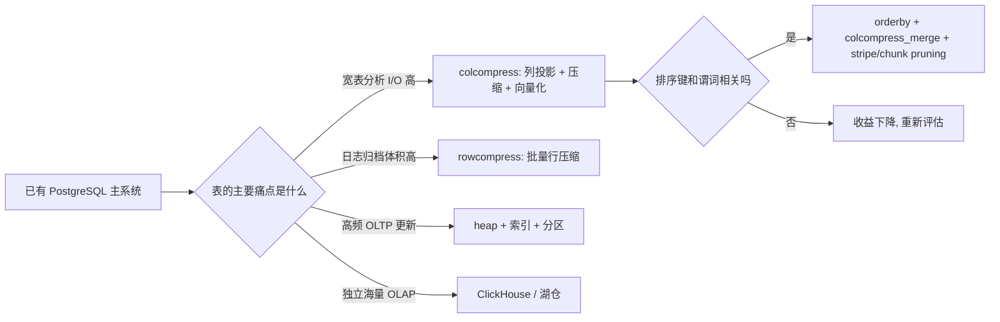
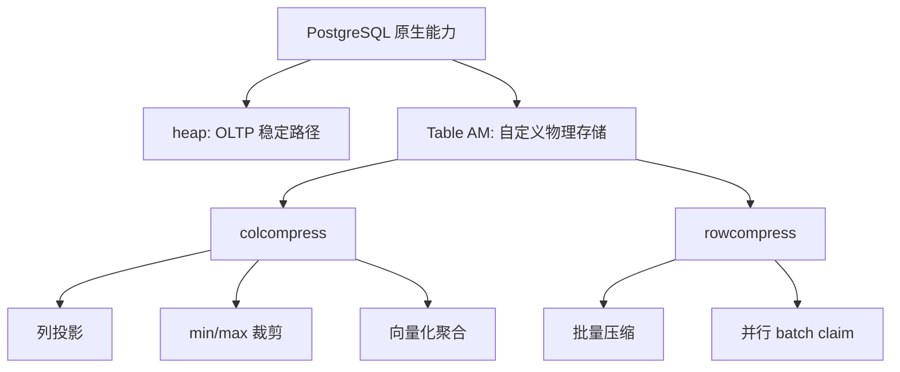
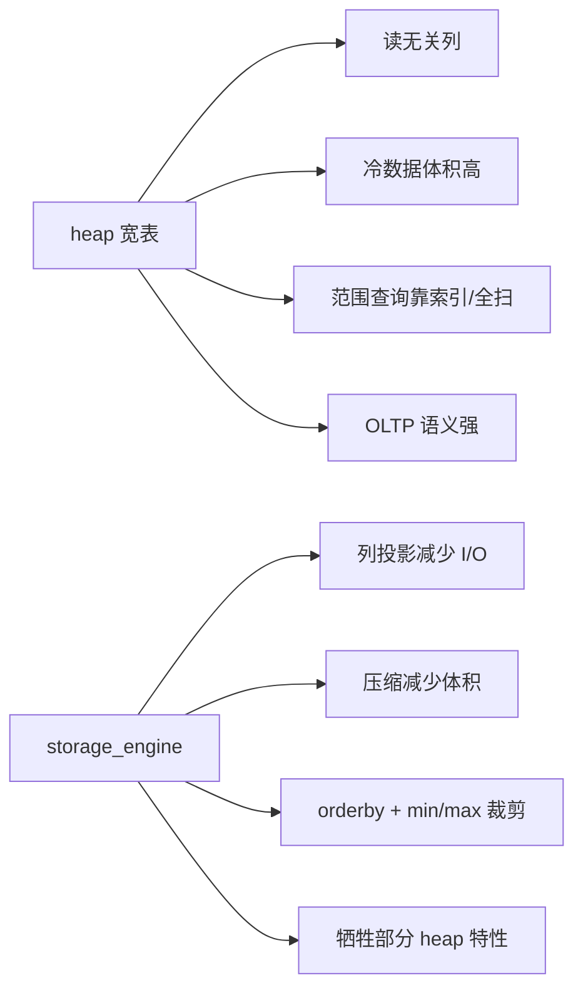
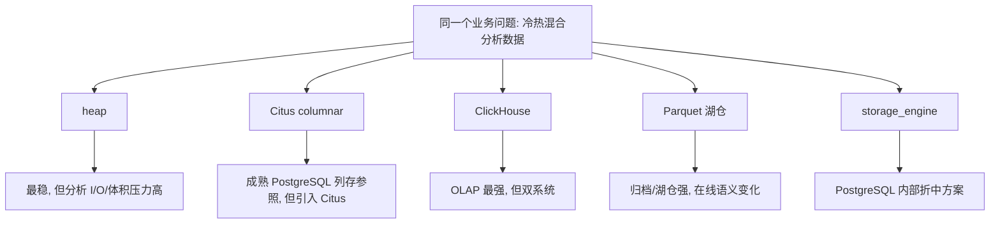
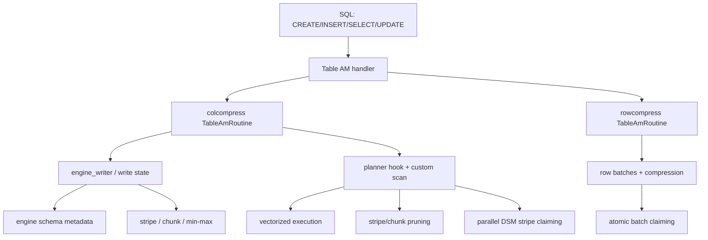
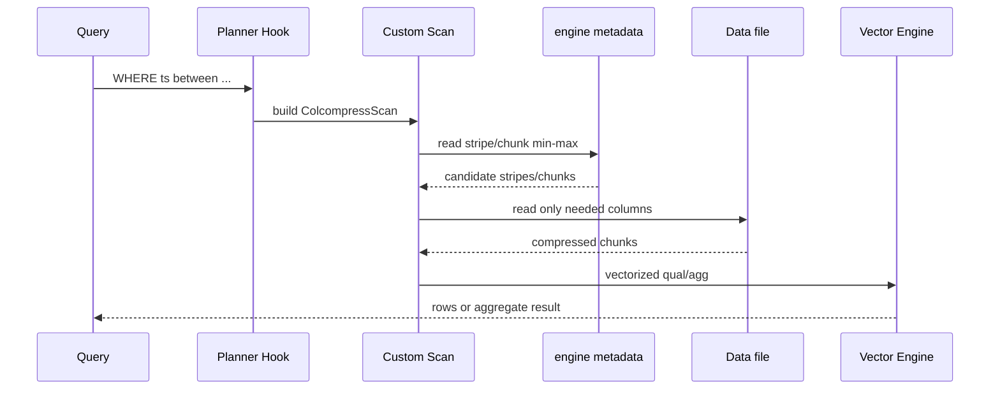
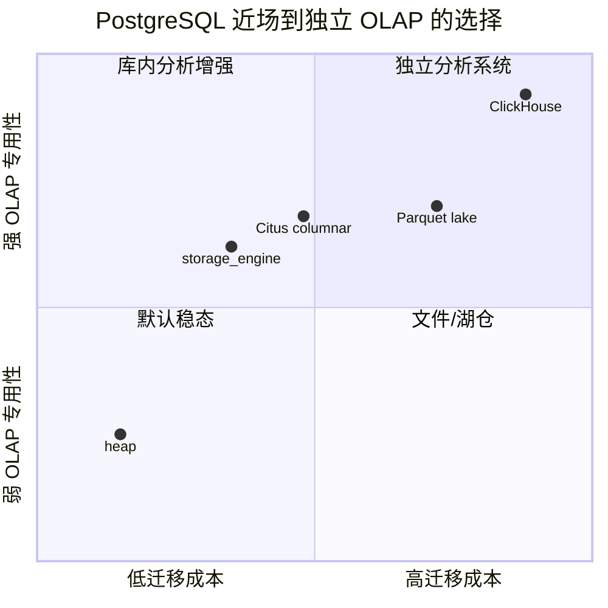
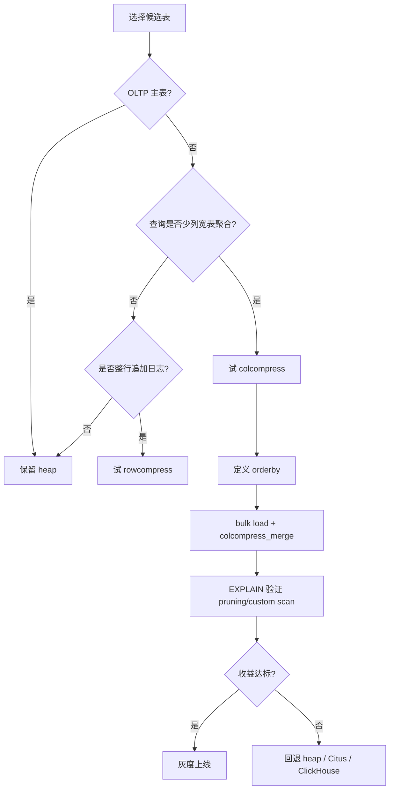
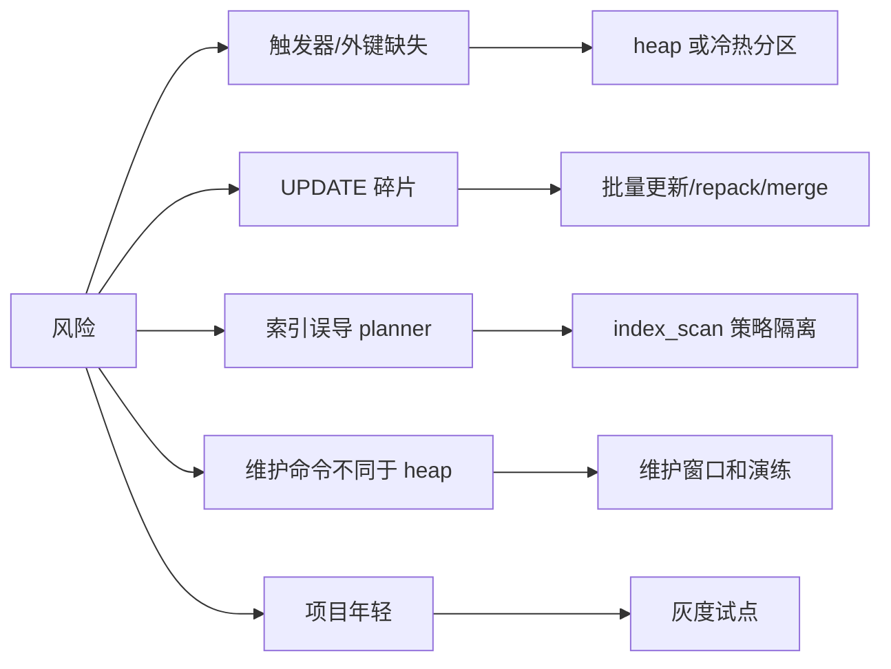

## PG 想成为HTAP数据库? 还缺一个存储引擎

### 作者
digoal

### 日期
2026-04-29

### 标签
PostgreSQL , 存储引擎 , 行列混合存储 , 行存储 , 列存储 , 压缩 , 整理 , chunk , strip , order , 向量化 

----

## 背景
HTAP, 很多PG衍生产品，特别是云厂商，都在拿存算分离，对象存储冷热分离，DuckDB插件讲故事，但这不是真正的HTAP。

要实现真正的HTAP，PG还缺一个存储引擎，得支持压缩、列存储、向量化、混合存储。

它来了。

**storage_engine：把 PostgreSQL 分析表推进到 Table AM 存储层**

`storage_engine` 的价值不是“让 PostgreSQL 变成 ClickHouse”，而是在不离开 PostgreSQL 事务、SQL、权限、扩展生态的前提下，把一部分宽表分析、日志归档、HTAP 冷热混合数据，直接下沉到 PostgreSQL Table Access Method 层做压缩、列投影、并行扫描和 zone-map 裁剪。

我的观点：如果你的系统已经以 PostgreSQL 为主库，且存在“宽表、追加多、批量更新、按时间或业务键范围分析”的表，`storage_engine` 值得作为 heap 之外的第二种物理存储选择。  
成立前提：目标表不是高频小事务 OLTP 主表；查询能受益于列投影、压缩、排序后的 min/max 裁剪或批量行压缩；团队能接受 PostgreSQL 扩展安装、重启、维护窗口和 AGPL-3.0 许可约束。  
支撑证据：项目 README 明确提供两个 Table AM：`colcompress` 和 `rowcompress`，并描述列式 stripe/chunk、向量化、DSM 并行扫描、row mask DML、压缩 codec、benchmark 复现脚本；DeepWiki 架构分析也把 `engine_tableam.c`、`rowcompress_tableam.c`、`engine_customscan.c`、`engine_planner_hook.c`、`engine_compression.c` 等模块串成完整执行链。PostgreSQL 官方文档也说明 Table AM 正是扩展自定义表存储的核心接口。  
如果前提崩塌：如果你要的是独立 OLAP 集群、分布式列存、实时高并发物化视图或跨对象存储湖仓，那么 ClickHouse、Citus、Parquet + DuckDB/Trino/Spark 可能更合理；如果你要的是强外键、AFTER ROW 触发器、频繁点更新和最稳的运维路径，继续用 heap、分区、索引和 autovacuum 更合理。



## 为什么这个问题现在值得看

PostgreSQL 从 Table Access Method API 开始，给扩展提供了自定义表存储的正式入口。官方文档说明，表访问方法由 `pg_am` 记录和 handler function 代表，handler 返回 `TableAmRoutine`，核心系统通过回调使用这个存储实现。这意味着列式、压缩、追加式等物理布局不必绕成 FDW，也不必改 PostgreSQL 内核。

`storage_engine` 正是沿着这个方向走：它不是一个查询代理，也不是外部存储格式，而是安装进 PostgreSQL 的扩展。README 说明它提供两个 Table AM：

- `colcompress`：列式压缩存储，带向量化执行、并行扫描、stripe/chunk min/max 裁剪、MergeTree-like `orderby`。
- `rowcompress`：行式批量压缩存储，面向追加日志、审计、归档类数据，支持并行扫描。

背景里的关键变化是：越来越多系统不愿意为中等规模分析另建一套 OLAP 集群，但 heap 表在宽表聚合、冷数据压缩、时间范围扫描上又成本偏高。`storage_engine` 的位置就在中间：它试图把“可压缩、可裁剪、可并行”的一部分分析能力带回 PostgreSQL 内部。



## 典型场景：DBA 不想再为一张冷热混合表付两份成本

面向 DBA、数据库架构师和平台工程师，一个很真实的场景是：

业务主库已经是 PostgreSQL。每天写入事件、日志、审计、订单流水或监控明细。热数据要在 PostgreSQL 里参与 join、权限控制、运维备份；冷数据又要做聚合、时间范围筛选、JSONB/数组过滤和报表查询。

传统做法通常有三类：

- 继续 heap：稳定，但宽表聚合读太多列，冷数据占用高。
- 拆到 ClickHouse：分析能力强，但多一套复制链路、权限模型、运维和一致性语义。
- 归档到 Parquet：成本好，但查询路径、更新语义和 PostgreSQL 内部 join 体验变了。

`storage_engine` 的答案是：仍然 `CREATE TABLE ... USING ...`，但把不同表换成不同物理 AM。宽表事实表用 `colcompress`，追加日志用 `rowcompress`，真正事务主表继续 heap。

## 痛点不是“PostgreSQL 慢”，而是 heap 的物理布局不总匹配分析查询

痛点一：宽表分析读了太多不需要的列。  
heap 按行组织，查询 30 列表中的 4 列时，I/O 和缓存行为很难只围绕这 4 列发生。`colcompress` 的列式布局让 scan 只读被查询引用的列。我的推断是：这类收益在列很多、查询列少、压缩率高、数据冷却后很少更新时更明显；如果表很窄或查询总是 `SELECT *`，列式收益会明显下降。

痛点二：时间范围查询常常想跳过整段历史。  
README 描述 `colcompress` 的 stripe 默认 150,000 行，chunk group 默认 10,000 行，每个 chunk 存 min/max。排序后的时间序列可以在执行前跳过不相交的 stripe，再在 stripe 内跳过 chunk group。这个机制和 ClickHouse/Parquet 的数据跳过思想相通：ClickHouse 官方文章强调 minmax skip index 对排序相关列有效，Parquet page index 也把 min/max 元数据用于 page skipping。

痛点三：压缩和 DML 很难同时要。  
纯 append-only 列存可以很快，但业务总会有删除、修正和补写。`storage_engine` 给 `colcompress` 加了 row mask，`UPDATE` 走 delete-then-insert；1.3.4 又把 `engine.colcompress_repack(regclass, float8)` 做成按 stripe 在线整理的 procedure，降低长期 update 后的碎片风险。但这不是免费午餐：频繁逐行 UPDATE 仍然会导致碎片和维护任务。

痛点四：运维链路不能太重。  
如果只是千万到数十亿级数据里的部分分析表，把数据同步到另一套 OLAP 系统可能比查询本身更贵。Table AM 的方案把安装复杂度集中在扩展层，但保留 PostgreSQL 的 SQL 入口和备份/权限体系。



## 对传统方案的批判：不是不好，而是边界不同

heap 的问题不是功能弱，而是它是通用行存。事务表、强约束、外键、触发器、点查和小更新，heap 仍然是 PostgreSQL 最可靠路径。但把所有历史明细、宽表报表、审计归档都塞进 heap，等于让一种物理布局承担所有工作。

Citus columnar 是更成熟的 PostgreSQL 生态参照。Microsoft 文档说明 Citus 10 引入 append-only columnar storage，适合分析和数据仓库场景，`USING columnar` 创建表，columnar stripe 默认与事务或 150,000 行相关，并建议 bulk insert 以避免小 stripe。它的问题是：如果你不需要 Citus 分布式能力，可能不想引入整个 Citus 扩展；同时 `storage_engine` 试图在 fork lineage 上加入 rowcompress、DML row mask、两级裁剪和自己的 planner/custom scan 路径。

ClickHouse 的问题不是能力不足，而是它是另一套数据库。它的 MergeTree、ORDER BY、granule、skip index 机制更完整，也更适合大规模独立 OLAP。但如果你的目标是 PostgreSQL 内部表的一部分分析加速，迁移到 ClickHouse 会引入数据复制、延迟、一致性和双系统运维。

Parquet 的问题也不是格式不好，而是它是文件格式。它非常适合湖仓、归档、跨引擎交换和对象存储，但要把 PostgreSQL 内部的在线表、权限、事务和索引语义映射过去，系统复杂度会上升。



## 产品方案：两个 AM，而不是一个万能表

`storage_engine` 的设计克制点在于它没有把所有场景塞进一个存储格式，而是拆成两个 AM：

| AM | 适合 | 机制 | 不适合 |
|---|---|---|---|
| `colcompress` | 宽表分析、范围过滤、聚合、文档压缩点查 | 列式 stripe/chunk、min/max、向量化、DSM 并行、row mask | 高频逐行 UPDATE、强外键/AFTER ROW trigger |
| `rowcompress` | 日志、审计、追加型归档、整行读取 | 固定行 batch，整批压缩，原子 batch claim 并行扫描 | 列投影、向量化聚合、细粒度列裁剪 |
| heap | OLTP 主表、强约束、点查更新 | PostgreSQL 默认行存 | 宽表冷数据压缩和列式分析 |

这意味着架构师可以按表选择，而不是按数据库选择：订单主表继续 heap，订单明细历史分区改 `colcompress`，审计日志改 `rowcompress`，需要独立海量 OLAP 的指标再进 ClickHouse。

## 架构原则：把“跳过不读”作为第一性能原则

DeepWiki 对仓库的架构拆解显示，`colcompress` 的入口在 `engine_tableam.c`，`rowcompress` 的入口在 `rowcompress_tableam.c`；压缩分发在 `engine_compression.c`；metadata 在 `engine_metadata.c`；custom scan 和 planner hook 则在 `engine_customscan.c`、`engine_planner_hook.c`、`engine_indexscan.c`；向量化在 `vectorization/` 目录。这个结构说明项目不是简单换一种落盘格式，而是从写入、元数据、规划、执行、压缩、并行和 DML 都做了闭环。



`colcompress` 的核心数据流：

1. 写入时把行转成列式 stripe，每个 stripe 拆成 chunk group。
2. 每个 chunk 存储本列 min/max 和压缩后的列数据。
3. 查询规划时 custom scan 尝试把 qual/projection 下推到列式路径。
4. 执行时先用 min/max 判断 stripe/chunk 是否可能命中。
5. 对剩余块只解压需要的列，再做向量化过滤和聚合。
6. 并行扫描时通过 DSM 让 worker 领取 stripe。

`rowcompress` 的核心数据流：

1. 写入时把 heap tuple 序列化到固定大小 batch。
2. batch 整体压缩，metadata 记录 offset、长度、行数等。
3. scan 时按 batch 解压并返回 tuple。
4. 并行 scan 时 worker 用原子计数领取 batch，减少中心调度成本。



## 效果对比：有收益，但别把 benchmark 当成生产承诺

README 给出的 benchmark 环境是 1,000,000 行、PostgreSQL 18.3、AMD Ryzen 7 5800H、40GB RAM、`shared_buffers=10GB`，`colcompress` 使用 `lz4`，并通过 `orderby = 'event_date ASC'` 和 `colcompress_merge` 形成全局排序。

在串行结果里，`colcompress` 对 Q2 `SUM/AVG` 从 heap 的 188.6ms 降到 117.4ms；Q9 LIKE text scan 从 150.9ms 降到 90.9ms；但 Q1 `count(*)` 不如 citus_columnar，Q6/Q8 这类 GIN/JSONB/array 查询 heap 也可能更好。并行结果里，Q10 heavy multi-agg 从 heap 的 1903ms 降到 641ms；但 Q3 低基数 GROUP BY 并行下 colcompress 反而慢于 heap。

我的观点：这个 benchmark 的真正价值不是证明“全面更快”，而是揭示边界。  
成立前提：你的 workload 类似宽表、聚合、列投影、范围过滤，且能维护物理排序。  
支撑证据：README 的 benchmark 同时列出了 heap、colcompress、rowcompress、citus_columnar 的胜负项，并说明 Q5 date range 能跳过 6/7 stripes。  
如果前提崩塌：如果查询依赖随机 TID、GIN 返回大量分散行、或 GROUP BY/聚合形态不适合当前向量化路径，就不要预设 colcompress 更快，应以 `tests/bench/` 改造自己的数据模型做压测。

| 维度 | 传统 heap | `colcompress` 后的预期变化 | 证据性质 |
|---|---|---|---|
| 宽表少列查询 | 读完整行相关数据 | 只读引用列 | README + 架构事实 |
| 时间范围查询 | 索引或扫描 | 排序后 stripe/chunk pruning | README benchmark |
| 多聚合 | 行式执行开销高 | vectorized aggregate 可能降低 CPU 开销 | README + DuckDB 向量化类比 |
| JSONB/array GIN | heap 成熟稳定 | 随机行访问可能抵消列存收益 | README benchmark |
| 频繁 UPDATE | heap 更自然 | row mask + append 新 stripe, 需 repack | README + CHANGELOG |

## 竞争对手对比：选项不是线性升级，而是工程取舍

| 方案 | 最强场景 | 相对 `storage_engine` 的优势 | 相对 `storage_engine` 的劣势 |
|---|---|---|---|
| heap | OLTP、强约束、小事务、外键、触发器 | PostgreSQL 默认路径，行为最稳 | 宽表分析、冷数据压缩、列投影弱 |
| Citus columnar | PostgreSQL columnar + Citus 生态 | 官方文档成熟，和 Citus 分布式体系结合 | 若不需要 Citus，部署面更大；部分场景是 append-only 列存思路 |
| ClickHouse MergeTree | 大规模 OLAP、实时分析、独立数仓 | MergeTree、primary key、skip index、物化视图生态强 | 双系统、同步链路、事务语义不同 |
| Parquet | 湖仓、归档、跨引擎交换 | 文件生态广，page/row group statistics 成熟 | 不直接保留 PostgreSQL 表内 DML/权限/事务体验 |
| DuckDB | 单机嵌入式/交互分析 | 向量化执行成熟，读 Parquet 体验好 | 不是 PostgreSQL 内部 Table AM |
| `storage_engine` | PostgreSQL 内部冷热分析表 | SQL 入口不变，按表替换 AM，兼顾压缩和 PostgreSQL 生态 | 项目年轻，限制多，生产证据少 |



## 六个适用场景

场景一：时间序列事件宽表。  
症状：`WHERE event_date BETWEEN ...` 加多个聚合，heap 扫描 I/O 高。  
为什么有帮助：`orderby='event_date ASC'` 后，`colcompress_merge()` 让 stripe 全局有序，min/max 裁剪能跳过历史区间。  
配置示例：

```sql
SELECT engine.alter_colcompress_table_set(
  'events_col'::regclass,
  orderby => 'event_date ASC, user_id ASC',
  compression => 'zstd',
  compression_level => 3,
  index_scan => false
);
SELECT engine.colcompress_merge('events_col');
```

预期信号：`EXPLAIN (ANALYZE, BUFFERS)` 中出现类似 `Engine Stripes Removed by Pruning` 的信息。  
注意：不要在 `orderby` 列上随手建 B-tree 索引，否则 planner 可能走 `randomAccess=true` 的 IndexScan，绕过 stripe pruning。

场景二：审计日志、应用日志、归档表。  
症状：写入追加多，读取通常整行查一段时间，存储体积压力大。  
为什么有帮助：`rowcompress` 以 batch 为单位压缩，适合不需要列投影的整行读取。  
配置示例：

```sql
CREATE TABLE audit_log (
  id bigserial,
  logged_at timestamptz NOT NULL,
  message text,
  payload jsonb
) USING rowcompress;

SELECT engine.alter_rowcompress_table_set(
  'audit_log'::regclass,
  batch_size => 10000,
  compression => 'zstd',
  compression_level => 5
);
```

预期信号：`engine.rowcompress_batches` 能看到 batch metadata，表体积下降。  
注意：如果查询只读少数列，`rowcompress` 不如 `colcompress`。

场景三：大文档压缩 + 主键点取。  
症状：XML/PDF/JSON 大字段占空间，但查询通常按 id 取单行。  
为什么有帮助：README 明确建议 document repository 可以打开 `index_scan=true`，让索引驱动只解压匹配行。  
配置示例：

```sql
SELECT engine.alter_colcompress_table_set(
  'documents'::regclass,
  compression => 'zstd',
  compression_level => 9,
  index_scan => true
);
```

预期信号：点查不再 full scan 大量 stripe。  
注意：这和分析型 `orderby + pruning` 是两种策略，不要混成默认方案。

场景四：ClickBench 类 unsigned bigint 数据。  
症状：`WatchID`、`UserID` 覆盖完整 unsigned 64-bit 范围，`bigint` 会出现负值语义。  
为什么有帮助：`engine.uint8` 提供 unsigned comparison、btree/hash opclass 和 vectorized min/max/sum。  
注意：这是 engine schema 下的类型和聚合，SQL 迁移时要显式检查 cast 和 search_path。

场景五：已有 Citus/Hydra lineage 经验，但想要更强 DML/rowcompress 试验。  
症状：已有 columnar 使用经验，希望在 PostgreSQL 内评估 DELETE/UPDATE、两级 pruning、rowcompress。  
为什么有帮助：项目明确继承 Hydra/Citus columnar lineage，并扩展 rowcompress、row mask DML、planner/custom scan。  
注意：这仍是年轻项目，应先从非核心表和只读副本验证。

场景六：中小规模 HTAP，不想马上引入第二数据库。  
症状：数据规模和团队复杂度还没到必须 ClickHouse，但 heap 分析已吃紧。  
为什么有帮助：按表切换 AM，可以渐进改造。  
注意：如果最终目标是 PB 级 OLAP、海量并发 dashboard 或复杂物化视图生态，ClickHouse 等系统仍应进入主方案。

## 最佳实践：先把表分层，再谈压缩率

1. 先按表定性：OLTP 主表保留 heap；宽表事实表评估 `colcompress`；追加日志评估 `rowcompress`。
2. 对 `colcompress`，先确定主过滤列和排序键。没有排序相关性，min/max 裁剪就会变弱。
3. 分析表默认关闭 `index_scan`，文档点查表才打开 `index_scan`。
4. 对 `orderby` 列避免 B-tree 索引，范围查询依赖 stripe/chunk pruning。
5. 批量导入后执行 `engine.colcompress_merge()`；1.3.4 中碎片整理使用 `CALL engine.colcompress_repack(...)`，全表按排序重写仍使用 `engine.colcompress_merge()`。
6. 对频繁 UPDATE 的表，先评估 `smart_update`、批量 rewrite 或继续 heap。不要把 row mask 当成无限更新能力。
7. 每次升级先在测试库跑 `CREATE EXTENSION`、`ALTER EXTENSION UPDATE`、benchmark 和典型 `EXPLAIN`。
8. 与 `citus` 或 `pg_cron` 同时 preload 时，README 要求 `citus` 在 `storage_engine` 前面。
9. 监控维度至少包括表大小、stripe/chunk/batch 数、dead row 比例、repack 时间、查询计划是否走 custom scan。
10. 许可上按 AGPL-3.0 做合规评审，尤其是发行修改版或商业集成场景。



## 动手步骤

以下命令来自 README，并按 PostgreSQL 18 举例；如果你的 PostgreSQL 版本不同，替换对应 `PG_CONFIG`。

安装依赖：

```bash
sudo apt update
sudo apt install -y build-essential postgresql-server-dev-18 liblz4-dev libzstd-dev
```

构建安装：

```bash
sudo make -j$(nproc) install PG_CONFIG=/usr/lib/postgresql/18/bin/pg_config
```

配置 `postgresql.conf`：

```conf
shared_preload_libraries = 'storage_engine'
```

如果同时使用 `pg_cron`、`citus`：

```conf
shared_preload_libraries = 'pg_cron,citus,storage_engine'
```

重启 PostgreSQL 后：

```sql
CREATE EXTENSION storage_engine;
```

创建两类表：

```sql
CREATE TABLE events_col (
  event_date date NOT NULL,
  user_id bigint,
  event_type text,
  value float8,
  metadata jsonb
) USING colcompress;

CREATE TABLE logs_row (
  id bigserial,
  logged_at timestamptz NOT NULL,
  message text
) USING rowcompress;
```

设置列式表选项并整理：

```sql
SELECT engine.alter_colcompress_table_set(
  'events_col'::regclass,
  orderby => 'event_date ASC, user_id ASC',
  compression => 'zstd',
  compression_level => 3,
  index_scan => false
);

SELECT engine.colcompress_merge('events_col');
```

验证计划：

```sql
EXPLAIN (ANALYZE, BUFFERS)
SELECT event_type, count(*), avg(value)
FROM events_col
WHERE event_date >= current_date - interval '30 days'
GROUP BY 1;
```

维护碎片，按 1.3.4 changelog 使用 procedure：

```sql
CALL engine.colcompress_repack('events_col'::regclass);
CALL engine.colcompress_repack('events_col'::regclass, 0.7);
```

如果需要全表重新按 `orderby` 排序，使用：

```sql
SELECT engine.colcompress_merge('events_col');
```

复现 benchmark：

```bash
createdb bench_am
psql -d bench_am -f tests/bench/setup.sql

bash tests/bench/run.sh 3
python3 tests/bench/chart.py

bash tests/bench/run_parallel.sh 3
python3 tests/bench/chart_parallel.py
```

回滚思路：

```sql
CREATE TABLE events_heap AS SELECT * FROM events_col;
DROP TABLE events_col;
ALTER TABLE events_heap RENAME TO events_col;
```

实际生产回滚要补齐索引、权限、约束、触发器和依赖对象，不能只执行上述三句。

## 风险、限制和失败条件

限制一：不支持 AFTER ROW triggers 和 foreign keys。  
这会直接影响强约束业务表、pg_repack、审计触发器和复杂级联引用。前提崩塌后的方案是：该表保留 heap，或把冷历史分区单独迁移为 `colcompress`。

限制二：`VACUUM FULL`、`CLUSTER`、unlogged table 等路径不可按 heap 经验直接套用。  
前提崩塌后的方案是：为 `colcompress_merge`、`rowcompress_repack`、`colcompress_repack` 设计维护窗口和回滚脚本。

限制三：B-tree index 可能破坏分析型 pruning 路径。  
前提崩塌后的方案是：不要把 `orderby` 列建成普通 B-tree 分析索引；如果必须点查，考虑单独 document table 或继续 heap。

限制四：UPDATE 是 row mask + append，新版本通过 repack 改善碎片，但不是高频 OLTP 更新模型。  
前提崩塌后的方案是：高频更新表继续 heap；批量修正用 `smart_update`、clone/truncate/reinsert 或离线 merge。

限制五：生产案例证据仍不足。  
当前公开证据主要来自 README benchmark、PGXN/PostgreSQL announce、作者文章、DeepWiki 架构分析和仓库代码。我的推断是：它适合先从内部非核心分析表试点，而不是直接替换关键账务表。

限制六：网页版本信息存在滞后。  
本地仓库 `VERSION`、`META.json`、`storage_engine.control` 和 `CHANGELOG.md` 均显示当前版本为 1.3.4；PGXN 搜索页在抓取时展示的最新稳定版本滞后于本地仓库状态。本文以当前工作区和 GitHub README/代码为产品事实，以 PGXN/公告作为生态可见度证据，不把 stars 或 release HTML 作为关键判断依据。



## 结论：把它当成 PostgreSQL 内部的“物理存储选择”，不是万能 OLAP

`storage_engine` 最有意思的地方，是它把分析优化放在 PostgreSQL Table AM 这个正确层级：不是把查询导到外部系统，也不是只做 SQL rewrite，而是让表本身拥有不同物理形态。

我的最终建议：对已有 PostgreSQL 系统，先选三类候选表做 POC：宽表事实表、追加日志表、大文档压缩表。每张表用真实查询跑 heap 对照、`EXPLAIN` 对照、压缩率对照和维护脚本演练。只要收益来自“少读列、少读 stripe、少解压、并行处理”，`storage_engine` 就有采用价值；如果收益依赖它像 ClickHouse 一样承担完整 OLAP 平台职责，或者像 heap 一样承担强事务主表职责，那就是错配。

## 参考资料

- storage_engine GitHub README: https://github.com/saulojb/storage_engine
- storage_engine 本地 `VERSION` / `META.json` / `CHANGELOG.md`：当前工作区显示 1.3.4。
- PostgreSQL Table Access Method 文档: https://www.postgresql.org/docs/current/tableam.html
- PostgreSQL `CREATE ACCESS METHOD` 文档: https://www.postgresql.org/docs/current/sql-create-access-method.html
- DeepWiki 架构结构页: https://deepwiki.com/saulojb/storage_engine
- DeepWiki 架构问答: https://deepwiki.com/search/analyze-the-architecture-of-st_0d962844-9fd7-457f-aabc-f4a3bc1a9602
- DeepWiki tradeoff 问答: https://deepwiki.com/search/what-are-the-main-extension-po_8c921875-94d0-4812-af76-33fc504b497b
- PGXN storage_engine 页面: https://pgxn.org/dist/storage_engine/
- PostgreSQL announce: storage_engine 1.0.7: https://www.postgresql.org/about/news/storage_engine-107-columnar-row-compressed-table-access-methods-for-postgresql-16-18-3279/
- 作者 DEV 文章: https://dev.to/saulojb/storageengine-two-high-performance-table-access-methods-for-postgresql-analytics-and-htap-4hgp
- Microsoft Citus columnar storage 文档: https://learn.microsoft.com/en-us/postgresql/citus/table-management?view=citus-14
- ClickHouse index-based pruning: https://clickhouse.com/blog/index-based-pruning
- Apache Parquet page index: https://parquet.apache.org/docs/file-format/pageindex/
- DuckDB vectorized execution format: https://duckdb.org/docs/lts/internals/vector

## 校验记录

- 已按顺序读取 README，再使用 DeepWiki，再进行网页搜索。
- 核心能力均对应 README、本地元数据、DeepWiki 或官方生态资料。
- benchmark 数字只引用 README 场景，并明确其硬件、数据量和局限。
- 竞争对手对比使用 PostgreSQL、Citus、ClickHouse、Parquet、DuckDB 官方或一手资料。
- 版本差异和公开生产案例不足已作为证据缺口写入文中。
- Hands-on 命令按 README/CHANGELOG 当前语义整理，特别区分 1.3.4 的 `CALL engine.colcompress_repack(...)` 与旧版 alias。
  
  
#### [PostgreSQL 解决方案集合](../201706/20170601_02.md "40cff096e9ed7122c512b35d8561d9c8")
  
  
#### [德哥 / digoal's Github - 公益是一辈子的事.](https://github.com/digoal/blog/blob/master/README.md "22709685feb7cab07d30f30387f0a9ae")
  
  
#### [About 德哥](https://github.com/digoal/blog/blob/master/me/readme.md "a37735981e7704886ffd590565582dd0")
  
  

  
