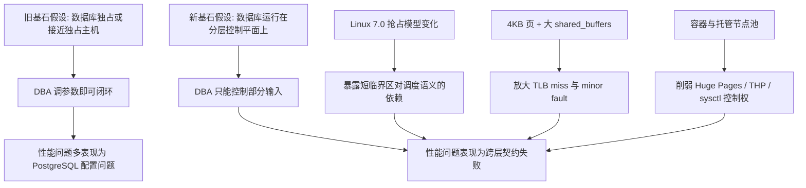
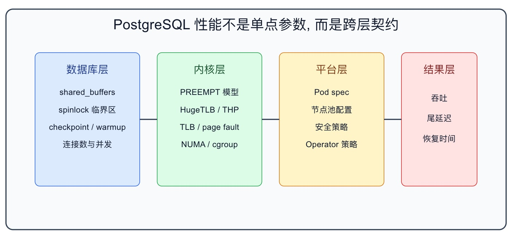

## Linux 7.0 导致 PG 性能腰斩的问题, 是被人恶意放大的

### 作者
digoal

### 日期
2026-04-29

### 标签
PostgreSQL , Linux 内核 , 调度 , CPU 抢占模式 , 性能 , 控制面 

----

## 背景
还记得这篇文章吗? [《PG用户怒了，Linux 7.0 新内核导致PG性能暴跌50%》](../202604/20260408_01.md)  

今天有一篇文章要来平反: Linux 7.0 导致 PG 性能腰斩的问题, 其实是被人恶意放大的! 

https://mydbanotebook.org/posts/postgres-performance-regression-are-we-there-yet/

但我觉得还不够深刻, 所以我又写了今天这篇.

> 一句话新结论: Linux 7.0 的 PREEMPT_NONE 变化不是 PostgreSQL 性能灾难的根因, 它只是把一个更深的问题照亮了: 现代数据库性能越来越取决于数据库、内核、虚拟化和编排平台之间的控制权是否完整。

## 旧文真正说了什么

Lætitia Avrot 的文章《Postgres performance regression: are we there yet?》讨论了一个容易制造恐慌的事件: 有 benchmark 显示 Linux 7.0 下 PostgreSQL 吞吐量相比 Linux 6.x 只剩约 0.51x。旧文的价值在于, 它没有停留在标题党层面, 而是把问题拆回到调度、spinlock、页表和容器部署边界。

旧文的核心主张有六个。

第一, PostgreSQL 不是突然变慢了。过去十多年, PostgreSQL 的优化器和执行能力一直在进步。Ryan Marcus 用 Join Order Benchmark 比较 PostgreSQL 8 到 16, 得出的结论是性能有持续改善, 其中回归分析显示每个大版本平均带来约 15% 的性能改善。这构成了旧文的背景假设: PostgreSQL 项目本身不是一个停滞系统。

第二, Linux 7.0 的调度变化确实有理论风险。Peter Zijlstra 的 Linux commit `7dadeaa6e851` 将支持 PREEMPT_LAZY 的主流架构限制到 full 和 lazy 两种抢占模型, 传统 server 场景常用的 PREEMPT_NONE 不再是这些架构上的常规选项。旧文认为, PostgreSQL 的某些短临界区依赖一个隐含前提: 拿到 spinlock 的线程会很快释放锁, 不会在关键路径中间被调度器拿走 CPU。

第三, 0.51x benchmark 不是通用生产结论。旧文指出, AWS 工程师 Salvatore Dipietro 的测试是在 96 vCPU Graviton4、1024 clients、96 threads、100GB 以上 shared buffers 的配置下跑 pgbench, 并且脚本显式设置 `huge_pages=off`。这不是“所有 PostgreSQL 在 Linux 7.0 上减半”, 而是一个极端条件组合。

第四, 真正的放大器是 4KB 页导致的 TLB miss 与 minor page fault。没有 Huge Pages 或 THP 时, 100GB 级 shared memory 会被映射成大量 4KB 页。冷启动或 buffer pool 预热时, 首次触达页面会触发 minor fault。如果这发生在持有 spinlock 的线程上, 等锁的线程会白白自旋。PREEMPT_LAZY 进一步放大这种等待, 但并不是唯一根因。

第五, 被测路径更像预热阶段而不是稳定态。旧文强调, 争用的 `StrategyGetBuffer()` 主要出现在 buffer pool 装载页面的阶段。当 freelist 消耗完、系统进入稳定态, 这条路径的意义会下降。因此把冷启动瞬间放大成长期吞吐结论, 逻辑上有误导性。

第六, 容器才是更值得担心的现实问题。裸机或专用 VM 上, DBA 往往能打开 explicit Huge Pages 或调整 THP。但容器环境里, THP 是 host 级 sysfs 策略, explicit Huge Pages 也需要宿主机预留池。Kubernetes 虽能把 hugepages 作为可调度资源, 但节点必须先预分配。数据库进了容器, 常常失去对内核内存策略的直接控制权。

压缩成一句话: 旧文认为, “Linux 7.0 让 PostgreSQL 减半”这个说法过度简化；更准确的结论是, 在大 shared_buffers、冷启动、高并发、未启用 huge pages、调度模型变化叠加时, PostgreSQL 的短临界区假设会被打穿, 而容器化让修复手段变得不容易。

## 旧逻辑的关键漏洞

旧文的方向是对的, 但它还没有走到最底层。

第一个漏洞是, 文章仍然把“开启 Huge Pages 或 THP”写成主要修复动作, 但没有把它上升为“控制权归属”问题。PostgreSQL 官方文档确实说明, explicit `huge_pages` 可以减少大块共享内存的管理开销, 但它要求操作系统预留足够 huge pages, 并且 `huge_pages=on` 时资源不足会导致服务无法启动。换句话说, 这不是一个单纯的 PostgreSQL GUC, 而是一个跨越数据库配置、内核参数、启动时机和权限边界的系统契约。

第二个漏洞是, 旧文没有充分区分三类性能风险: 稳定态吞吐、冷启动恢复、尾延迟。benchmark 中最醒目的 0.51x 是吞吐数字, 但背后的危险更像“恢复窗口”和“尾部抖动”。对于数据库生产系统, 冷启动、failover、扩容、Pod 重建、节点驱逐后的恢复性能, 往往比平时稳定态 TPS 更决定事故半径。

第三个漏洞是, 旧文把容器问题主要放在 Huge Pages 和 THP 上, 但容器化真正改变的是 DBA 的工作边界。传统 DBA 控制数据库进程、主机内核、磁盘调度、NUMA、HugeTLB、sysctl、cgroup。云原生部署以后, 这些权力被拆给镜像、Pod spec、Operator、节点池、云厂商、内核版本和安全策略。性能退化不再只是“参数没调好”, 而是“负责数据库结果的人没有控制数据库所需的全部输入”。

第四个漏洞是, 文章把 rseq 作为 Linux 社区的方向, 但没有讲清它的工程含义。Linux rseq 文档说明, scheduler time slice extension 允许线程在进入临界区后请求时间片延长, 避免线程在持有资源时被调出。但这要求内核、libc、应用和具体临界区代码协同采用。对于 PostgreSQL 这样的成熟系统, 这不是 DBA 能在 `postgresql.conf` 里打开的开关, 而是数据库内核与 Linux ABI 之间的长期适配。

因此, 旧文不是错, 而是不够高。它解释了“为什么这次 benchmark 不必恐慌”, 但更大的问题是: 数据库系统正在进入一个跨层耦合更强、但控制权更分散的阶段。

## 如果基石假设崩塌: 新假设是什么

旧文的隐含基石假设是:

> 只要 PostgreSQL 配置合理, 内核和运行环境会提供足够稳定的底层语义, 数据库可以把 OS 当成相对可控的执行平台。

这个假设正在变脆。

新的基石假设应该是:

> 数据库性能不是 PostgreSQL 单体的属性, 而是“数据库内核假设”和“运行时控制平面能力”之间的匹配度。谁控制内存页大小、调度模型、NUMA、cgroup、容器安全策略和节点生命周期, 谁就控制了数据库性能的下限。

## 新观点: 性能回归本质是控制平面回归

把这件事看成“Linux 7.0 是否会让 PostgreSQL 慢一半”, 层次太低。

更高阶的问题是: PostgreSQL 的性能假设正在从“进程内算法”外溢到“整机运行时契约”。只看 SQL、索引、shared_buffers、work_mem 已经不够。你还要知道 PostgreSQL 的共享内存到底落在 4KB 页、2MB 页还是 1GB 页上；你要知道持有短锁的线程会不会在错误时刻被调度出去；你要知道 Pod 能不能继承、申请或影响宿主机的 HugeTLB 池；你要知道云厂商的 managed node pool 是否允许你触碰这些参数。

PostgreSQL 官方文档对 explicit Huge Pages 的描述很清楚: `huge_pages` 控制主共享内存区是否请求 huge pages, 默认 `try`, `on` 会在资源不足时阻止启动；使用 huge pages 可以减少大块内存的管理开销。它还提醒 THP 在某些 Linux 版本上曾导致 PostgreSQL 性能下降, 因而官方仍倾向于 explicit huge pages, 而不是无条件推荐 THP。

Linux 官方 THP 文档则显示, THP 的策略由 `/sys/kernel/mm/transparent_hugepage/...` 这类系统路径控制, 并且不同大小的 THP、tmpfs/shmem 策略、应用重启时机都会影响实际生效。Kubernetes 官方文档也明确, huge pages 必须由节点预先分配, kubelet 才能把它们报告为可调度资源；Pod 只是消费已经存在的资源, 不能凭空创建节点级 huge pages。

这三个事实合在一起, 会推出一个更硬的结论:

> 数据库的性能参数正在从数据库配置文件迁移到平台控制平面。没有节点控制权, 就没有完整的数据库性能控制权。

这也是为什么“容器里跑 PostgreSQL”不是一句简单的是非题。容器不是天然慢, Kubernetes 也不是天然不适合数据库。真正的问题是, 你的数据库 SLO 是否被写进了节点层、内核层和调度层的契约。

如果你的 PostgreSQL 只是一个普通 Pod, 使用通用节点池, 无法约束内核版本, 无法预留 huge pages, 无法定义 THP 策略, 无法确保 NUMA 和 CPU 拓扑, 无法控制节点重启与 Pod 重建节奏, 那么数据库虽然“部署成功”, 但性能工程没有闭环。

<svg role="img" aria-label="PostgreSQL 性能控制权分层图" viewBox="0 0 900 420" xmlns="http://www.w3.org/2000/svg">
  <rect x="20" y="20" width="860" height="380" rx="12" fill="#f8fafc" stroke="#334155" stroke-width="2"/>
  <text x="450" y="55" text-anchor="middle" font-size="24" font-family="Arial" fill="#0f172a">PostgreSQL 性能不是单点参数, 而是跨层契约</text>

  <rect x="70" y="95" width="180" height="230" rx="8" fill="#dbeafe" stroke="#2563eb"/>
  <text x="160" y="130" text-anchor="middle" font-size="18" font-family="Arial" fill="#1e3a8a">数据库层</text>
  <text x="160" y="168" text-anchor="middle" font-size="14" font-family="Arial" fill="#0f172a">shared_buffers</text>
  <text x="160" y="198" text-anchor="middle" font-size="14" font-family="Arial" fill="#0f172a">spinlock 临界区</text>
  <text x="160" y="228" text-anchor="middle" font-size="14" font-family="Arial" fill="#0f172a">checkpoint / warmup</text>
  <text x="160" y="258" text-anchor="middle" font-size="14" font-family="Arial" fill="#0f172a">连接数与并发</text>

  <rect x="280" y="95" width="180" height="230" rx="8" fill="#dcfce7" stroke="#16a34a"/>
  <text x="370" y="130" text-anchor="middle" font-size="18" font-family="Arial" fill="#14532d">内核层</text>
  <text x="370" y="168" text-anchor="middle" font-size="14" font-family="Arial" fill="#0f172a">PREEMPT 模型</text>
  <text x="370" y="198" text-anchor="middle" font-size="14" font-family="Arial" fill="#0f172a">HugeTLB / THP</text>
  <text x="370" y="228" text-anchor="middle" font-size="14" font-family="Arial" fill="#0f172a">TLB / page fault</text>
  <text x="370" y="258" text-anchor="middle" font-size="14" font-family="Arial" fill="#0f172a">NUMA / cgroup</text>

  <rect x="490" y="95" width="180" height="230" rx="8" fill="#fef3c7" stroke="#d97706"/>
  <text x="580" y="130" text-anchor="middle" font-size="18" font-family="Arial" fill="#78350f">平台层</text>
  <text x="580" y="168" text-anchor="middle" font-size="14" font-family="Arial" fill="#0f172a">Pod spec</text>
  <text x="580" y="198" text-anchor="middle" font-size="14" font-family="Arial" fill="#0f172a">节点池配置</text>
  <text x="580" y="228" text-anchor="middle" font-size="14" font-family="Arial" fill="#0f172a">安全策略</text>
  <text x="580" y="258" text-anchor="middle" font-size="14" font-family="Arial" fill="#0f172a">Operator 策略</text>

  <rect x="700" y="95" width="130" height="230" rx="8" fill="#fee2e2" stroke="#dc2626"/>
  <text x="765" y="130" text-anchor="middle" font-size="18" font-family="Arial" fill="#7f1d1d">结果层</text>
  <text x="765" y="178" text-anchor="middle" font-size="14" font-family="Arial" fill="#0f172a">吞吐</text>
  <text x="765" y="213" text-anchor="middle" font-size="14" font-family="Arial" fill="#0f172a">尾延迟</text>
  <text x="765" y="248" text-anchor="middle" font-size="14" font-family="Arial" fill="#0f172a">恢复时间</text>

  <path d="M250 210 L280 210" stroke="#334155" stroke-width="2" marker-end="url(#arrow)"/>
  <path d="M460 210 L490 210" stroke="#334155" stroke-width="2" marker-end="url(#arrow)"/>
  <path d="M670 210 L700 210" stroke="#334155" stroke-width="2" marker-end="url(#arrow)"/>

  <text x="450" y="365" text-anchor="middle" font-size="16" font-family="Arial" fill="#0f172a">任何一层失去控制权, 都可能把局部机制问题放大成生产性能问题</text>
  <defs>
    <marker id="arrow" markerWidth="10" markerHeight="10" refX="8" refY="3" orient="auto" markerUnits="strokeWidth">
      <path d="M0,0 L0,6 L9,3 z" fill="#334155"/>
    </marker>
  </defs>
</svg>
  
  

## 三类系统要分开判断

第一类是裸机或强控制 VM。你能控制内核版本、boot 参数、sysctl、HugeTLB 池、PostgreSQL 参数和压测流程。对这类系统, Linux 7.0 事件的正确动作不是恐慌, 而是建立升级前基准: 冷启动、预热、稳定态、failover 后恢复、尾延迟都要测。explicit Huge Pages 优先；如果评估 THP, 要把延迟抖动也纳入指标, 不能只看平均 TPS。

第二类是可控 Kubernetes。你能控制节点池, 能预分配 huge pages, 能用 taint/toleration 或 node affinity 给数据库专用节点, 能用 Operator 固化内核和数据库参数契约。对这类系统, PostgreSQL 可以容器化, 但数据库 Pod 不应和普通 stateless workload 共用一套模糊资源策略。数据库不是“镜像能跑就算完成”, 而是要把底层依赖写成基础设施代码。

第三类是不可控托管容器。你不能控制宿主机 THP, 不能预留 huge pages, 不能决定内核小版本, 不能使用 privileged DaemonSet, 也不能确认节点生命周期。对这类系统, 大 shared_buffers、高并发、冷启动敏感的 PostgreSQL 就不应该只按稳定态 benchmark 做判断。你要么降低对本地 buffer pool 的依赖, 要么选择有数据库级性能契约的托管数据库, 要么把节点控制权拿回来。

## 逻辑三洽检验

- 自洽: 新观点把性能回归定义为“数据库假设与运行时控制能力不匹配”, 因此能同时解释 PREEMPT_LAZY、4KB 页、Huge Pages、THP、容器权限边界和冷启动 benchmark, 不需要把任何单点因素夸大成唯一根因。
- 他洽: 它保留旧文有效观察: benchmark 条件极端, Huge Pages/THP 能缓解, 容器是现实难点。同时也能解释 PostgreSQL 官方文档为什么推荐 explicit huge pages, Linux 文档为什么把 THP 暴露为系统级策略, Kubernetes 为什么要求节点预分配 huge pages。
- 续洽: 如果这个观点正确, 未来类似性能事件会越来越多地表现为“数据库版本没变, SQL 没变, 但节点镜像、内核配置、容器运行时或云厂商策略一变, 性能曲线就变”。反过来, 如果平台能把这些底层契约产品化, 同样的数据库版本会表现得更稳定。

## 未来主要观测信号

第一, PostgreSQL 是否会在核心代码中采用 rseq 或类似机制保护更短的用户态临界区。如果会, 说明数据库内核正在主动适配更可抢占的 Linux 世界。

第二, 主流发行版在 Linux 7.0 及之后版本中, 是否默认启用 rseq slice extension, 以及是否给数据库类 workload 提供清晰的调度策略建议。

第三, Kubernetes 生态是否把 huge pages、THP、NUMA、CPU pinning、节点内核策略纳入数据库 Operator 的一等能力, 而不是留给用户手写节点脚本。

第四, 云厂商的 managed PostgreSQL 与自建 PostgreSQL on Kubernetes 的性能差距, 是否更多出现在 cold start、failover recovery 和 p99/p999 延迟, 而不是平均 TPS。

第五, PostgreSQL 官方文档对 THP 的态度是否会随着 Linux THP/mTHP 机制演进而改变。现在官方仍提醒 THP 在某些版本上曾造成性能下降, 因此需要版本、内核和 workload 绑定评估。

## 结论

这次争议不应该被读成“Linux 7.0 危险”。

它真正提醒我们: 数据库性能工程已经从单机调参时代进入控制平面时代。

以前, DBA 问的是: `shared_buffers` 多大, `work_mem` 多大, checkpoint 怎么设。

现在, 还必须问: 谁控制节点内核? 谁控制页大小? 谁控制调度模型? 谁控制容器能看到的 sysfs? 谁控制 huge pages 的预留池? 谁为 failover 后的冷启动性能负责?

如果这些问题没有主人, 那么所谓“PostgreSQL 性能回归”就会反复出现。它每次看起来都像某个新版本、某个内核 patch、某个云平台策略导致的事故；但底层其实是同一个问题: 数据库还在承担性能责任, 却已经失去了完成责任所需的控制权。

## 参考来源

- [Postgres performance regression: are we there yet?](https://mydbanotebook.org/posts/postgres-performance-regression-are-we-there-yet/)
- [Linux commit 7dadeaa6e851: sched: Further restrict the preemption modes](https://github.com/torvalds/linux/commit/7dadeaa6e851)
- [PostgreSQL 18 Documentation: Linux Huge Pages](https://www.postgresql.org/docs/18/kernel-resources.html)
- [PostgreSQL current Documentation: Resource Consumption, huge_pages](https://www.postgresql.org/docs/current/static/runtime-config-resource.html)
- [Linux Kernel Documentation: Transparent Hugepage Support](https://docs.kernel.org/admin-guide/mm/transhuge.html)
- [Linux Kernel Documentation: Restartable Sequences](https://docs.kernel.org/userspace-api/rseq.html)
- [Kubernetes Documentation: Manage HugePages](https://kubernetes.io/docs/tasks/manage-hugepages/scheduling-hugepages/)
- [Ryan Marcus: Ten years of improvements in PostgreSQL's optimizer](https://rmarcus.info/blog/2024/04/12/pg-over-time.html)

  
#### [PostgreSQL 解决方案集合](../201706/20170601_02.md "40cff096e9ed7122c512b35d8561d9c8")
  
  
#### [德哥 / digoal's Github - 公益是一辈子的事.](https://github.com/digoal/blog/blob/master/README.md "22709685feb7cab07d30f30387f0a9ae")
  
  
#### [About 德哥](https://github.com/digoal/blog/blob/master/me/readme.md "a37735981e7704886ffd590565582dd0")
  
  

  
