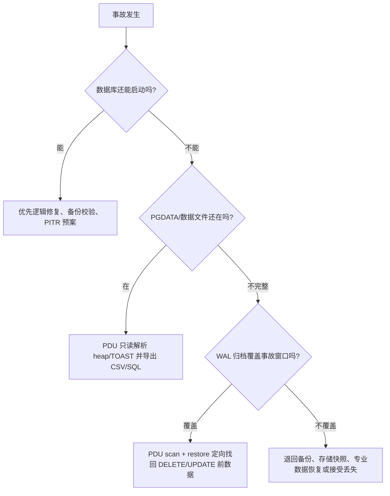
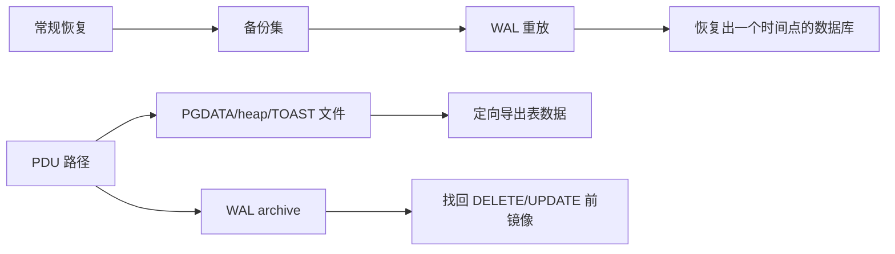
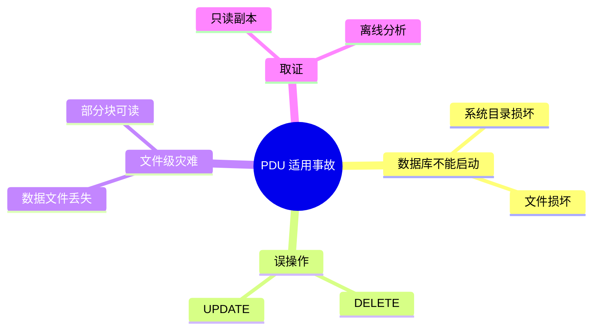
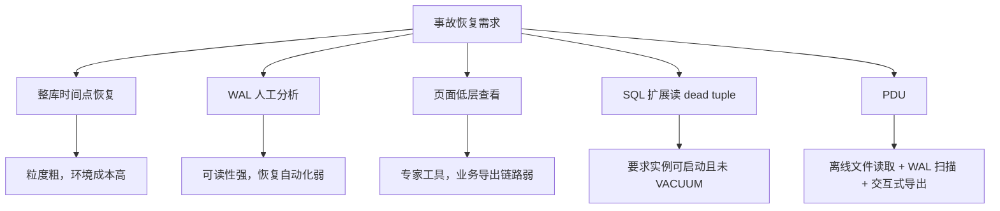
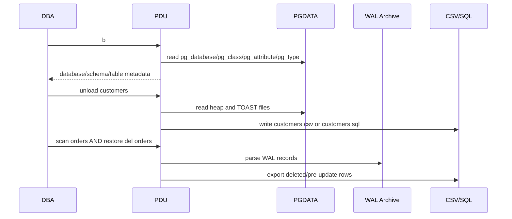
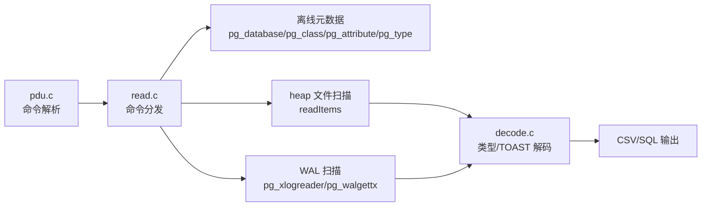
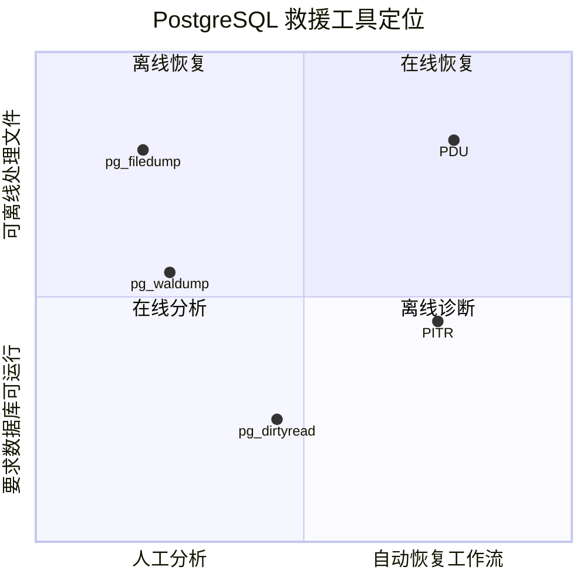
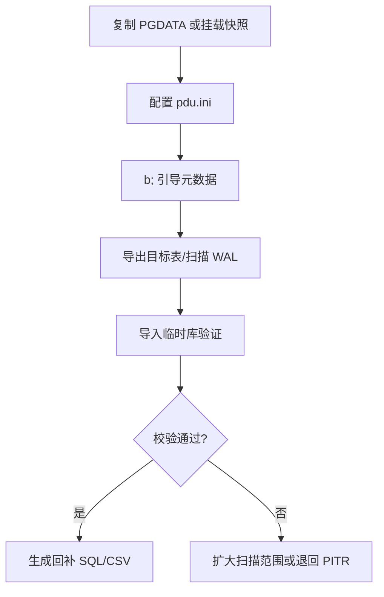

## PG 数据库无法启动如何恢复?

### 作者
digoal

### 日期
2026-04-30

### 标签
PostgreSQL , 无法启动 , 恢复 , 数据文件恢复 , 灰色地带

----

## 背景

生产库最难处理的事故，不是“有备份、能按流程恢复”的事故，而是介于数据库内核、文件系统、WAL 归档和业务止损之间的灰色地带：实例起不来、系统目录损坏、误删误改刚发生、单个数据文件丢失、PITR 回到某个时间点会牵连大量正常业务写入。

PDU（PostgreSQL Data Unloader）的价值，不在于替代备份体系，而在于给 PostgreSQL DBA 多一个“数据库不必启动、原始文件只读、尽量定向导出”的救援通道。




## 背景：PostgreSQL 的恢复体系很强，但不是所有事故都适合整库回滚

PostgreSQL 官方文档说明，WAL 记录数据文件的每次变更，数据库崩溃后可通过重放 WAL 恢复一致性；连续归档和 PITR 则通过文件系统级备份加 WAL 归档，把数据库恢复到某个时间点。这是主干恢复体系，必须优先建设。

问题在于，PITR 的恢复粒度通常是实例或集群级，需要准备替代环境、选择恢复目标点、处理时间线分叉，并在恢复后做数据比对和业务补偿。对于“只误删了一张表的一部分数据”“实例系统目录损坏但很多用户表文件仍可读”“需要先抢出核心表再慢慢重建”的场景，整库恢复经常过重。

PDU 切入的是另一个面：不从 SQL 执行器进入数据库，而是直接面对 PostgreSQL 数据目录、关系文件、TOAST 和 WAL 归档。它更像 PostgreSQL 领域的“离线数据卸载器”，适合在常规路径失败或成本过高时救急。



观点：PDU 的定位应该是“备份恢复体系的补充工具”，不是备份替代品。

成立前提：团队已经有基础备份、归档和恢复演练；PDU 被纳入灾备工具箱，而不是灾后第一次下载。

## 场景：谁会真正需要 PDU

PDU 面向的不是日常 ETL，而是事故中的 DBA、数据库内核支持工程师、平台 SRE、安全取证人员和业务系统负责人。

典型触发场景：

| 场景 | 症状 | PDU 为什么可能有用 | 关键前提 |
|---|---|---|---|
| 实例无法启动 | catalog、控制文件、部分关系文件异常 | 绕过数据库引擎，直接读数据文件导出 | 用户表文件仍可读 |
| 误 DELETE | 业务行被删除，应用已提交 | 扫描 WAL 归档，提取删除前记录 | WAL 覆盖事故窗口 |
| 误 UPDATE | 大量字段被错误覆盖 | 从 WAL 找回更新前值 | WAL 记录仍可解析 |
| 单表数据文件损坏 | 一张表打不开或部分块坏 | 逐页读取可解析块，尽量导出可见元组 | 损坏不是全文件级 |
| 取证分析 | 不希望启动原库或写入原盘 | 只读扫描 PGDATA | 有一致的文件副本 |



## 痛点：传统做法不是不能用，而是粒度和现场成本太高

第一类传统方案是 PITR。它是 PostgreSQL 正统恢复能力，但在误删少量数据时，PITR 会把整个数据库带回过去某个时间点。后续要把误删数据从恢复环境搬回生产，还要处理事故后正常产生的业务写入。

第二类工具是 `pg_waldump`。官方文档定义它用于把 WAL 做成人类可读形式，主要适合调试或学习。它能帮助理解 WAL，但不会自动把误删行重建成业务可直接导入的 CSV/SQL。

第三类工具是 `pg_filedump`。PostgreSQL wiki 和项目 README 都把它定位为格式化查看 heap/index/control 文件的低层工具。它适合看页面结构、定位损坏，但不是面向 DBA 的一站式恢复工作流。

第四类工具是 `pg_dirtyread`。它能读取 dead but unvacuumed tuples，适合误删后 VACUUM 前的窗口；但它要求数据库能启动、能安装扩展、目标旧版本元组还没有被清理。



观点：PDU 的批判对象不是 PITR、pg_waldump、pg_filedump 或 pg_dirtyread 本身，而是“在所有事故中只会使用单一路径”的恢复策略。

成立前提：事故恢复目标是尽快缩小损失面，而不是严格回放整个实例到一致时间点。

## 产品方案：PDU 做了什么

PDU 的核心方案可以概括为四步：

1. 从 `PGDATA` 读取 PostgreSQL 系统目录相关文件，建立数据库、schema、table、attribute、type 等离线元数据。
2. 根据元数据定位表的数据文件，按 PostgreSQL page 和 tuple 格式读取 heap 数据。
3. 对字段类型做解码，处理常见数值、时间、文本、UUID、网络地址、JSON 和 TOAST 数据，并导出为 CSV 或 SQL。
4. 在误删误改场景中扫描 WAL 归档，恢复 DELETE 行或 UPDATE 前值。

README 给出的最小使用路径是：修改 `basic.h` 中的 `PG_VERSION_NUM`，执行 `make`，配置 `pdu.ini` 中的 `PGDATA` 和 `ARCHIVE_DEST`，启动 `./pdu`，然后执行 `b;` 初始化元数据，再通过 `use`、`set`、`\dt`、`\d+`、`unload`、`scan`、`restore` 完成恢复。



## 架构与实现原则

PDU 是一个 C 语言命令行工具，核心文件包括：

| 模块 | 作用 | 证据 |
|---|---|---|
| `pdu.c` | CLI 入口、命令解析、批量命令执行 | `parseCmd` 识别 `b/use/set/unload/scan/dropscan/info/restore/meta` 等命令，`main` 支持交互和命令行模式 |
| `read.c` | 元数据引导、关系文件读取、命令分发 | 包含 `execCmd`、`readItems`、`bootDBStruct`、`bootAttrStruct`、`bootTabStruct`、`bootSCHStruct` 等函数 |
| `decode.c` | 字段解码、类型处理、TOAST 相关上下文 | 包含 `typeHandlerRegistry`，注册 int、float、numeric、time、date、timestamp、uuid、bool、macaddr、varchar 等处理器 |
| `dropscan_fs.c` | 文件系统/删除扫描相关能力 | 仓库文件名和 README 的数据文件丢失场景相互印证 |
| `pg_xlogreader.c`、`pg_walgettx.c` | WAL 读取和事务恢复相关能力 | README 的 WAL Archive Scanning、`scan`、`restore del/upd` 命令与这些模块对应 |



PDU 的架构不是“连接 PostgreSQL 执行 SQL”，而是“用 PostgreSQL 存储格式知识重建一个最小离线读取器”。

## 前后效果对比

| 维度 | 只有传统恢复路径 | 加入 PDU 后的补充路径 |
|---|---|---|
| 实例无法启动 | 依赖备份、PITR、物理修复 | 可尝试直接从可读关系文件导出 |
| 误删少量数据 | 恢复副本后人工搬数据 | 有 WAL 时可定向扫描和导出 |
| 工具学习曲线 | 多个工具分别掌握 | 一个交互式工具覆盖多个救援动作 |
| 原盘风险 | 修复动作可能需要写入环境 | README 声明只读读取原始数据文件 |
| 性能承诺 | 取决于备份和恢复环境 | README 明确 PDU 对大表执行全表扫描；没有公开基准时不应宣称固定性能收益 |
| 可审计性 | 标准 PITR 更成熟 | PDU 需要团队自建演练记录和输出校验流程 |


## 竞品与替代方案比较

| 工具/方案 | 核心机制 | 适合场景 | 不适合场景 | 与 PDU 的关系 |
|---|---|---|---|---|
| PostgreSQL PITR | 基础备份 + WAL 归档重放 | 严肃生产恢复、整库时间点恢复 | 只找回少量行时成本偏高 | 主恢复体系，PDU 不应替代 |
| `pg_waldump` | 人类可读 WAL 展示 | 调试、学习、分析 WAL | 自动恢复业务行 | PDU 把 WAL 分析向恢复动作推进 |
| `pg_filedump` | 格式化查看 heap/index/control 文件 | 页面级诊断、低层检查 | 面向业务表批量导出 | PDU 更偏恢复工作流 |
| `pg_dirtyread` | SQL 扩展读取未清理 dead tuple | 实例可启动、VACUUM 前误删找回 | 实例无法启动、dead tuple 已清理 | PDU 覆盖离线和 WAL 路径 |
| pgBackRest/Barman | 企业级备份、归档、恢复管理 | 标准灾备、自动化、审计 | 无备份或只需离线提取局部数据 | 应与 PDU 组合，而不是二选一 |



观点：PDU 最应该比较的不是 pgloader、pg_bulkload 这类数据加载工具，而是 PITR、pg_waldump、pg_filedump、pg_dirtyread 这些事故恢复/诊断路径。

成立前提：读者关心的是 PostgreSQL 原生数据文件和 WAL 中的“救援”，不是跨库迁移或高吞吐导入。

## 使用场景和操作要点

### 场景一：实例损坏但数据文件仍可读

症状：PostgreSQL 启动失败，业务要求先抢出核心表。

为什么 PDU 有用：它不依赖运行中的数据库实例，先通过 `b;` 从 PGDATA 引导元数据，再 `unload` 指定表或 schema。

命令：

```sql
PDU> b;
PDU> use mydb;
PDU> set public;
PDU> unload customers;
```

预期信号：当前目录下生成对应 CSV 文件；日志显示成功和失败记录数。

限制：如果系统目录、表文件、TOAST 文件同时严重损坏，导出可能不完整。

### 场景二：误删订单数据

症状：错误 `DELETE` 已提交，需要找回删除前行。

为什么 PDU 有用：README 声明可扫描 WAL 归档提取已删除行。

命令：

```sql
PDU> use production;
PDU> set public;
PDU> scan orders;
PDU> restore del orders;
```

预期信号：删除记录导出为 CSV。

限制：`ARCHIVE_DEST` 必须指向正确 WAL 归档目录，且归档覆盖误删时间窗口。

### 场景三：误更新用户字段

症状：错误 `UPDATE` 覆盖了关键字段。

命令：

```sql
PDU> scan users;
PDU> restore upd users;
```

预期信号：UPDATE 前值被导出。

限制：需要 WAL 中包含相关 UPDATE 记录；复杂类型或未支持类型可能无法完整还原。

### 场景四：数据文件部分损坏

症状：单个表文件部分页损坏。

为什么 PDU 有用：`read.c` 的 `readItems` 逻辑按页读取并对 tuple 解码；这类设计天然适合“能读多少导多少”的抢救思路。

命令：

```sql
PDU> b;
PDU> use damaged_db;
PDU> set public;
PDU> unload critical_table;
```

限制：这是“尽量抢救”，不是一致性恢复。导出后必须做行数、主键、业务约束和抽样校验。

## 最小上手步骤

以下命令来自 README，并按生产演练做了少量上下文补充。

### 1. 安装依赖

Ubuntu/Debian：

```bash
sudo apt-get update
sudo apt-get install build-essential liblz4-dev zlib1g-dev
```

RHEL/CentOS：

```bash
sudo yum install gcc lz4-devel zlib-devel
```

### 2. 设置目标 PostgreSQL 主版本并编译

```bash
sed -i 's/#define PG_VERSION_NUM [0-9]\+/#define PG_VERSION_NUM 16/g' basic.h
make clean
make
```

README 的模板写的是把 `PG_VERSION_NUM` 替换为 14-18 的目标版本。这里用 16 只是示例。

### 3. 配置 `pdu.ini`

```ini
PGDATA=/var/lib/postgresql/15/main
ARCHIVE_DEST=/var/lib/postgresql/wal_archive
```

`PGDATA` 用于离线读取数据目录；`ARCHIVE_DEST` 用于 DELETE/UPDATE 的 WAL 扫描恢复。

### 4. 启动并初始化

```bash
./pdu
```

```sql
PDU> b;
PDU> \l;
PDU> use production_db;
PDU> set public;
PDU> \dt;
PDU> \d+ customers;
PDU> unload customers;
```

### 5. 验证导出结果

建议至少做四类校验：

| 校验 | 方法 |
|---|---|
| 文件完整性 | 检查 CSV/SQL 文件大小、行尾、编码 |
| 行数 | 与备份副本、业务账表、审计日志比对 |
| 主键重复 | 导入临时库后检查主键/唯一键 |
| 业务抽样 | 按订单号、用户号、时间范围抽查 |

### 6. 回滚与清理

PDU 自身按 README 声明只读原始数据文件；清理主要是删除临时导出的 CSV/SQL、日志和临时验证库。不要在原 PGDATA 上做写入式修复实验，建议先复制数据目录或挂载存储快照。



## 最佳实践

1. 在事故前演练。至少准备 PostgreSQL 14-18 中本团队使用版本的测试集，覆盖普通表、TOAST 大字段、误删、误改、归档缺失、数据文件损坏。
2. 固定版本和二进制。PDU 编译时依赖 `PG_VERSION_NUM`，不要在事故现场临时猜版本。
3. 永远从副本或快照读取。即使工具只读，也应避免在原盘上做任何额外风险动作。
4. 保留完整证据链。记录 PGDATA 来源、WAL 范围、PDU commit 或 release、命令、输出日志、导出文件校验和。
5. 和 PITR 联合使用。PDU 导出的是救援数据，不等于恢复了数据库一致时间线；关键数据应先进临时库校验，再通过业务流程回补。
6. 控制权限。只有 DBA/平台管理员可接触 PGDATA 和 WAL；导出的 CSV/SQL 很可能包含敏感数据，需要加密存放并限制流转。
7. 监控归档。PDU 的误删误改恢复依赖 WAL 归档，归档失败会直接击穿这个前提。PostgreSQL 官方文档也提醒归档命令反复失败会导致 `pg_wal` 持续增长，甚至文件系统满后数据库 PANIC。

## 风险、边界和失败条件

PDU 不是魔法。它的边界比宣传语更重要。

| 风险 | 影响 | 应对 |
|---|---|---|
| 类型支持有限 | README 列出 enum、composite、range、tsvector/tsquery 不支持 | 事故前做类型盘点；复杂类型走 PITR 或应用侧重建 |
| 版本格式不匹配 | 页面/tuple/WAL 解析错误 | 按 PostgreSQL 主版本编译和演练 |
| WAL 不完整 | DELETE/UPDATE 恢复失败 | 监控 archive_command，保留足够 WAL |
| 数据文件物理损坏严重 | 只能部分导出或无法导出 | 使用存储快照、块设备镜像、专业物理恢复 |
| 无公开基准 | 不能承诺恢复耗时 | 用本地数据规模做演练基准 |
| DeepWiki 证据缺失 | 架构结论需谨慎 | 本文已将架构部分标记为源码推断 |

观点：PDU 应在“可读文件 + 可用 WAL + 可验证输出”的边界内使用。

成立前提：恢复团队愿意把导出数据再经过临时库校验和业务比对。

## 结论

PDU 最值得重视的地方，是它把 PostgreSQL 灾难恢复中的几个低层动作串成了一个相对统一的交互式工具：读 PGDATA 建元数据、读 heap/TOAST 导出、扫 WAL 找回误删误改前的数据。它不会取代 PITR，也不应该取代备份软件；它应该被放在“常规恢复太重、实例无法启动、但底层文件仍有价值”的位置上。

对 DBA 和架构师的实际建议：

1. 把 PDU 纳入灾备演练，而不是等事故发生后才研究。
2. 对核心库做类型、TOAST、归档覆盖、表规模的演练矩阵。
3. 用 PITR 保底，用 PDU 缩小恢复粒度，用临时库校验结果，用业务流程完成回补。
4. 如果文件/WAL/类型/版本任一前提不满足，立即切换到标准备份恢复或专业数据恢复路径。
  
  
#### [PostgreSQL 解决方案集合](../201706/20170601_02.md "40cff096e9ed7122c512b35d8561d9c8")
  
  
#### [德哥 / digoal's Github - 公益是一辈子的事.](https://github.com/digoal/blog/blob/master/README.md "22709685feb7cab07d30f30387f0a9ae")
  
  
#### [About 德哥](https://github.com/digoal/blog/blob/master/me/readme.md "a37735981e7704886ffd590565582dd0")
  
  

  
