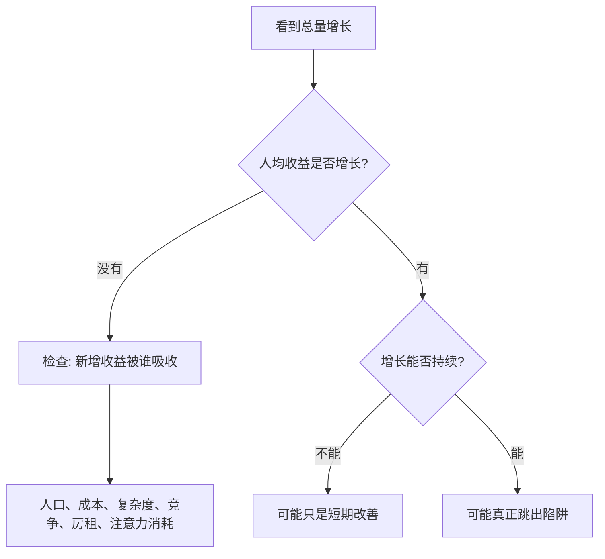

## 思维筑基课: 马尔萨斯人口陷阱
  
### 作者  
digoal  
  
### 日期  
2026-04-30
  
### 标签  
人口 , 资源 , 有限 , 周期性 , 马尔萨斯人口陷阱 , 生产力提升 , 人口增长 , 资源到顶 , 经济滞胀 
  
----  
  
## 背景 

> 面向对象: 初中到高中学生  
> 核心问题: 为什么古代社会辛苦种出更多粮食，普通人的生活却常常没有长期变富？  
> 先说结论: 马尔萨斯陷阱说的是，在技术进步很慢、土地有限的农业社会里，粮食增加会让人口增加，人口增加又会摊薄粮食，最后普通人的生活水平容易回到接近生存线。它不是“人口一定有害”，而是一个有前提的历史经济机制。

## 一张图先看懂


## 求真讲法

### 它到底说了什么

马尔萨斯陷阱来自英国经济学家托马斯·马尔萨斯的《人口原理》。它的核心不是一句“人太多”，而是一条机制:

1. 在农业社会，土地是最重要的生产资源，但好土地有限。
2. 如果粮食变多，短期内人们吃得更好，死亡率会下降，人口会增加。
3. 当人口增长快于粮食增长时，人均粮食又会下降。
4. 贫困、饥荒、疾病、战争或推迟婚育，会把人口增长压回去。

所以，陷阱的“陷”不在于人类不能进步，而在于进步被人口增长吸收了，普通人的长期生活水平难以明显超过生存线。

一个极简示意:

```text
粮食总量: 100 -> 130
人口数量: 100 -> 130
人均粮食: 1.0 -> 1.0

如果粮食多了，但人口也同样多了，
普通人的平均生活并没有长期改善。
```

### 它是怎么来的

马尔萨斯观察到一个紧张关系: 人口有可能很快增长，而土地和粮食的增长通常没那么快。他用“人口增长倾向”和“生活资料增长限制”来解释为什么许多前工业社会长期贫困。

更直观地说，古代社会像一个只有一个大锅饭的村子。村民改进耕作，锅里的饭变多了。短期看，这是好事。但如果人口也增加，饭又要分给更多人。只要“饭增长的速度”长期追不上“吃饭人数增长的速度”，每个人分到的饭就会被压回去。

这是一种观点和模型，不是数学定理。它的可信度来自对前工业社会的历史经验解释: 在工业革命以前，许多地区技术进步慢，人口压力大，人均收入增长长期有限。

### 它依赖哪些假设

| 假设 | 含义 | 如果不成立会怎样 |
|---|---|---|
| 技术进步慢 | 单位土地产出提高有限 | 如果技术持续高速进步，人均产出可能长期上升 |
| 土地或关键资源有限 | 增产不能无限复制 | 如果能找到新资源或新生产方式，压力会减轻 |
| 生育率对生活改善反应强 | 日子好过后人口会明显增加 | 如果家庭主动少生，人口压力会下降 |
| 多数人靠农业生存 | 收入主要来自粮食和土地 | 如果工业、服务业、知识产业扩张，人均收入不再只受土地限制 |
| 社会保障和公共卫生有限 | 饥荒、疾病等会直接影响人口 | 如果制度和卫生改善，死亡率机制会改变 |

### 常见误解

误解一: 马尔萨斯陷阱等于“人越少越好”。  
不对。它讨论的是在特定生产条件下，人口增长怎样吞掉人均收益。现代社会里，人也可以是知识、创新和分工的来源。

误解二: 马尔萨斯说技术没用。  
不对。技术有用，但在技术进步慢、人口反应快的条件下，技术带来的收益可能被人口增长摊薄。工业革命以后，持续技术进步恰恰是打破陷阱的重要力量。

误解三: 所有贫困都能用人口解释。  
不对。贫困还可能来自战争、殖民、制度失败、教育不足、市场封闭、公共卫生薄弱、资源分配不公等。马尔萨斯陷阱只解释其中一种机制。

## 求存讲法

### 它有什么用

马尔萨斯陷阱帮助我们理解一个反常现象: 为什么古代农业技术也在进步，但普通人生活水平没有像现代社会这样长期快速提升？

它提醒我们，看一个社会是否真正变富，不能只看总产量，还要看人均产量、人口结构、技术速度和制度条件。

### 它怎么迁移到熟悉领域

这个思想可以迁移成一个更一般的判断:

> 如果资源增长被需求增长迅速吃掉，系统就会看起来很努力，但人均改善很小。

在学习中，类似情况是: 学习资料越来越多，但时间和注意力没有增加。如果你只是收藏更多课程，不提高筛选、练习和复盘能力，资料增长反而会变成压力。

在工作中，类似情况是: 团队招了更多人，但协作方式没有升级。沟通成本随着人数上升，产出未必按人数增加。

### 它的适用范围和边界

适用范围:

- 农业占主导，土地约束强。
- 技术进步慢，不能持续提高人均产出。
- 生育率高，人口会对生活改善快速反应。
- 缺少教育、医疗、市场和制度机制来吸收人口压力。

不适用或需要谨慎使用的情况:

- 现代工业和数字经济中，知识、机器、能源和组织方式能持续放大人的产出。
- 生育率已经很低的社会，人口增长不再自动吞掉增产。
- 全球贸易可以让一个地区不完全依赖本地土地。
- 国家之间差异很大，不能用一个人口模型解释所有发展问题。

### 正例: 怎么用它提升能力

假设你每天有 2 小时学习时间。你买了 10 门网课，看似“资源增加”，但时间没有增加。如果你不改变学习方法，结果可能是每门课都只看一点，成绩没有提高。

用马尔萨斯陷阱的思路，你要问:

| 系统问题 | 学习中的对应问题 | 改进动作 |
|---|---|---|
| 资源增长了吗 | 资料、课程、题库变多了吗 | 不盲目增加资料 |
| 人均收益增长了吗 | 每小时掌握的知识变多了吗 | 用错题本和复盘提高效率 |
| 增长被谁吃掉了 | 注意力被切换和收藏消耗了吗 | 限定主教材和练习节奏 |
| 如何跳出循环 | 能否改变生产函数 | 学会主动检索、总结、讲题 |

这里的关键不是“少学”，而是提高单位时间产出。只有方法升级快过任务膨胀，你才不会掉进“资料越多越焦虑”的陷阱。

### 反例: 前提不成立会怎样

有人说: “一个城市人口越多，大家一定越穷，这就是马尔萨斯陷阱。”

这个说法可能失败，因为它把农业社会的假设搬到了现代城市。现代城市里，人口增加不只意味着更多嘴巴，也可能意味着更大的市场、更细的分工、更多创新和更高的生产率。如果交通、住房、教育和治理能跟上，人口密度反而可能提高效率。

这里失效的前提是: “关键资源固定且生产方式不变”。如果生产方式升级了，人口不一定只会摊薄资源，也可能创造新资源。

## 思考

马尔萨斯陷阱最值得思考的地方，不是它是否永远正确，而是它逼我们问一个更深的问题:

> 当一个系统变好时，新增收益会被谁吸收？

如果粮食增加被人口增长吸收，人均生活就不变。  
如果工资增加被房租上涨吸收，可支配收入就不变。  
如果工具增加被任务膨胀吸收，人的自由时间就不变。  
如果算力增加被更复杂的软件消耗，用户体验也未必变快。

因此，真正的进步往往不只是“总量增加”，而是“人均收益增加”，并且这种收益没有被新的压力立刻吞掉。



## 最后记住

1. 马尔萨斯陷阱讲的是“总产出增加不等于人均生活改善”。
2. 它依赖几个关键前提: 技术慢、土地有限、生育率高、农业占主导。
3. 工业革命、持续技术进步、教育普及、低生育和制度改善，是跳出陷阱的重要条件。
4. 不要把它简化成“人口越多越穷”，现代人口也可能带来分工、市场和创新。
5. 迁移使用时，要问: 新增收益有没有被新增需求、成本或复杂度吃掉？

## 参考资料

- Thomas Robert Malthus, *An Essay on the Principle of Population*, 1798.
- Gregory Clark, *A Farewell to Alms: A Brief Economic History of the World*, Princeton University Press, 2007.
- Robert C. Allen, *Global Economic History: A Very Short Introduction*, Oxford University Press, 2011.
- Oded Galor, *Unified Growth Theory*, Princeton University Press, 2011.
- Encyclopaedia Britannica, “Thomas Malthus” and “Malthusianism” entries.
  
  
#### [PostgreSQL 解决方案集合](../201706/20170601_02.md "40cff096e9ed7122c512b35d8561d9c8")
  
  
#### [德哥 / digoal's Github - 公益是一辈子的事.](https://github.com/digoal/blog/blob/master/README.md "22709685feb7cab07d30f30387f0a9ae")
  
  
#### [About 德哥](https://github.com/digoal/blog/blob/master/me/readme.md "a37735981e7704886ffd590565582dd0")
  
  

  
