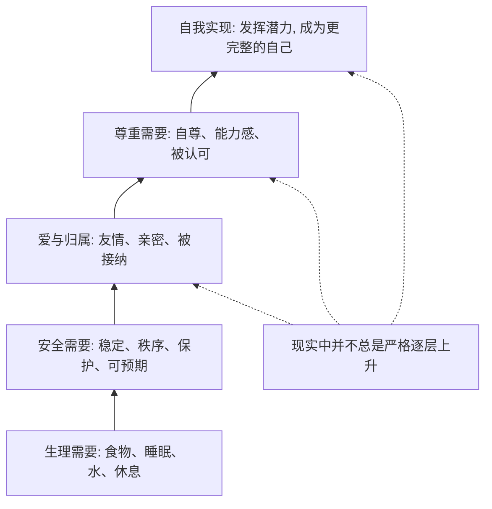

## 心理学思维筑基课: 马斯洛需求层级理论
  
### 作者  
digoal  
  
### 日期  
2026-05-01 
  
### 标签  
马斯洛需求理论 , 人的需求 , 生理 , 安全 , 爱与归属 , 尊重 , 自我实现 
  
----  
  
## 背景 
  
> 面向对象: 初中到高中学生  
> 核心问题: 为什么人在不同阶段，会被“吃饱睡好”“安全稳定”“被爱和被尊重”“实现自己”这些不同目标推动？  
> 先说结论: 马斯洛需求层级是心理学里一个很有影响力的动机理论。它认为人的需要大致有层次，较基础的需要常常比更高层的需要更先影响行为，但这个顺序不是铁板一块，也不是每个人都按同一条阶梯往上走。

## 一张图先看懂



## 求真讲法

### 它到底说了什么

马斯洛需求层级最常见的版本有五层，从低到高通常写成：

| 层级 | 通俗解释 |
|---|---|
| 生理需要 | 活下去需要的基本条件，如吃、喝、睡、休息 |
| 安全需要 | 希望环境稳定、不受威胁、有保护和秩序 |
| 爱与归属需要 | 希望被爱、被接纳、有关系、有群体 |
| 尊重需要 | 希望有能力感、自尊，也被别人尊重 |
| 自我实现需要 | 希望发挥潜力，做成真正重要、符合自己的事 |

这套理论想表达的不是“人只能一层一层爬楼梯”，而是：

> 当更基础的需要非常缺乏时，它们通常会更强地占据注意力；当这些需要相对稳定后，人更可能被更高层的成长目标推动。

比如：

- 很饿的时候，人很难专心谈理想。
- 很不安全的时候，人更在乎保护自己。
- 长期被排斥的人，可能首先想解决归属感问题。
- 当生活比较稳定后，人更可能思考“我到底想成为什么样的人”。

所以，马斯洛不是在说“高层需要不重要”，而是在说：  
**不同需要会争夺人的注意力，而基础匮乏往往更容易优先上场。**

### 它是怎么来的

这套理论最早来自 Abraham Maslow 1943 年的论文 *A Theory of Human Motivation*。  
他的核心动机不是给人贴标签，而是想解释：

- 为什么人在不同条件下，会被不同目标推动？
- 为什么有些人先为生存奔波，有些人开始追求成长和意义？

他观察到，人的需要似乎存在“相对优先级”：

- 当基本生存被严重威胁时，其他目标会暂时退后。
- 当一些基本问题较稳定后，更高层的社会性和成长性需要会更明显。

一个简单的 ASCII 图：

```text
严重缺乏食物/睡眠
    -> 先被生理需要主导

生活稳定一些
    -> 更在乎安全、关系、尊重

更稳定之后
    -> 更可能追求成长、意义、潜力
```

后来这套理论被广泛传播，常被画成“金字塔”。  
要注意一点：**Maslow 原始论文并没有画那种著名金字塔图**，金字塔是后来的教学传播形式。  
Maslow 晚年还讨论过更扩展的版本，比如把“自我超越”放在更高处。但最常见、最适合入门教学的，仍是五层版本。

### 它依赖哪些假设

马斯洛需求层级要成立，依赖几个关键假设。

| 假设 | 含义 | 如果不成立会怎样 |
|---|---|---|
| 人有多种类型的需要 | 不只是吃饭，也有关系、尊严和成长需要 | 如果只有单一需要，层级就没有意义 |
| 需要之间存在相对优先级 | 严重匮乏的基础需要常更先主导 | 如果所有需要永远同等强，层级会变弱 |
| 缺乏会改变注意力分配 | 越缺什么，越容易被什么占据 | 如果匮乏不影响行为，理论难成立 |
| 人不只为生存，也会为成长而活 | 稳定后会追求潜力、意义和实现 | 如果人只追求生存，高层需要就难解释 |

这也说明一句很重要的话：

> 需求层级讲的是“常见倾向”，不是“严格铁律”。

### 常见误解

**误解一：必须满足下一层，上一层才会完全出现。**  
不对。现实里很多需要会同时存在，只是强弱不同。

**误解二：它就是一座固定金字塔，人人都一样。**  
不对。不同文化、年龄、处境的人，对需要的排序可能不同。

**误解三：自我实现就是做自己喜欢的事。**  
不完全对。自我实现更接近“发挥潜力、实现更完整的自己”，不只是“图开心”。

**误解四：这套理论已经被完全证明。**  
不对。它影响很大，但经验支持并不算特别强，尤其“严格层层递进”的部分常受批评。

## 求存讲法

### 它有什么用

这套理论最大的用处，是帮人理解：

- 为什么有时讲道理没用，因为对方正在被更基础的焦虑主导。
- 为什么环境稳定后，人会开始追求尊严、意义和成长。
- 为什么教育、管理、关系支持不能只讲目标，还要看基本需要有没有被照顾。

它提醒你：  
**不能只盯着“表现”，还要看这个人当下被哪一层需要牵引。**

### 它怎么迁移到熟悉领域

这个理论很容易迁移到学生生活。

| 场景 | 被哪类需要主导 |
|---|---|
| 熬夜很久、没睡够，上课发呆 | 生理需要在抢注意力 |
| 转学到新环境，焦虑不安 | 安全和归属需要更强 |
| 被同学排斥，学习动力下降 | 爱与归属受挫 |
| 明明成绩不错，却总觉得不够好 | 尊重需要没有稳定满足 |
| 基本生活稳定后，开始问“我适合什么” | 更靠近自我实现需要 |

迁移后的核心意思是：

> 很多所谓“没动力”，不是没有目标，而是有更基础的需要正在前面插队。

### 它的适用范围和边界

这套理论适合用于：

- 理解人的动机为什么会随处境变化。
- 分析教育、管理、家庭支持为什么不能只讲目标。
- 帮助自己识别“我现在真正缺的是什么”。
- 提醒自己成长问题常和基础稳定度有关。

但它也有明显边界。

第一，它不是精确科学公式。  
不能用它机械预测每个人下一步一定会怎样。

第二，需求层次并不总按顺序来。  
有些人在生活艰难时，依然会坚持理想、艺术、信仰或道德。

第三，文化会改变表达方式。  
有的文化更强调集体归属，有的更强调个人实现。

第四，它容易被过度简化。  
把复杂的人生动机硬压成五格，会丢掉很多细节。

### 正例: 怎么用它提升能力

假设一个学生最近总觉得“自己没动力学习”。

如果只给自己扣帽子，说“我太懒了”，通常没什么帮助。  
如果用马斯洛框架检查，可能会发现：

- 最近一直睡不好，生理状态先掉了。
- 班里关系紧张，归属感也差。
- 被反复否定后，尊重需要受伤了。

这时更有效的做法不是立刻逼自己“自我实现”，而是先修复前面的缺口：

- 先把作息拉回来。
- 找一个更稳定的同伴关系。
- 给自己设置能完成的小目标，慢慢恢复能力感。

这就是这套理论的价值：  
它让你不再只盯着最高目标，而是先看底部哪里漏了。

### 反例: 前提不成立会怎样

假设一个老师说：“学生只要明白学习的重要性，就自然会努力。”

这句话常常错在忽略了低层需要的干扰。  
可能真实情况是：

- 学生长期睡眠不足。
- 家庭环境让他缺乏安全感。
- 在班里感到孤立。
- 一直被批评，尊重需要受伤。

在这些前提下，只强调高目标，效果往往有限。

这里失败的根本原因，是忽略了“严重匮乏的基础需要常更先主导”这个前提。  
不是学生不懂道理，而是别的需要先把注意力抢走了。

## 思考

为什么马斯洛理论这么流行，即使它并不完美？

因为它抓住了一个很强的直觉：  
人不是只靠一个目标活着，而是同时受生存、安全、关系、尊严和成长推动。  
它给了人们一个容易记住的框架，去理解“为什么有时候理想让位给现实，有时候现实稳定后又开始追问意义”。

这也引出几个更深的问题：

- 你现在最强的缺口，在哪一层？
- 你说自己“没动力”时，真的是没有目标，还是更基础的需要在前面堵着？
- 你追求的所谓成长，是不是建立在一个过于脆弱的底座上？

成熟的心理学思维，不是把马斯洛当成绝对真理，而是把它当成一个检查工具：

- 我现在被什么需要主导？
- 哪些低层问题没有照顾好？
- 我所谓的高层目标，现实支撑够不够？

马斯洛需求层级真正教人的，不是背五层名字，而是学会看见动机背后的层次结构。

## 最后记住

1. 马斯洛需求层级认为，人有从基础生存到成长实现的多层需要。
2. 当更基础的需要严重缺乏时，它们通常更容易主导行为和注意力。
3. 这套理论是常见倾向，不是 rigid 的铁律，现实中很多需要会同时存在。
4. 它最有用的地方，不是给人分类，而是帮助你判断“现在真正缺的是什么”。
5. 它影响很大，但也有局限，尤其不能机械理解成每个人都按同一顺序上升。

## 参考资料

- Abraham H. Maslow, “A Theory of Human Motivation” (1943), 马斯洛最早系统提出需求层级的经典论文。
- Encyclopaedia Britannica, 关于 Maslow hierarchy of needs 与 self-actualization 的词条与综述，概括其五层框架与非 rigid 特征。
- Abraham H. Maslow, *Motivation and Personality* (1954), 对需求层级与人类动机的进一步展开。
- 本文为面向学生的简化解释，基于通用心理学教材与经典理论框架，不用于诊断或替代专业心理帮助。

  
  
#### [PostgreSQL 解决方案集合](../201706/20170601_02.md "40cff096e9ed7122c512b35d8561d9c8")
  
  
#### [德哥 / digoal's Github - 公益是一辈子的事.](https://github.com/digoal/blog/blob/master/README.md "22709685feb7cab07d30f30387f0a9ae")
  
  
#### [About 德哥](https://github.com/digoal/blog/blob/master/me/readme.md "a37735981e7704886ffd590565582dd0")
  
  

  
