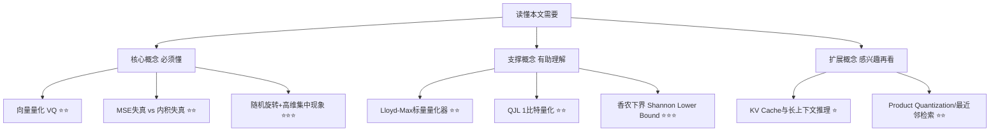

## AI论文解读 | 谷歌向量压缩器 TurboQuant: Online Vector Quantization with Near-optimal Distortion Rate
  
### 作者  
digoal  
  
### 日期  
2026-07-24  
  
### 标签  
AI , KV Cache , 向量检索 , 量化技术 , PQ , kmean , 香浓下界 , 失真率 , 谷歌 , TurboQuant 
  
----  
  
## 背景 

> **原文信息**：Amir Zandieh（Google Research）、Majid Daliri（NYU）、Majid Hadian（Google DeepMind）、Vahab Mirrokni（Google Research） | 2025年4月28日提交 arXiv | cs.LG / cs.AI / cs.DB / cs.DS
> **原文链接**：https://arxiv.org/abs/2504.19874
> **解读日期**：2026-07-24

---

## 📍 论文定位

**一句话**：TurboQuant 是一种"即插即用、不用看数据"的向量压缩方法，能把高维浮点向量压成几个比特，同时在数学上证明它的失真程度几乎逼近理论最优，特别适合用来压缩大模型推理时的 KV Cache，以及向量数据库里的海量 embedding。

**🎓 学术价值**：向量量化（Vector Quantization, VQ）这个问题可以一路追溯到香农的信源编码理论。过去几十年学术界一直在"理论最优但不能落地"和"能落地但理论上不够优"之间打转 —— 要么是像 Zador、Gersho 那样给出漂亮的渐近理论却没造出可用算法，要么是工业界能用但没有严格的失真上界保证。TurboQuant 第一次把二者统一起来：既给出了可以直接跑在加速器上的高效算法，又证明了它的失真率和香农下界只相差一个很小的常数（约 2.7 倍，位宽越低这个倍数越接近 1）。

**🏭 工业价值**：可以直接用在两个非常现实的场景 —— 一是大模型推理时的 KV Cache 压缩（把每个 token 的 key/value 向量从 16/32 比特压到 2.5~3.5 比特而几乎不掉点），二是向量数据库的最近邻检索（不需要像传统 Product Quantization 那样对数据做耗时的 k-means 预训练，索引时间几乎为零，检索召回率还更高）。

**💡 直觉类比**：可以把 TurboQuant 想象成一个"标准化压缩流水线"。任何形状歪七扭八的高维向量，先被"随机旋转"这道工序打乱方向（就像把一堆写着地址的信封统一转个角度，让每个坐标看起来都差不多"服从同一种分布"），这样后面就可以用一套统一定制的、事先算好的"最优压缩尺子"（标量量化器）去逐个坐标打点，而不用针对每一份数据单独定制尺子。这就是它"在线（online）""数据无关（data-oblivious）"的由来：不用先看一眼数据、不用预训练，来一个向量就能立刻压缩。

---

## 🗺️ 知识地图

- **向量量化（VQ）** ：把一个高维浮点向量，转换成一串比特（0/1），并能大致还原回去。⭐⭐
- **MSE 失真 vs 内积失真**：前者关心"压缩后向量和原向量差多少"，后者关心"压缩后向量和另一个向量做内积时，误差有多大" —— 两者目标不完全一致，是本文的一个关键分歧点。⭐⭐
- **随机旋转 + 高维集中现象**：把向量随机旋转后，每个坐标近似服从同一种分布，且坐标之间几乎独立，这让"逐坐标独立压缩"变得既简单又接近最优。⭐⭐⭐

---

## 🔬 论文精读

### Why — 为什么要做这个研究？

现有的向量量化方法长期存在一个两难：

| 维度 | 传统方法的问题 |
| --- | --- |
| 理论最优但难落地 | 高分辨率量化理论（如 Zador、Gersho 的工作）证明了渐近最优的失真率，但没有给出真正能跑起来的算法，很多依赖暴力最近邻搜索，计算代价高 |
| 能落地但理论不够优 | 基于 k-means 的 Product Quantization 等方法，需要针对具体数据集做大量预处理和"学习"，属于离线（offline）方法，无法用于像 KV Cache 这种数据源源不断到来的在线场景，而且失真率随比特数下降呈指数级"变差"（不是最优的指数衰减速度） |

作者的动机很直接：现有的向量量化算法要么在加速器上难以向量化、计算速度慢，不适合KV cache量化这类实时AI应用场景，要么在给定比特宽度下的失真界不够理想。他们想设计一种轻量、支持在线场景（对KV cache量化尤为关键）、且对加速器高度友好的算法。

### What — 提出了什么方法/系统？

TurboQuant 本质上是"两级流水线"：先做一个 MSE 最优的量化器，再在残差上叠加一个内积无偏的 1-bit 量化器。

- **Q_mse（MSE 最优量化器）** ：先对输入向量做一次随机旋转。旋转之后，任意一个坐标的分布都收敛到同一种（缩放/平移过的）Beta 分布，在高维极限下这个 Beta 分布又进一步逼近正态分布。更关键的是，不同坐标之间不仅近似不相关，而且近似"独立" —— 这个更强的性质，使得可以完全不考虑坐标间的相关性，直接对每个坐标独立地做一维最优标量量化。
- **最优标量量化器怎么来的**：把"给一个服从 Beta 分布的随机变量找最优量化点"这件事，转化成一个一维（1-dimensional）的连续 k-means 问题，用 Lloyd-Max 算法求解，并对常用的几个比特宽度提前算好、存好这些"最优码本"，之后调用时直接查表即可，不需要每次都重新优化。
- **Q_prod（内积最优量化器）** ：作者发现一个反直觉的事实 —— 为 MSE 设计的最优量化器，用来估计内积时其实是有偏的。于是他们设计了两阶段方案：先用比目标比特预算少 1 比特的 Q_mse 去压缩一次，把残差的 L2 范数降到最小；再对残差施加最近提出的 QJL（Quantized Johnson-Lindenstrauss）变换 —— 本质上是把残差乘以一个随机高斯矩阵后再取符号，得到 1 比特编码。这样两阶段组合起来的量化器 Q_prod，被证明是内积无偏估计，并且失真率也接近最优。

### How — 具体怎么实现的？

关键的技术细节可以拆成三块：

**1）随机点在超球面上的坐标分布**

论文证明了一个引理：如果 $\mathbf{x}$ 是单位超球面 $\SS^{d-1}$ 上均匀随机的一个点，那么它的任意一个坐标 $\mathbf{x}_j$ 都服从：

$$f_X(x) = \frac{\Gamma(d/2)}{\sqrt{\pi}\cdot\Gamma((d-1)/2)}(1-x^2)^{(d-3)/2}$$

白话解释：这是一个关于原点对称、随维度 $d$ 增大而越来越"集中"的钟形分布；当 $d$ 很大时它趋近于均值 0、方差 $1/d$ 的正态分布。也就是说，维度越高，随机旋转后每个坐标的取值就越"温顺"、越可预测，这正是"逐坐标独立量化仍能接近最优"的数学基础。

**2）香农下界（Shannon Lower Bound, SLB）**

作者借助信源编码理论中的 SLB，推导出对于超球面上均匀分布的向量，任何量化算法在比特预算 $B$ 下的 MSE 失真都必须满足：

$$D(B) \geq 2^{-2B/d}$$

这给出了一个"不管你多聪明都跨不过去"的理论天花板，后面 TurboQuant 的实际失真会拿来跟这个天花板对比。

**3）QJL：1比特内积量化**

QJL 的做法很直接：采样一个 $d\times d$ 的高斯随机矩阵 $\mathbf{S}$ ，把输入向量投影后取符号，即 $Q_{qjl}(\mathbf{x}) = \text{sign}(\mathbf{S}\cdot\mathbf{x})$ ；反量化则是把符号乘回去再做一个尺度缩放。论文证明这个估计量对内积是无偏的，且方差有界： $\text{Var} \leq \frac{\pi}{2d}\|\mathbf{y}\|_2^2$ —— 也就是说维度越高，这个 1 比特量化器的内积估计噪声反而越小。

TurboQuant 把这个已有的 QJL 工具，作为"精修残差"的第二阶段，套在自己第一阶段 MSE 量化器的输出之上。

### So What — 结果怎么样？

论文给出了显式的理论失真上界，并且和实验高度吻合：

| 比特宽度 b | Q_mse 的 MSE 失真上界（约） | Q_prod 的内积失真上界（约，含 1/d 因子）|
| --- | --- | --- |
| 1 | 0.36 | 1.57/d |
| 2 | 0.117 | 0.56/d |
| 3 | 0.03 | 0.18/d |
| 4 | 0.009 | 0.047/d |

对照同样条件下推导出的信息论下界，TurboQuant 的 MSE 失真最多只比理论最优差约 2.7 倍（ $\sqrt{3}\pi/2$ ），而且比特数越少这个倍数还越小 —— 在 1 比特这种极端压缩场景下，只差大约 1.45 倍，几乎逼近理论极限。

在实际应用层面， 面向 KV cache 量化的实验显示，在每个通道 3.5 比特时可以做到质量几乎完全无损，在 2.5 比特时也只有轻微的质量下降；在最近邻搜索任务中，该方法在召回率上超过了现有的乘积量化技术，同时将索引构建时间降低到几乎为零 。此外论文也做了"大海捞针"（needle-in-a-haystack）式的长上下文检索测试和 LongBench 端到端生成实验，验证压缩后模型依然能准确定位和利用长上下文中的信息，同时把 KV Cache 体积压缩到原来的五分之一以下。

### Now What — 对我们意味着什么？

- **学术界**：这篇论文把"高分辨率量化理论"和"可加速器部署的在线算法"重新连接了起来 —— 过去几十年这两条线基本是平行发展的。它也提醒我们，MSE 最优和内积无偏这两个看起来都"合理"的优化目标，实际上是冲突的，需要专门设计针对性方案，这对后续做嵌入压缩、稀疏检索、甚至权重量化的研究都是一个值得借鉴的方法论。
- **工业界**：对于做大模型推理优化（尤其是长上下文场景）的团队，KV Cache 压缩到 2.5~3.5 比特却几乎不掉点，意味着可以用更少的显存服务更长的上下文或更大的并发批量；对于做向量数据库/检索系统的团队，"在线、无需预训练、索引时间趋近于零"这几个特性，意味着数据实时写入、实时可查询的场景（比如流式更新的推荐系统、RAG 系统）能拿到更好的压缩率-召回率权衡，而不必忍受传统 PQ 方法漫长的离线建索引过程。

---

## 📖 术语词典

### 向量量化（Vector Quantization, VQ）
- **是什么**：把连续的高维浮点向量，映射为有限个比特表示的过程，目标是在尽量少用比特的同时保留原始向量的关键几何信息（如长度、方向、内积）。
- **为什么重要**：几乎所有需要存储或传输大量高维向量的系统（大模型权重/激活、KV Cache、向量数据库）都依赖它来省显存、省带宽、提速度。
- **现实类比**：就像把一张高清照片压缩成缩略图 —— 你不需要每个像素都精确，但要让人一眼还能认出图里画的是什么。

### MSE 失真（均方误差失真）
- **是什么**：量化前后向量之间欧氏距离平方的期望，衡量"整体形状还原得准不准"。
- **为什么重要**：它是最经典、最直接的失真度量，很多下游任务（比如向量重建、聚类）都直接依赖它。
- **现实类比**：就像给一幅画拍照后再冲印出来，衡量冲印版和原画每个像素颜色差了多少。

### 内积失真
- **是什么**：量化后的向量与另一个向量做内积，其结果与真实内积之间误差的期望，且要求这个估计是"无偏的"（平均意义上不系统性偏大或偏小）。
- **为什么重要**：在检索、注意力机制等场景里，真正要用的往往不是向量本身，而是向量之间的内积（相似度），所以内积保真比整体形状保真更贴近实际需求。
- **现实类比**：好比两个人握手时用力是否合适（内积），比每根手指摆放的绝对位置（MSE）更能反映"这次握手感觉对不对"。

### 随机旋转（Random Rotation）
- **是什么**：在量化之前，先用一个随机正交矩阵把向量整体"转个方向"，不改变向量长度，只改变各坐标上的数值分布。
- **为什么重要**：它把原本可能"奇形怪状"（比如某几个坐标特别大）的最坏情况向量，转换成统计上"温顺"、各坐标近似同分布且近似独立的向量，从而让简单的逐坐标量化也能取得接近最优的效果。
- **现实类比**：就像给一批形状各异的行李箱统一套上标准尺寸的箱套后再打包托运，托运流程就能标准化处理，不用针对每个箱子单独想办法。

### Beta 分布（本文中特指超球面坐标分布）
- **是什么**：随机点均匀分布在高维单位超球面上时，其任意一个坐标所服从的概率分布，形式为 $(1-x^2)^{(d-3)/2}$ 的比例函数。
- **为什么重要**：它是随机旋转后每个坐标的"标准形状"，TurboQuant 正是针对这个已知、固定的分布提前算好最优量化码本。
- **现实类比**：就像知道某工厂生产的螺丝钉尺寸永远服从同一个固定的公差分布，工程师就可以提前设计好一套万能卡尺，而不用每批货都重新测量分布。

### Lloyd-Max 量化器
- **是什么**：针对某个已知概率分布，通过求解一维（1-dimensional）k-means 问题得到的一组"最优分割点+代表值"，使得该分布下的量化均方误差最小。
- **为什么重要**：它把"给定分布找最优量化器"变成一个经典、可数值求解的优化问题，TurboQuant 借此为 Beta 分布提前计算好各比特宽度下的最优码本。
- **现实类比**：像给一条鱼按大小分成几个尺码档，每个档位用一个代表重量来标价，Lloyd-Max 就是帮你找到"分几档、每档分界点在哪、代表重量取多少"能让总体估价误差最小。

### QJL（Quantized Johnson-Lindenstrauss）
- **是什么**：一种把向量投影到随机高斯方向后只保留符号（+1/-1）的 1 比特量化方法，用于无偏地估计内积。
- **为什么重要**：它是 TurboQuant 内积量化流水线里"第二阶段"的核心组件，负责把残差进一步压到极限的 1 比特，同时保证整体内积估计依然无偏。
- **现实类比**：就像做民意调查时不问"你有多支持"，只问"你支持还是反对"（只留符号），但通过设计合理的抽样方式，依然能无偏地估计出整体支持率。

### 香农下界（Shannon Lower Bound, SLB）
- **是什么**：基于信息论推导出的，任何有损压缩方案在给定比特预算下都无法突破的失真下限。
- **为什么重要**：它是评价任何量化算法"还有多少提升空间"的标尺，TurboQuant 正是通过对比这个下界来证明自己接近理论最优。
- **现实类比**：就像short track speed skating（短道速滑）里物理极限决定的"世界纪录理论下限"，任何选手（算法）都不可能突破这个由赛道长度和摩擦力（信息论）决定的下限，只能不断逼近它。

### KV Cache（键值缓存）
- **是什么**：Transformer 解码时为了避免重复计算，把此前每个 token 生成的 key/value 向量缓存起来，供后续 token 做注意力计算时复用。
- **为什么重要**：它的大小随上下文长度和模型规模线性增长，是长上下文推理最主要的显存瓶颈之一，这也是本文实验重点验证的应用场景。
- **现实类比**：就像开会时把前面每个人发言的要点都记在小本子上，后面发言人不用要求别人重复一遍，直接翻本子查阅即可；本子越写越厚，就得想办法把每条笔记压缩得更精简。

---

## ⚖️ 批判性评估

**1. 假设前提的合理性**

论文的核心理论结果都建立在"输入向量随机旋转后近似均匀分布在超球面上"这一假设之上，并且默认向量已经归一化为单位范数（论文也说明了对于非单位范数的数据集，可以额外存储 L2 范数用浮点精度做后处理缩放）。这个假设在很多实际场景（比如经过 LayerNorm 处理的激活值、经过归一化的 embedding）中相对成立，但对于范数分布本身就极不均匀、或者坐标间存在强结构性关联（比如某些位置编码维度）的向量，随机旋转是否总能完全"打散"这种结构，论文并没有给出更细致的实证分析。

**2. 实验设计的可质疑之处**

从摘要和引言可以看到，实验主要围绕 KV Cache 量化（needle-in-a-haystack、LongBench）和最近邻检索两大场景展开，并且都拿传统 Product Quantization 作为主要对比基线。但对比中并未明确提及是否与近年来其他专门为 KV Cache 设计的量化方法（如论文相关工作中提到的多篇 KV 量化技术）做了正面的、逐一的性能对比，这使得"TurboQuant 在 KV Cache 场景下相对其他专用方法的优势有多大"这一点，仅从摘要和引言层面还难以判断，需要结合论文正文的实验部分具体数字来进一步确认。

**3. 方法的适用边界**

TurboQuant 的两阶段设计（MSE 量化 + QJL 残差量化）针对的是"MSE 最优"和"内积无偏"这两个目标的平衡，但如果某个应用场景既不关心 MSE、也不特别关心内积无偏性（比如某些下游任务只关心 top-k 排序结果是否一致，而不关心具体数值误差），那么这套理论最优的设计是否仍然是"实践最优"，值得进一步验证。此外，随机旋转本身需要一个 $d\times d$ 的旋转矩阵，当维度 $d$ 非常大时，存储和应用这个矩阵的额外开销（即便论文强调是加速器友好的）也是需要在实际系统里评估的成本项。

**4. 未来改进方向**

论文在标题和摘要中反复强调"在线"（online/data-oblivious）这一特性作为主要卖点，一个自然的延伸问题是：如果放松"完全不看数据"这一约束，允许极轻量的数据统计（而不是像传统 PQ 那样重度的 k-means 训练），是否能在几乎不增加多少开销的前提下进一步逼近香农下界？另外，论文的理论分析集中在最坏情况（worst-case）向量上，如果结合具体下游任务的数据分布做轻量自适应，是否能把已经很小的 2.7 倍差距进一步压缩，也是一个值得追问的方向。读者在实际落地时，也可以关注该方法与其他压缩技术（如结合稀疏化、结构化剪枝）叠加使用时的效果是否会相互增强或相互抵消。

---

## 📚 参考资料
- 原文链接：https://arxiv.org/abs/2504.19874
- HTML 全文：https://arxiv.org/html/2504.19874v1
- 关键引用文献：Shannon 信源编码理论原始论文；Zador（1963）关于高分辨率量化渐近理论的工作；Gersho 关于格量化与高分辨率理论的工作；QJL（Quantized Johnson-Lindenstrauss）原始论文，用于本文第二阶段的 1 比特内积量化组件
- PostgreSQL 开源项目: https://codeberg.org/gregburd/pg_turbovec 
  
  
#### [PostgreSQL 解决方案集合](../201706/20170601_02.md "40cff096e9ed7122c512b35d8561d9c8")
  
  
#### [德哥 / digoal's Github - 公益是一辈子的事.](https://github.com/digoal/blog/blob/master/README.md "22709685feb7cab07d30f30387f0a9ae")
  
  
#### [About 德哥](https://github.com/digoal/blog/blob/master/me/readme.md "a37735981e7704886ffd590565582dd0")
  
  

  
