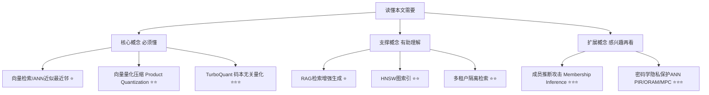
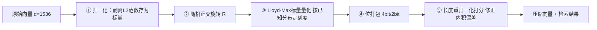

## AI论文解读 | 谷歌向量压缩器 TurboQuant 在 Snowflake 的工业落地 TurboVec: A Case Study in Cost-Efficient Private Retrieval for Enterprise RAG via Codebook-Oblivious Quantization

### 作者
digoal

### 日期
2026-07-24

### 标签
AI , KV Cache , 向量检索 , 量化技术 , 正交矩阵 , 码本无关 , 数学支撑 , PQ , kmean , 香浓下界 , 失真率 , 谷歌 , TurboQuant , 工业落地 , TurboVec , 向量索引 , snowflake , 租户 , 码本 , 安全问题 , 共享码本 , 攻击风险   

----

## 背景
  
> **原文信息**：Navnit Shukla, Kamal Pandey, Omshankar Tiwari | 2026年7月 | arXiv (cs.LG/cs.AI/cs.IR)，提交于 Snowflake 生态背景下的案例研究论文
> **解读日期**：2026-07-24

---

## 📍 论文定位

**一句话**：这篇论文做了一个案例研究——把一种"不需要训练、天生不容易泄露语料信息"的向量量化算法 TurboQuant 包装成开源向量索引 TurboVec，部署到 Snowflake 的容器服务上，证明它在企业级多租户 RAG 场景下，比传统的 Product Quantization（PQ）召回率更高、比 HNSW 省内存、比暴力扫描快得多，同时天然抵抗一种"码本泄露"攻击。

**🎓 学术价值**：把 ICLR 2026 提出的 TurboQuant 算法（原本只是理论 + 标准 benchmark 验证）落地到真实的企业 RAG 部署场景，补上了"码本级别隐私泄露"这个此前很少有人系统讨论的角度，并给出了可复现的量化对比实验。

**🏭 工业价值**：如果你在做多租户的向量数据库/RAG 平台（比如给多个客户共用一套向量索引），这篇论文提供了一个不用训练、不用囤积语料就能上线的量化方案，同时能省下大量内存和云成本，还顺带降低了"别的租户能不能通过码本反推出你的数据分布"这种安全隐患。

**💡 直觉类比**：传统的 PQ 量化就像是先把全班同学的身高体重都收集起来，算出几个"标准体型模板"，以后每个人都用最接近的模板来近似描述——这样虽然准，但"标准体型模板"本身就泄露了全班的身材分布信息。TurboQuant 则像是提前查了一本"人体工程学教科书"里的通用身高体重分布表，不需要看这一届学生的真实数据就能定好模板刻度——省事、不泄密，代价是不如"量身定制"的模板那么服帖，但这篇论文证明这点代价其实小到几乎可以忽略。

---

## 🗺️ 知识地图

- **向量检索/ANN**（⭐）：把文字、图片转成一串数字（向量），要找"意思最像"的内容，本质是在几十万甚至上亿个向量里找"距离最近"的几个。现实类比：在图书馆里凭"气质相似"而不是书名去找一本书。
- **向量量化压缩**（⭐⭐）：原始向量通常是 32 位浮点数，很占内存，量化就是把每个数压缩成 4 位甚至 2 位的"档位编号"，牺牲一点精度换取几倍到十几倍的空间节省。现实类比：把彩色照片存成 16 色的低画质版本，肉眼看着差不多，文件却小了很多。
- **TurboQuant 码本无关量化**（⭐⭐⭐）：不像 PQ 那样先"学习"这批数据的分布特征，而是利用数学上已知的规律（高维向量经过随机旋转后，各维度近似服从正态分布）提前算好量化刻度表，不用看语料就能定档。现实类比：不用先给全班量体温再定"正常体温区间"，因为医学教科书早就告诉你人体正常体温大概在什么范围。

---

## 🔬 论文精读

### Why — 研究动机

企业级 RAG 系统把很多客户（租户）的数据放在同一套向量库里共享基础设施，这带来两个此前不太被重视的问题：

| 维度 | 传统做法的痛点 | 本文的应对思路 |
|---|---|---|
| 索引构建 | PQ 等量化方法需要用真实语料"训练"码本，码本本身就会记住这批数据的统计特征，同租户之间存在泄露风险 | 用码本无关（codebook-oblivious）的 TurboQuant，码本刻度只由数学公式决定，与具体语料无关 |
| 多租户过滤检索 | 先搜索全量索引，再事后过滤掉不属于当前租户的结果（"先捞后筛"），选择性强的查询会明显掉召回 | 在 SIMD 内核层面按租户白名单直接跳过不相关的数据块，不做"先捞后筛" |

作者明确说明：TurboVec 假设平台运营方（比如 Snowflake）本身是可信的，它要防的不是"平台监守自盗"，而是"拿到了共享索引读权限的恶意/被攻陷租户"，这是一个比密码学方案（PIR/ORAM/MPC）弱得多、但更实用的威胁模型——密码学方案能提供强得多的保护，但开销要高 2~4 个数量级。

### What — 提出了什么方法/系统

TurboVec 是围绕 TurboQuant 算法搭建的开源 Rust 向量索引，核心是"量化算法 + 多租户过滤内核 + 云上部署"三件套。

系统层面，TurboVec 提供两种索引类型（TurboQuantIndex 平铺扫描 / IdMapIndex 外部 ID 映射，支持 O(1) 删除和基于 ID 的访问控制），并通过"32 个向量为一个数据块"的粒度做租户白名单过滤：整块都不属于当前租户就直接跳过，不再走"扫描全部→事后丢弃"的老路。作为案例研究，作者把它容器化部署到 Snowflake 的 Snowpark Container Services（SPCS）上，对外暴露 add/search/带租户过滤的 search 接口。

### How — 具体怎么实现的？

TurboQuant 压缩管线拆成五步（见上图）。关键的直觉是第②③步：把向量乘以一个固定的随机正交矩阵后，根据高维几何的性质，每个坐标的分布会收敛到 $\mathcal{N}(0, 1/d)$ （也就是均值为0、方差为 $1/d$ 的正态分布）——这是数学上可以提前推导出来的，不需要看这批向量长什么样。于是量化边界（第③步 Lloyd-Max 标量量化）可以直接按这个"理论上该有的分布"提前算好，不用像 PQ 那样对着真实数据跑 k-means 聚类去"学"出边界。

一个 1536 维的向量本来占 6144 字节（32位浮点 ×1536），4-bit 量化后只要 768 字节，压缩了 8 倍。

论文里还提到一个可选的增强步骤 TQ+ 校准：从第一批入库的向量里统计每个坐标的均值和方差，微调对齐一下理论分布和实际分布的偏差。作者坦诚地指出，这一步确实引入了"有限的、聚合级别"的数据依赖（只留统计的一阶二阶矩，不保留具体向量），比 PQ 的 k-means 聚类中心泄露的信息"质"上更弱，但并非绝对零依赖——这是论文态度比较严谨的一处细节。

### So What — 结果怎么样？

**压缩质量对比**（DBpedia OpenAI 向量数据集，d=1536，10万~99.9万条向量）：

| 方法 | 比特数 | Recall@5 (100K) | Recall@5 (999K) | 内存 (999K) |
|---|---|---|---|---|
| TurboQuant | 4-bit | 0.965 | 0.968 | 767 MB |
| FAISS PQ | 4-bit | 0.876 | 0.883 | 767 MB |
| HNSW-Flat | 32-bit (FP32) | 0.991 | 无法测试(内存不足) | 999K时超6.4GB |
| IVF-PQ | 4-bit | 0.820 | 0.840 | 390 MB |

同样占用内存的情况下，TurboQuant 4-bit 比训练出来的 FAISS PQ 4-bit 召回率高出 8.5~8.9 个百分点，而且不需要任何训练（PQ 训练还得花几十到上百秒）。作者还专门做了 PQ 超参数扫描（子空间数从192到768）和 OPQ（学习旋转矩阵的升级版 PQ）对比，确认这不是"PQ 没调好"导致的假象——即便用了训练耗时超过1000秒的 OPQ，最好情况也只有 0.737，仍然明显落后。

**对下游 RAG 效果的影响**：光看 Recall@5 差 3.8 个百分点听起来是个减分项，但作者进一步测了 Hit@k（正确答案是否出现在前 k 个结果里）——TurboQuant 4-bit 的 Hit@5 是 100%，和精确检索完全一样！也就是说那 3.8% 的召回差距只是把"正确答案"从第1名挤到第3~5名之间重新排了个序，并没有真的把它挤出候选池，对 RAG 下游任务的影响可能微乎其微（作者也谨慎地说这需要更完整的问答级评测来验证）。

**实际部署效果**（Snowpark Container Services，2核4G）：TurboVec 4-bit 检索 10万向量，中位延迟只要 11ms，Recall@5 达到 96.2%；而 Snowflake 自带的暴力扫描（VECTOR_COSINE_SIMILARITY）要 707ms 才能拿到 100% 精确召回——快了 60 多倍，代价是有约 4% 的召回损失。作者也提醒，这个对比更多是"专用索引 vs 通用关系型扫描"的架构性差异，而非算法本身的胜利。

**多租户过滤检索**：按 10/100/1000 个租户切分10万条数据后，内核级白名单过滤在所有场景下 Recall@10 都在 0.86~0.93 之间，而"先搜后筛"的简单基线只有 0.09~0.19——租户越多、每个租户数据越稀疏，"先搜后筛"崩得越厉害，因为多捞的那部分结果根本捞不到足够多属于当前租户的候选。

**隐私/成员推断评估**：作者用一种基于量化误差的成员推断攻击（判断某条向量是否在训练语料里）做测试——PQ 码本下攻击准确率 57.3%（明显偏离随机猜的50%，说明确实存在信息泄露信号），而 TurboVec 的码本无关设计下攻击准确率是 50.0%，几乎等于瞎猜。不过这个实验是在 d=256 的合成数据上做的，并非真实的 d=1536 RAG 语料，作者也明确把这列为局限性之一。

### Now What — 对我们意味着什么？

- **学术界**：把"码本是否携带语料统计信息"这一隐私维度和向量量化的召回/内存权衡放在同一个框架里讨论，是一个此前研究不多的交叉视角，为后续在 TQ+ 校准参数上做正式的隐私泄露上界分析、以及把码本无关量化和图索引（如 HNSW）结合起来留下了明确的后续方向。
- **工业界**：对于要做多租户 SaaS 化向量检索/RAG 平台的团队，这提供了一个"不需要训练、上线即用、内存省、还顺带降低同租户窥探风险"的量化方案候选项，尤其适合新客户/新语料需要"即插即用"、不想为每个客户单独训练码本的场景。论文里给出的成本估算（万级 QPS、千万级文档规模下，TurboVec 每月约 248 美元 vs Pinecone 约 770 美元、自建 pgvector FP32 约 1160 美元）虽然是粗略的量级估计，但方向性上很有参考价值。

---

## 📖 术语词典

### Product Quantization / PQ（乘积量化）
- **是什么**：把高维向量切成若干段子向量，对每一段分别用 k-means 学习出一组"代表点"（码本），检索时用最近的代表点编号来近似原始向量。
- **为什么重要**：是当前工业界最常用的向量压缩方法之一，也是本文最主要的对比基线。
- **现实类比**：把一整句话拆成几个短语，每个短语都在一本"常用短语词典"里找最接近的那句去替代，用词典编号代替原句存储。

### TurboQuant / 码本无关量化（Codebook-Oblivious Quantization）
- **是什么**：一种不需要用具体语料训练、而是根据高维向量随机旋转后近似服从的已知分布（Beta/正态分布）直接解析计算出量化边界的标量量化方法。
- **为什么重要**：本文的核心方法，兼顾了压缩效果和"不泄露语料统计信息"的隐私属性。
- **现实类比**：不用先给这一届学生量体重定"正常范围"，直接套用医学教科书上人群体重的通用分布区间。

### Recall@k（召回率@k）
- **是什么**：在近似检索返回的前 k 个结果里，包含了多少比例本该在"真实最相似的前 k 个"里的正确项。
- **为什么重要**：衡量近似检索质量最核心的指标，本文几乎所有对比表格都围绕它展开。
- **现实类比**：你让助理去图书馆帮你找5本最相关的书，Recall@5 就是这5本里有几本确实是真正最相关的那5本之一。

### Hit@k 与 MRR（平均倒数排名）
- **是什么**：Hit@k 只关心"唯一正确答案"是否出现在前 k 个结果里（不管排第几）；MRR 关心这个正确答案排名的倒数，排名越靠前分数越高。
- **为什么重要**：论文用它来说明"召回率差一点"不代表"下游 RAG 效果真的变差"，因为 RAG 只需要正确段落出现在上下文窗口里，不太在乎它排第1还是第4。
- **现实类比**：老师阅卷时，只要答案在你写的前5个选项里就算对（Hit@5），但排名越靠前说明你越确定这是对的（MRR）。

### HNSW（层级可导航小世界图）
- **是什么**：一种基于图结构的近似最近邻检索算法，通过多层"导航图"跳跃式逼近目标，是目前生产环境里精度最高的主流方案之一。
- **为什么重要**：本文里作为"高召回但高内存"的参照系，凸显 TurboQuant 在内存效率上的优势。
- **现实类比**：像坐地铁换乘一样，先坐大站快线大致定位方向，再换乘小站慢线精确定位，比一站一站挨个走（暴力扫描）快得多，但要维护"地铁线路图"（图结构）需要额外的存储空间。

### 成员推断攻击（Membership Inference Attack）
- **是什么**：攻击者试图判断某条特定数据是否曾经被用于训练某个模型或构建某个索引。
- **为什么重要**：本文用它来量化"码本到底泄露了多少语料信息"，是隐私评估部分的核心攻击手段。
- **现实类比**：通过观察一份"全班平均分"报告，猜测某个具体同学的分数是否被算进去了。

### 多租户过滤检索（Multi-Tenant Filtered Search）
- **是什么**：多个客户（租户）共用一套向量索引，但每次检索必须只返回属于当前租户的数据，需要在检索过程中做权限过滤。
- **为什么重要**：企业级 SaaS 化向量数据库的核心刚需，"先搜后筛"还是"边搜边筛"直接决定了性能和召回率。
- **现实类比**：一个共享图书馆，你只能借阅你所在部门采购的那部分书——好的做法是进门时就只给你看你能借的书架（内核级过滤），差的做法是把所有书都翻一遍再筛掉你不能借的（先捞后筛）。

### 密码学隐私保护 ANN（PIR / ORAM / MPC）
- **是什么**：利用私有信息检索（PIR）、不经意随机存取存储（ORAM）或安全多方计算（MPC）等密码学技术，让服务器在"看不到"查询内容和数据库内容的前提下完成检索。
- **为什么重要**：代表比 TurboVec 强得多的隐私保护级别，本文明确说明自己的威胁模型比这类方案弱，但开销也低了2~4个数量级，是更务实的折中方案。
- **现实类比**：密码学方案像是让快递员蒙着眼睛、戴着手套送快递，全程不知道包裹里是什么、寄给了谁；TurboVec 更像是快递员知道包裹长什么样，但被严格要求不能偷看内部统计信息。

---

## ⚖️ 批判性评估

### 1. 假设前提的合理性
TurboQuant 的核心数学假设是"高维、L2归一化向量经过随机旋转后，各坐标近似服从正态分布"。这个假设对本文使用的 OpenAI text-embedding-3-large（d=1536）这类高维稠密嵌入是成立的，但论文自己也承认：对于低维向量、非归一化向量、或者领域特化（如代码、结构化数据）的嵌入，这个分布假设可能不成立，届时 TurboQuant 的优势能否保持是未知数。这是一个"在验证过的场景下确实好用，但边界在哪里还不清楚"的典型情况。

### 2. 实验设计的可质疑之处
- 论文所有主结果都建立在**单一数据集、单一嵌入模型**上（DBpedia + OpenAI embedding），没有跨数据集、跨嵌入模型的验证，作者自己也在多处反复强调这一局限。
- HNSW 对比用的是未压缩的 FP32 版本，属于"内存消耗上限"的对照，而不是和"压缩版 HNSW（如 HNSW+PQ）"的公平对比——如果换成压缩版 HNSW，内存差距可能会明显缩小，这一点论文也主动承认了。
- 隐私评估部分的成员推断攻击是在 d=256 的**合成数据**上做的，并非论文其他部分使用的真实 d=1536 RAG 语料，攻击方式也只测了一种（基于量化误差），没有覆盖基于压缩向量距离、邻域结构等更复杂的攻击手法。

### 3. 方法的适用边界
- TurboQuant 的威胁模型很窄：只防"拿到码本/校准参数读权限的恶意租户"，明确不防查询内容泄露、访问模式泄露、压缩向量本身的泄露——这些仍然需要密码学方案。如果你的安全需求超出这个范围，TurboVec 提供的保护是不够的。
- 论文的多租户过滤实验用的是均匀切分、均匀查询分布的合成场景，没有测试真实世界更常见的"长尾租户分布"（少数大客户 + 大量小客户）或对抗性租户场景。
- 所有延迟数据都是低并发下的中位数单查询延迟，没有测试高 QPS、多租户并发下的吞吐表现——生产环境的真实压力测试仍是空白。

### 4. 未来改进方向
作者自己列出的方向包括：做更全面的跨数据集/跨嵌入模型泛化验证、把 TurboQuant 和图索引（如 HNSW）结合以兼顾召回和内存效率、做 GPU 上的评估、对 TQ+ 校准参数做正式的差分隐私分析、扩大隐私评估的攻击面（更多攻击类型、更贴近真实的高维语料）、以及做真正的下游 QA 任务级评测（EM/F1 指标）而不只是向量层面的 Hit@k/MRR。读者角度还可以补充：如果换成中文语料或非 OpenAI 系的国产嵌入模型，随机旋转后的分布假设是否依然成立，也是一个值得验证的问题——这对国内做 RAG 平台的团队尤其有实际意义。

---

## 📚 参考资料
- 原文链接（摘要页）：https://arxiv.org/abs/2607.16973
- 原文链接（HTML全文）：https://arxiv.org/html/2607.16973v1
- 核心引用算法：J. Zhang et al., "TurboQuant: Online Vector Quantization with Near-optimal Distortion Rate," ICLR 2026
- 核心对比方法：H. Jégou et al., "Product Quantization for Nearest Neighbor Search," IEEE TPAMI, 2011
- PostgreSQL 开源项目: https://github.com/mayflower/pg_turboquant  ;  https://codeberg.org/gregburd/pg_turbovec  
  
  
#### [PostgreSQL 解决方案集合](../201706/20170601_02.md "40cff096e9ed7122c512b35d8561d9c8")
  
  
#### [德哥 / digoal's Github - 公益是一辈子的事.](https://github.com/digoal/blog/blob/master/README.md "22709685feb7cab07d30f30387f0a9ae")
  
  
#### [About 德哥](https://github.com/digoal/blog/blob/master/me/readme.md "a37735981e7704886ffd590565582dd0")
  
  

  
