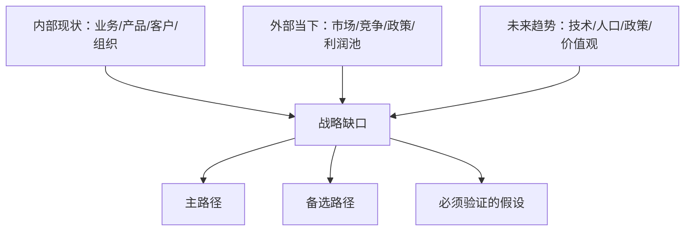

# 企业未来规划与建议书模板

Use this structure for the final Markdown report. Adapt headings to the company context, but do not omit required analytical sections.

## File Rules

- Save to `markdown/` under the current project.
- Filename pattern: `enterprise-future-planning-<company>-YYYYMMDD-HHMM.md`.
- Include source links near relevant claims or in a final source list.
- Record generation time and the date range of web research.

## Recommended Opening

```markdown
# <企业名>未来规划与建议书

生成时间：YYYY-MM-DD HH:MM  
研究对象：<企业名、官网、主营业务一句话>  
规划周期：<1年/3年/5年，按用户要求或合理假设>  
结论置信度：高/中/低；哪些关键部分仍需内部数据验证
```

## Required Structure

### 1. 执行摘要

Include:

- One-sentence core judgment.
- Main recommended path.
- Backup path.
- 3 most important risks.
- 30-day first action.

### 2. 前提假设与信息缺口

| Type | Content | Confidence | How to verify |
|---|---|---|---|
| Known fact |  | High | Source/user supplied |
| Inference |  | Medium |  |
| Assumption |  | Medium/Low |  |
| Unknown |  | Needs validation |  |

Explain: "If assumption X is false, recommendation Y should change to Z."

### 3. 企业画像

Include the minimum profile table:

| Dimension | Known facts | Inferences | Assumptions | Unknowns | Planning implication |
|---|---|---|---|---|---|
| Business |  |  |  |  |  |
| Product |  |  |  |  |  |
| Customer |  |  |  |  |  |
| Operations |  |  |  |  |  |
| Team |  |  |  |  |  |
| Resources |  |  |  |  |  |
| External market |  |  |  |  |  |
| Future trends |  |  |  |  |  |

Add a compact visual:



### 4. 内部诊断

Subsections:

- 业务基本面：营收结构、利润结构、现金流、增长质量、资产负债风险。公开资料不足时标注缺口。
- 产品/服务结构：明星业务、现金牛、问题业务、探索业务。
- 客户资产：客户群体、集中度、复购、购买原因、痛点。
- 运营效率：人效、交付、供应链、研发转化、销售周期或可观察代理指标。
- 组织与人：创始人/高管、决策机制、人才结构、文化和执行约束。
- 资源与能力：牌照、专利、品牌、渠道、供应链、数据、核心流程能力。

### 5. 外部环境分析

Must include:

- Industry size/growth/profit pool with sourced evidence.
- Value chain and pricing power.
- Customer demand and purchase decision process.
- Direct competitors, substitutes, potential entrants, and cooperation map.
- Current macro, credit, employment, trade, policy, and regulation temperature when relevant.

### 6. 行业、赛道、场景分析

Use tables:

| Candidate track | Demand driver | Profit pool | Customer budget | Company fit | Entry difficulty | Confidence |
|---|---|---|---|---|---|---|

| Scenario | Customer pain | Current workaround | Why they pay | Company entry point | Validation method |
|---|---|---|---|---|---|

### 7. 未来趋势与战略缺口

Analyze:

- Technology discontinuities and AI/automation impact.
- Demographic and social structural changes.
- Long-term policy anchors and supply-chain reconstruction.
- Value-driven demand migration.

Use this table:

| Future trend | Threat/opportunity | Impact on current advantage | Required capability | Action |
|---|---|---|---|---|

### 8. 战略选项与推荐

Provide 2-4 options:

| Option | Core bet | Required assets | Expected upside | Key risk | Validation signal |
|---|---|---|---|---|---|

Then recommend:

- Main path.
- Backup path.
- Paths to reject and why.

### 9. 客户愿意付费的痛点与商机

For each opportunity:

- Target customer and budget owner.
- Pain frequency, severity, and urgency.
- Current spending or workaround.
- Why now.
- Why this company has an advantage.
- First reachable customer channel.
- Payment model and pricing hypothesis.

### 10. 产品/服务原型

Describe:

- Product/service name.
- Target user.
- Core promise.
- Main workflow.
- Deliverables.
- Pricing hypothesis.
- Differentiation.
- Data, technology, delivery, and compliance requirements.

Optional SVG sketch:

```html
<svg width="760" height="260" viewBox="0 0 760 260" xmlns="http://www.w3.org/2000/svg">
  <rect x="20" y="40" width="190" height="80" fill="#f5f5f5" stroke="#333"/>
  <text x="115" y="85" text-anchor="middle" font-size="16">客户痛点/输入</text>
  <rect x="285" y="40" width="190" height="80" fill="#f5f5f5" stroke="#333"/>
  <text x="380" y="85" text-anchor="middle" font-size="16">企业能力/流程</text>
  <rect x="550" y="40" width="190" height="80" fill="#f5f5f5" stroke="#333"/>
  <text x="645" y="85" text-anchor="middle" font-size="16">可付费结果</text>
  <path d="M210 80 H285" stroke="#333" marker-end="url(#arrow)"/>
  <path d="M475 80 H550" stroke="#333" marker-end="url(#arrow)"/>
  <defs><marker id="arrow" markerWidth="10" markerHeight="10" refX="8" refY="3" orient="auto"><path d="M0,0 L0,6 L9,3 z" fill="#333"/></marker></defs>
</svg>
```

### 11. MVP 设计与验证

| MVP step | Scope | Cost/time | Success metric | Stop/continue rule |
|---|---|---|---|---|

Keep the MVP smaller than the final product. Prefer manual, service-first, pilot, or concierge delivery before building full software or heavy assets.

### 12. 参与方式、变现路径与团队

Include:

- Participation mode: self-build, partnership, channel, OEM/ODM, consulting/service, SaaS/product, platform/ecosystem, investment/M&A, or hybrid.
- Monetization ladder: pilot fee -> project fee -> annual/recurring contract -> productized package -> platform/ecosystem revenue where applicable.
- Sales channel: existing customers, outbound, distributors, industry associations, content, tender/procurement, strategic partners.
- Team design: leader, sales, product, delivery, technical, operations, finance/compliance, advisors. Explain why each role is necessary and when to hire.

### 13. Roadmap

Use a 30/90/180-day plan:

| Period | Goal | Actions | Metric | Review decision |
|---|---|---|---|---|

### 14. Risks and Fallbacks

| Risk | Early signal | Mitigation | Fallback |
|---|---|---|---|

### 15. Source List

List sources with title, publisher, date if available, and URL.

## Writing Style

- Use "结论先行 + 前提 + 证据 + 推理 + 行动".
- Keep language direct, decision-oriented, and specific to the company.
- Avoid slogans, unverifiable praise, and generic transformation language.
- Use cases as illustrations, not as proof of market truth.
