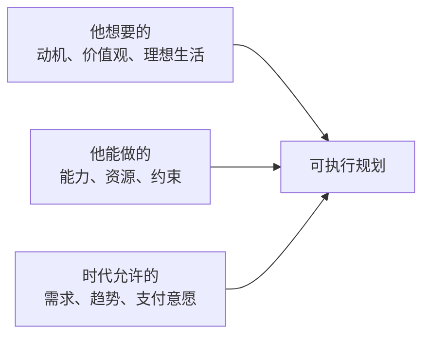

# 个人画像采集框架

Use this reference when the user's background is incomplete or when the planning report needs a structured profile section.

## Core Model

Planning must seek the intersection of three circles:

## Internal Information: Understand the Person

### 1. Current Position

Collect and summarize:

- Hard skills: technical specialties, domain expertise, languages, tools, certifications.
- Soft skills: communication, leadership, complex problem solving, empathy, selling, writing, teaching, organizing.
- Resource advantages: network, information advantage, capital reserve, team, brand, patents, community, distribution channel.
- Capability boundaries: disliked tasks, weak skills, health/time limits, environments that drain energy.

Recommended questions:

- What are the 3 things others repeatedly ask you for help with?
- What tasks are you good at but hate doing?
- What assets do you already have that others in the same field do not?
- What is currently impossible because of time, family, money, location, credentials, or energy?

### 2. Motivation and Energy

Collect and summarize:

- Peak experiences: three past events that created strong achievement or meaning.
- Driver type: achievement, control, connection, security, meaning, curiosity, status, freedom.
- Energy pattern: solo vs social, fast challenge vs stable rhythm, deep work vs high interaction.
- Values ranking: family harmony, career success, adventure, stability, recognition, internal freedom, wealth, health.

Recommended questions:

- Describe three moments when you forgot time and felt energized.
- Which tradeoff hurts more: lower income with autonomy, or higher income with less freedom?
- If nobody could see or praise the result, what would you still want to do well?

### 3. Current Pain and Blockers

Collect and summarize:

- Concrete anxiety scenes, not abstract labels.
- Paths already tried and why they failed.
- Resource gaps, method gaps, internal resistance.
- Limiting beliefs: "I am not qualified", "I only know this one thing", "I started too late", etc.

Recommended questions:

- When did you last feel strong anxiety or powerlessness? What exactly happened?
- What have you tried? What result did you get?
- What belief about yourself may be preventing action?

### 4. Future Direction

Collect and summarize:

- Ideal ordinary day 3 years later: location, people, work, rhythm, income, health, learning, family.
- Role goals: career, wealth, health, family, learning, social contribution.
- Risk preference: stable path vs uncertain high-upside opportunity.
- Sacrifice willingness: stability, leisure, current income, reputation, location, comfort zone.
- Growth capacity: metacognition, feedback speed, growth mindset.

Recommended questions:

- Describe a satisfying ordinary day 3 years from now, from waking up to sleeping.
- What are you willing to give up for that life?
- Would you prefer a 30% success chance with 10x upside or a near-certain path with modest upside? Why?

## External Information: Locate the Person in the Environment

### 1. Current Industry and Role

Analyze:

- Value chain position: core profit pool or replaceable edge.
- Talent supply-demand: shortage or oversupply, supported by job postings or salary reports when possible.
- AI/automation substitutability: what part of daily work is automatable, augmentable, or defensible.
- Company/role resilience: customer dependency, pricing power, regulatory risk, platform dependency.

### 2. Family and Social Capital

Analyze:

- Family life cycle: single, married, children, eldercare, mortgage, health constraints.
- Time/energy budget: realistic weekly hours for transition or side project.
- Network quality: decision-makers, paying customers, experts, mentors, collaborators, weak ties.

### 3. Future Trends

Analyze:

- Slow variables: aging, urbanization/regional migration, carbon transition, digitalization, globalization restructuring, healthcare demand, education transformation.
- Technology diffusion: generative AI, robotics, biotech, new energy, data infrastructure, agentic software, privacy/security.
- Talent flow: where capital, top builders, and high-skill workers are entering or leaving.
- New vocabulary: new roles, new budgets, new workflows, new compliance language.
- Durable human needs: health, emotional support, education, trust, complex decision-making, cross-cultural communication, identity/community.

## Integration Tools

### Personal SWOT

Use a table:

| Type | Evidence | Planning meaning |
|---|---|---|
| Strengths | Peak moments, skills, resources | Where to apply leverage |
| Weaknesses | Boundaries, disliked tasks, limiting beliefs | What to avoid or partner around |
| Opportunities | Trends, unmet demand, new roles | Where to search for upside |
| Threats | AI substitution, oversupply, regulation | What to hedge |

### Odyssey Plan

Produce three 5-year versions:

1. Current path to excellence: how to make the existing path 2-10x better.
2. Forced pivot: if the current path disappears, how to make a living.
3. No money/status constraint: the life the person most wants.

For each version include:

- Core bet.
- Required capability.
- First 90 days.
- Major risk.
- Validation signal.
