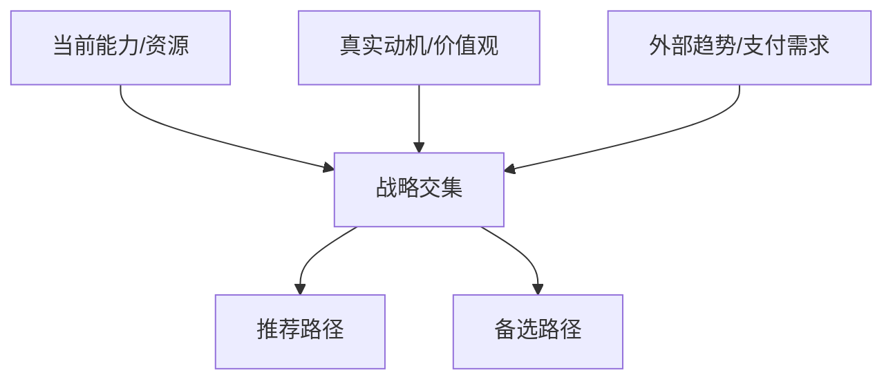

# 未来规划建议书模板

Use this structure for the final Markdown report. Adapt headings to the user's context, but do not omit required analytical sections.

## File Rules

- Save to `markdown/` under the current project.
- Filename pattern: `future-planning-建议书-YYYYMMDD-HHMM.md` or `future-planning-<person-or-theme>-YYYYMMDD-HHMM.md`.
- Include source links near the relevant claims or in a final source list.

## Recommended Front Matter

```markdown
# <提问者/主题>未来规划与建议书

生成时间：YYYY-MM-DD HH:MM  
适用对象：<一句话描述>  
结论置信度：高/中/低；哪些部分仍需验证
```

## Required Structure

### 1. 执行摘要

Include:

- One-sentence core judgment.
- Main recommended path.
- Backup path.
- 3 most important risks.
- 30-day first action.

### 2. 前提假设与信息缺口

Use a table:

| Type | Content | Confidence | How to verify |
|---|---|---|---|
| Known fact |  | High | User supplied |
| Assumption |  | Medium/Low |  |
| Unknown |  | Needs validation |  |

Explain: "If assumption X is false, recommendation Y should change to Z."

### 3. 个人画像

Subsections:

- 当前台阶：硬技能、软技能、资源、能力边界。
- 动机与能量：驱动力、巅峰体验、价值观排序、能量模式。
- 当前卡点：焦虑场景、尝试过的路径、失败原因、限制性信念。
- 未来画面：3年后理想普通日，多重角色目标，风险偏好，牺牲意愿。

Add a compact visual:



### 4. 外部环境分析

Must include:

- Macro slow variables.
- Industry value chain and profit pool.
- Talent supply-demand.
- AI/automation substitutability at task level.
- Regulation or platform dependency when relevant.
- New roles, new budgets, new vocabulary.

Use sourced data. Do not rely on generic trend language.

### 5. 行业、赛道、场景分析

Use tables:

| Candidate track | Demand driver | Customer budget | Fit with user | Entry difficulty | Confidence |
|---|---|---|---|---|---|

| Scenario | Customer pain | Current workaround | Why they pay | User entry point |
|---|---|---|---|---|

### 6. 个人 SWOT

| Type | Evidence | Planning implication |
|---|---|---|
| Strength |  |  |
| Weakness |  |  |
| Opportunity |  |  |
| Threat |  |  |

### 7. 奥德赛计划：未来 5 年的三种版本

| Version | Core bet | Year-1 action | Capability to build | Risk | Validation signal |
|---|---|---|---|---|---|
| 当前路径做到极致 |  |  |  |  |  |
| 当前路径失效后的谋生方案 |  |  |  |  |  |
| 不考虑钱和面子的理想生活 |  |  |  |  |  |

### 8. 客户愿意付费的痛点与商机

For each opportunity:

- Target customer.
- Pain frequency and severity.
- Current spending or workaround.
- Why now.
- Why this person has an advantage.
- First reachable customer channel.
- Payment model.

### 9. 产品/服务原型

Describe:

- Product/service name.
- Target user.
- Core promise.
- Main workflow.
- Deliverables.
- Pricing hypothesis.
- Differentiation.

Optional SVG sketch:

```html
<svg width="720" height="240" viewBox="0 0 720 240" xmlns="http://www.w3.org/2000/svg">
  <rect x="20" y="30" width="190" height="70" fill="#f5f5f5" stroke="#333"/>
  <text x="115" y="70" text-anchor="middle" font-size="16">客户输入</text>
  <rect x="265" y="30" width="190" height="70" fill="#f5f5f5" stroke="#333"/>
  <text x="360" y="70" text-anchor="middle" font-size="16">解决流程</text>
  <rect x="510" y="30" width="190" height="70" fill="#f5f5f5" stroke="#333"/>
  <text x="605" y="70" text-anchor="middle" font-size="16">可付费结果</text>
  <path d="M210 65 H265" stroke="#333" marker-end="url(#arrow)"/>
  <path d="M455 65 H510" stroke="#333" marker-end="url(#arrow)"/>
  <defs><marker id="arrow" markerWidth="10" markerHeight="10" refX="8" refY="3" orient="auto"><path d="M0,0 L0,6 L9,3 z" fill="#333"/></marker></defs>
</svg>
```

### 10. MVP 设计与验证

Include:

| MVP step | Scope | Cost/time | Success metric | Stop/continue rule |
|---|---|---|---|---|

Keep the MVP smaller than the final product. Prefer manual/concierge delivery before building software.

### 11. 参与方式、变现路径与团队

Include:

- Participation mode: employment, independent consulting, content, course, product, community, partnership, investment, or hybrid.
- Monetization ladder: free signal -> low-ticket -> high-ticket -> recurring or scalable product.
- Sales channel: warm network, outbound, platform, content, partnerships.
- Team design: solo first, part-time collaborators, core hires, advisors. Explain why each role is necessary.

### 12. Roadmap

Use 30/90/180-day plan:

| Period | Goal | Actions | Metric | Review decision |
|---|---|---|---|---|

### 13. Risks and Fallbacks

| Risk | Early signal | Mitigation | Fallback |
|---|---|---|---|

### 14. Source List

List sources with title, publisher, date if available, and URL.

## Writing Style

- Use "结论先行 + 前提 + 证据 + 推理 + 行动".
- Keep language direct and decision-oriented.
- Avoid moralizing, slogans, and vague encouragement.
- Use concrete examples only as illustrations, not as proof of a trend.
