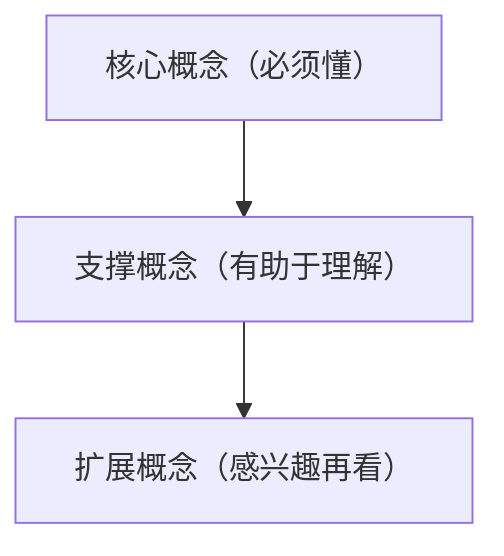

# 论文解读 Markdown 模板

~~~markdown
# 《论文标题》通俗解读：一句话副标题

> 论文：Title  
> 作者：Authors  
> 会议/期刊/年份：Venue, Year  
> PDF：来源或本地文件  
> 解读日期：YYYY-MM-DD

## 1. 先给结论：这篇论文解决什么问题？

用 1-3 句话说明现实问题、论文方案和为什么值得读。

| 维度 | 价值 |
|---|---|
| 学术价值 | ... |
| 工业价值 | ... |
| 直觉类比 | ... |

## 2. 读懂它之前，需要哪些知识？

## 3. 论文精读：问题-方案-验证

| 5W1H | 论文回答 | 证据位置 |
|---|---|---|
| Why | ... | Section / Page |
| What | ... | Section / Page |
| How | ... | Section / Page |
| So What | ... | Table / Figure |
| Now What | ... | Discussion |

## 4. 关键图表怎么读？

| 图/表 | 论文想证明什么 | 普通读者该怎么看 |
|---|---|---|
| Figure 1 | ... | ... |
| Table 1 | ... | ... |

## 5. 术语词典

**Term（中文名）**
- 是什么：...
- 为什么重要：...
- 现实类比：...

## 6. 批判性评估

| 问题 | 判断 |
|---|---|
| 假设前提是否成立 | ... |
| 实验设计是否充分 | ... |
| 失效场景 | ... |
| 未来改进 | ... |

## 7. 对工业界和学术界的启发

...

## 8. 来源备注

- Section / Page / Figure / Table references.
~~~
