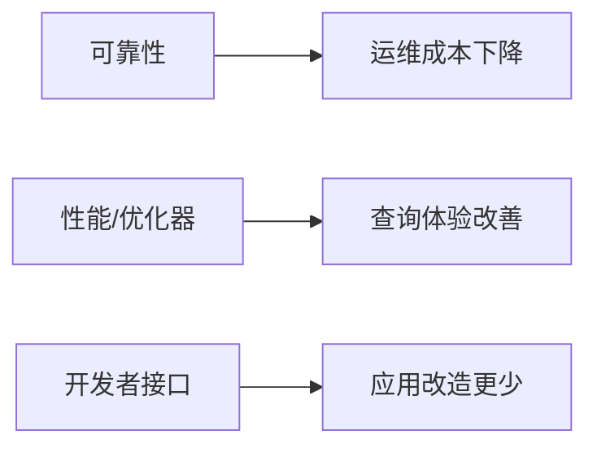

# Postgres Commit History Article

## Goal

Turn a PostgreSQL commit range into a publishable Chinese Markdown article for DBA and application developers when the range contains valuable user-facing or operator-facing changes. Work from commit logs first, then only deep-read full commit messages for selected valuable groups. Before writing usage examples, inspect relevant SQL tests, documentation, or source context so examples are rich and correct. Do not analyze code diffs unless needed to understand a mechanism or produce a practical example.

## Inputs

Expect the user to run the skill from a PostgreSQL git checkout and provide:

```text
commitid1 commitid2
```

Treat the range as inclusive of both endpoints. If the order is unclear, test both ancestry directions and use the direction that produces a valid range; otherwise ask for clarification.

## Workflow

1. Verify context.
   - Confirm `git rev-parse --show-toplevel` succeeds.
   - Confirm the repository looks like PostgreSQL, for example `src/backend`, `src/include`, and `configure.ac` exist.
   - Create `markdown/` in the current project if missing.

2. Collect commit metadata without diffs.
   - Prefer `scripts/collect_pg_commits.py` from this skill.
   - Run it from the PostgreSQL repository root:

```bash
python3 /path/to/postgres-commit-history-article/scripts/collect_pg_commits.py commitid1 commitid2 --output markdown/postgres-commit-range.json
```

   - The JSON includes inclusive commits, short ids, authors, dates, subjects, full bodies, revert relationships, merge flags, and suggested chronological/reverse order.

3. First-pass analysis from short descriptions only.
   - Read every commit subject.
   - Exclude commits that were reverted inside the selected range. Exclude both the reverting commit and the reverted commit unless the revert itself carries lasting user-facing value.
   - Treat typo, buildfarm-only, test-only, documentation-only, translation-only, and mechanical cleanup commits as low priority unless they expose an important operational change.
   - Select commits with clear value for DBAs or application developers: performance, reliability, observability, planner/executor behavior, SQL features, replication, recovery, backup, storage, concurrency, security, compatibility, extension APIs, client tooling, migration risk, and behavior changes.
   - If no commits remain with clear DBA or application-developer value, stop here. Return an analysis summary in the chat and do not write a Markdown article file.

4. Group related commits.
   - Group commit ids that solve the same problem, evolve the same feature, fix follow-ups for the same change, or are authored by the same person around the same subsystem.
   - Prefer problem-oriented group names, not file/subsystem names. Example: "降低逻辑复制槽失效风险" is better than "replication commits".
   - Preserve each group's commit short ids and authors.

5. Deep-read only selected groups.
   - For each selected group, read the full commit messages from the collected JSON or with `git show -s --format=fuller <commit>`.
   - Still avoid code diff analysis. Inspect diff only when the full message is insufficient to explain the mechanism, compatibility impact, or example.
   - Capture exact behavior changes, affected users, constraints, GUCs/options/functions/catalogs, and upgrade caveats.

6. Verify example material before writing usage examples.
   - Before writing each `使用示例`, inspect nearby authoritative material for that feature:
     - SQL regression tests: `src/test/regress/sql/`, `src/test/isolation/specs/`, `src/test/subscription/t/`, `src/test/recovery/t/`, extension test SQL, or TAP tests.
     - Documentation: `doc/src/sgml/`, especially pages for SQL commands, functions, catalogs, GUCs, monitoring views, replication, backup/recovery, and release notes.
     - Source context only when tests/docs do not expose enough syntax or operational detail.
   - Prefer examples adapted from committed tests or docs, then simplify them for readers.
   - If a commit introduces SQL syntax, functions, catalog columns, GUCs, views, command options, psql/client behavior, replication/recovery operations, or extension APIs, verify the exact names and valid usage from tests/docs before writing.
   - Record the evidence used for each example in your working notes and mention key paths when useful in the article.
   - If tests/docs/source do not provide enough confidence, do not fabricate a runnable SQL example. Use an operational checklist or validation query and state the limitation.

7. Write the article.
   - Only write the article when at least one selected group has clear DBA or application-developer value.
   - Output Markdown to `markdown/` in the current project. Use a filename like:

```text
markdown/postgres-commit-history-<short1>-<short2>.md
```

   - Use Chinese, suitable for 公众号传播, but keep technical claims precise.
   - Add a brief source note that the analysis is based on git commit logs and full commit messages, not a full code audit.

## No-Article Output

When the selected range has no commits worth a DBA/application-developer article, return a concise Chinese analysis instead of creating a Markdown file:

```markdown
本次范围：<commit1>..<commit2>（含两端），共 <n> 个提交。

结论：未发现值得面向 DBA 或应用开发者单独成文解读的提交。

原因：
- 已剔除 range 内 revert 的提交：<ids or 无>
- 其余提交主要属于：<测试/文档/拼写/构建/内部重构/无用户可见行为变化等>
- 未发现明确的性能、可靠性、可观测性、SQL 行为、复制恢复、运维接口、应用兼容性或迁移风险变化。

可保留记录：
| commit | 作者 | 简短描述 | 判断 |
|---|---|---|---|
| abc1234 | ... | ... | 不成文：... |

未输出文章文件。
```

Do not create `markdown/postgres-commit-history-*.md` in this case. It is acceptable to keep the collector JSON only if it was already generated as working data.

## Required Article Structure

Use a consistent structure for every selected item or group:

````markdown
## N. 标题（commit: abc1234, def5678）

一句话简介：...

出现背景：...

解决什么痛点：...

用的什么方法：...

效果对比：
- 补丁前：...
- 补丁后：...

使用场景：...

最佳实践：...

使用示例：
```sql
...
```
````

If a SQL example is not appropriate, use a shell, config, monitoring query, operational checklist, or "无需用户侧改动，但建议验证..." example.

Every usage example must be backed by one of: a PostgreSQL SQL regression/isolation/TAP test, SGML documentation, or relevant source context. Prefer citing the path briefly after the example, for example: `示例依据：src/test/regress/sql/xxx.sql, doc/src/sgml/yyy.sgml`.

## Article Outline

Recommended outline:

````markdown
# PostgreSQL 提交解读：从 <commit1> 到 <commit2>，哪些变化最值得 DBA 和开发者关注？

> 范围：<commit1>..<commit2>（含两端），共 <n> 个提交；剔除 range 内 revert 后重点解读 <m> 组。

## 先给结论

## 这批提交的主线



## 值得关注的改进

... repeat the required per-group structure ...

## DBA 落地清单

## 应用开发者落地清单

## 版本升级与验证建议

## 附：commit 分组表
````

Add Mermaid diagrams where they clarify relationships, such as:

- commit groups by value chain: feature -> mechanism -> impact
- before/after behavior flow
- DBA rollout checklist

Use inline SVG only if Mermaid cannot express the concept clearly. Keep diagrams readable in WeChat Markdown.

## Quality Rules

- Do not invent behavior not supported by commit messages. If inferring from PostgreSQL architecture, mark it as inference.
- Keep commit short ids attached to every claim-heavy group.
- Distinguish DBA value from application-developer value.
- Mention breaking/behavioral changes and migration risks explicitly.
- Avoid dumping all commits. The article should curate the most valuable groups, then include a compact appendix table for the rest.
- Do not force an article when all commits are low-value for DBAs and application developers. Return the no-article analysis instead.
- Do not write SQL or command examples from memory alone. Verify them against PostgreSQL tests, docs, or source context first.
- Do not include full commit descriptions verbatim. Summarize them.
- Do not include code diffs.

## Useful Commands

```bash
# Confirm both endpoints exist
git rev-parse --verify <commitid1>^{commit}
git rev-parse --verify <commitid2>^{commit}

# Show only subjects for the inclusive range
git log --reverse --format='%h%x09%an%x09%ad%x09%s' --date=short <older>^..<newer>

# Show full message for selected commits, no diff
git show -s --format=fuller <commit>
```
