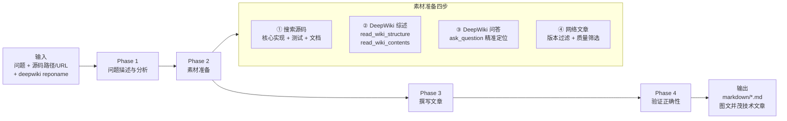

# opensourcefaq Skill 设计文档

> 作者：Claude | 日期：2026-04-23

## 概述

`opensourcefaq` 是一个专为开源技术深度问答设计的 Skill，将用户的技术问题转化为可发布级别的 Markdown 技术文章，图文并茂，有原理、有源码、有实操。

---

## 解答流程总览



---

## 文章结构规范

每篇输出文章遵循以下结构：

```
# 问题标题

> 关键词标签

## TL;DR           ← 3-5 句核心结论
## 背景与问题定义   ← 为什么这个问题值得深入
## 原理分析        ← 配 mermaid 图
## 源码走读        ← 文件路径 + 行号 + 代码片段
## 实操演练        ← Docker/本地环境 + 可复现步骤
## 边界与误区      ← 反直觉的坑
## 拓展思考        ← 举一反三
## 参考资料        ← 版本明确的来源
```

---

## 图表规范

### mermaid 使用场景

| 场景 | 图类型 |
|------|--------|
| 代码执行路径 | flowchart |
| 组件间交互 | sequenceDiagram |
| 对象生命周期 | stateDiagram |
| 数据结构关系 | classDiagram |

### SVG 使用场景

- 内存布局（页面结构、数据块组织）
- 方案对比（Side-by-side）
- 性能趋势示意

---

## 素材质量过滤规则

### 网络文章筛选

```
✅ 保留标准
  - 官方博客 / 官方 release notes
  - 版本与用户关注版本一致
  - 有源码引用支撑
  - 作者可信（核心贡献者、知名技术团队）

❌ 丢弃标准
  - 内容与当前版本 API 不符
  - 纯经验分享、无源码验证
  - 与源码走读结论相矛盾
  - SEO 农场 / 无实质内容
```

---

## 验证 Checklist

在最终输出前，必须完成：

```
源码验证
  [ ] 每个原理陈述有对应源码（文件 + 行号）
  [ ] 源码版本与描述匹配
  [ ] 无与源码矛盾的表述

DeepWiki 验证
  [ ] 核心结论与 DeepWiki 问答一致
  [ ] 出入处以源码为准并更新文章

代码示例验证
  [ ] 语法正确
  [ ] 逻辑与原理一致
  [ ] 实操命令可执行

文章完整性
  [ ] TL;DR 直接回答问题
  [ ] 图表 ≥ 2 种
  [ ] 实操步骤完整（环境 + 数据 + 命令 + 预期输出）
  [ ] 参考资料版本明确
  [ ] 文件已保存到 markdown/ 目录
```

---

## 输出文件命名规范

```
markdown/<问题关键词>-<项目名>.md

示例：
  markdown/mvcc-visibility-postgresql.md
  markdown/wal-recovery-postgresql.md
  markdown/compaction-strategy-rocksdb.md
  markdown/consumer-group-rebalance-kafka.md
```

---

## 注意事项

1. **版本敏感**：开源实现随版本变化大，每次引用必须注明版本/commit hash
2. **多项目问题**：分别建立素材池，综合分析时标注各结论来自哪个项目
3. **避免过度概括**：用"在 X.Y 版本中"代替"X 总是..."
4. **实操优先**：每个原理点尽量配一个可验证的实操步骤
5. **中文主体**：文章默认中文，代码注释可英文
