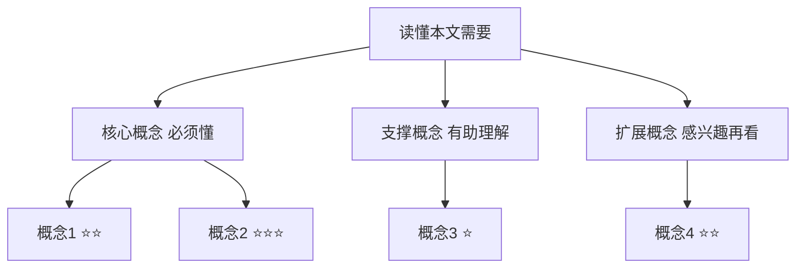

# Paper Interpreter Skill

将学术论文转化为通俗易懂、图文并茂的深度解读文档。

## 工作流程总览

```
输入(PDF文件/URL) → 全文提取 → 5步解读 → 输出 Markdown 文件到 markdown/
```

---

## Step 0：获取论文内容

### 情况A：用户上传了 PDF 文件
读取路径 `/mnt/user-data/uploads/` 下的 PDF 文件，用 `bash_tool` 提取文本：

```bash
pip install pdfminer.six --break-system-packages -q
python3 - <<'EOF'
from pdfminer.high_level import extract_text
text = extract_text("/mnt/user-data/uploads/论文文件名.pdf")
print(text[:50000])  # 先输出前50000字符
EOF
```

若论文有图表密集或文字提取不完整，追加用 `pymupdf` 逐页提取并描述图表内容：
```bash
pip install pymupdf --break-system-packages -q
python3 - <<'EOF'
import fitz
doc = fitz.open("/mnt/user-data/uploads/论文文件名.pdf")
for i, page in enumerate(doc):
    print(f"\n=== Page {i+1} ===")
    print(page.get_text())
    # 列出图片
    imgs = page.get_images()
    if imgs:
        print(f"[此页含 {len(imgs)} 张图片]")
EOF
```

### 情况B：用户提供了 PDF URL
使用 `web_fetch` 工具抓取 PDF，或者先用 `web_search` 找到 arXiv/DOI 页面，再抓取 HTML 摘要 + 全文。

```
web_fetch(url)  →  提取文本内容
```

**重要**：提取完成后，记录以下信息备用：
- 论文标题、作者、发表年份、期刊/会议
- 摘要（Abstract）
- 章节结构
- 所有图表的标题和描述
- 实验数据和核心结论

---

## Step 1：确定输出路径

```bash
mkdir -p markdown
# 文件名格式：论文标题关键词（英文）+ _解读.md
# 例：attention_is_all_you_need_解读.md
```

---

## Step 2：执行五步解读法，生成 Markdown

按以下结构逐步撰写输出文档。**每一步都必须完成，不可跳过。**

---

### 📍 第0步：论文定位

**目标**：让读者在30秒内判断"这篇论文值不值得读、跟我有什么关系"。

写法要求：
1. **一句话摘要**：用最简单的语言说清楚这篇论文做了什么
2. **价值标注**：
   - 🎓 学术价值：在学界填补了什么空白 / 突破了什么瓶颈
   - 🏭 工业价值：在业界可以用来做什么、解决什么实际问题
3. **直觉类比**：用一个生活化的类比帮助读者建立第一印象

示例格式：
```markdown
## 📍 论文定位

**一句话**：本文提出了 XXX 方法，解决了 YYY 场景下 ZZZ 的问题。

**🎓 学术价值**：首次将...应用于...领域，填补了...的空白。

**🏭 工业价值**：可直接用于...系统，降低...成本，提升...效率。

**💡 直觉类比**：这篇论文就像是给 AI 配了一个...，让它能够...
```

---

### 🗺️ 第1步：知识地图

**目标**：用结构化方式呈现读懂本文所需的前置知识，降低阅读门槛。

写法要求：
1. 用 **Mermaid 图** 画出知识树（三层：核心→支撑→扩展）
2. 对每个核心概念，用「是什么 + 为什么重要 + 现实类比」三件套讲解
3. 标注难度等级（⭐ 简单 / ⭐⭐ 中等 / ⭐⭐⭐ 较难）

Mermaid 知识树模板：


---

### 🔬 第2步：论文精读（5W1H框架）

**目标**：按"问题-方案-验证"三段式完整解读论文内容。

#### 2.1 Why — 为什么要做这个研究？
- 现有方法的痛点是什么？
- 作者的 motivation 是什么？
- 用**对比表格**展示"之前 vs 本文"

#### 2.2 What — 提出了什么方法/系统？
- 核心方法/架构是什么？
- 用 **Mermaid 流程图或架构图** 展示系统结构
- 如果论文有架构图，用文字 + mermaid 重新描述

Mermaid 架构图示例：


#### 2.3 How — 具体怎么实现的？
- 关键技术细节（公式可以保留，但必须加白话解释）
- 重要的设计选择和背后的直觉
- 如有伪代码/算法，用代码块呈现并注释

#### 2.4 So What — 结果怎么样？
- 主要实验结果（用**表格**整理核心指标对比）
- 消融实验说明了什么？
- 结果中最令人印象深刻的发现是什么？

#### 2.5 Now What — 对我们意味着什么？
- 学术界：开了哪些新方向？
- 工业界：可以怎么落地？有哪些应用场景？

---

### 📖 第3步：术语词典

**目标**：让读者看完就记住关键术语的含义和重要性。

每个术语使用固定三件套模板：

```markdown
### 术语名（英文原名）
- **是什么**：...
- **为什么重要**：...
- **现实类比**：就像...
```

只收录论文中**真正关键的**术语（5~15个），不要堆砌所有专业词汇。

---

### ⚖️ 第4步：批判性评估

**目标**：培养读者的独立思考能力，呈现论文的局限性与未来方向。

必须覆盖以下四个维度：

1. **假设前提的合理性**
   - 论文依赖哪些假设？
   - 这些假设在现实场景中是否成立？

2. **实验设计的可质疑之处**
   - 基线选择是否公平？
   - 数据集是否有代表性？
   - 有没有重要的对比实验缺失？

3. **方法的适用边界**
   - 这个方法在什么场景下会失效？
   - 有哪些已知限制（计算成本、数据依赖、场景限制等）？

4. **未来改进方向**
   - 作者自己提出的 future work 是什么？
   - 读者/你认为还可以从哪些角度改进？

---

## Step 3：写入文件

完整的 Markdown 文件结构如下：

```markdown
# 📄 论文解读：{论文标题}

> **原文信息**：作者 | 年份 | 期刊/会议
> **解读日期**：{今天日期}

---

## 📍 论文定位
...

---

## 🗺️ 知识地图
...

---

## 🔬 论文精读
### Why — 研究动机
### What — 核心方法
### How — 技术细节
### So What — 实验结果
### Now What — 价值总结

---

## 📖 术语词典
...

---

## ⚖️ 批判性评估
...

---

## 📚 参考资料
- 原文链接
- 相关论文（如论文中引用的关键文献）
```

最后执行：
```bash
# 保存文件
cp /home/claude/解读文件.md markdown/文件名.md
echo "✅ 解读文档已保存至 markdown/文件名.md"
```

---

## 质量检查清单

生成文档后，逐项确认：

- [ ] 包含至少 1 个 Mermaid 图（知识树或架构图）
- [ ] 包含至少 1 个对比表格（方法对比或实验结果）
- [ ] 每个核心概念都有现实类比
- [ ] 术语词典覆盖 5 个以上关键术语
- [ ] 批判性评估覆盖全部 4 个维度
- [ ] 文件已保存到 `markdown/` 目录
- [ ] 文档语言通俗，无堆砌定义的段落

---

## 常见注意事项

**关于图片**：论文中的图片无法直接嵌入 Markdown，应用文字描述 + mermaid 重新表达其核心信息。

**关于公式**：保留核心公式（使用 LaTeX 格式 `$公式$`），但每个公式后面必须跟一段白话解释。

**关于篇幅**：解读文档通常在 2000~5000 字之间。太短说明解读不够深入，太长可能存在不必要的堆砌。

**关于语气**：用"我们"和"读者"的视角写作，像一位熟悉该领域的朋友在讲解，避免学术腔。
